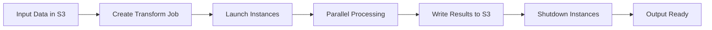

**Category:** Cloud Provider AI Services
**Difficulty:** Intermediate
**Reading time:** 6 min read

---

SageMaker Batch Transform processes large volumes of data asynchronously by running inference jobs against datasets stored in S3. This approach optimizes cost and resources for use cases where real-time prediction is unnecessary and processing can occur on a scheduled or on-demand basis.

- **Batch Job** — single asynchronous inference operation processing multiple records from input data
- **Input Manifest** — S3 file containing paths to input data objects for processing
- **Transform Output** — predictions saved to S3 location for later retrieval and analysis
- **Data Splitting** — dividing large files across multiple instances for parallel processing
- **Max Concurrent Transforms** — number of parallel inference processes running simultaneously

Batch Transform jobs start by specifying input data location in S3 and desired output location. SageMaker launches compute instances (temporarily), downloads the model, and begins processing. Data is distributed across instances for parallel processing, with each instance processing its assigned data chunk. Models generate predictions and instances write results back to S3. Jobs can process various data formats including CSV, JSON, and image files. Data splitting strategies optimize throughput by balancing chunks across instances. Upon completion, instances terminate automatically, eliminating costs for idle compute. Failed jobs can be retried. Results can be compared with other models or used for post-processing analysis.

- Monthly scoring of customer database for engagement campaigns
- Processing historical data for model evaluation and testing
- Large-scale image classification for datasets too big for real-time processing
- Batch prediction for report generation
- Extracting features from unstructured data for analysis
- Parallel inference across distributed datasets

| Advantage | Disadvantage |
|-----------|--------------|
| Cost-effective for large-scale processing | Results available after job completion, not real-time |
| Parallel processing increases throughput | Learning curve for job configuration |
| Results stored durably in S3 | Network latency transferring large datasets |
| Automatic instance cleanup after jobs | Data preparation required before batch |
| Suitable for scheduled, off-peak processing | Limited to file-based input/output |

- [AWS SageMaker model hosting](aws-sagemaker-model-hosting.md)
- [SageMaker real-time inference](sagemaker-real-time-inference.md)
- [SageMaker multi-model endpoints](sagemaker-multi-model-endpoints.md)

---
*Part of the [Cloud Provider AI Services](../index.md) category · [Back to Master Index](../../index.md)*
