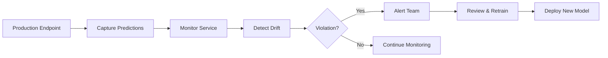

**Category:** Cloud Provider AI Services
**Difficulty:** Intermediate
**Reading time:** 6 min read

---

SageMaker Model Monitor tracks ML model performance in production by monitoring prediction quality, data drift, and model behavior changes. It automatically detects degradation and alerts teams, enabling proactive retraining decisions before models significantly impact business outcomes.

- **Data Drift** — change in input feature distributions over time, degrading model performance
- **Model Drift** — change in model performance on current data compared to baseline expectations
- **Prediction Drift** — shift in output distributions indicating changed model behavior
- **Baseline** — statistical profile of good model behavior used for comparison
- **Constraint** — threshold defining acceptable performance or data quality bounds

Model Monitor captures predictions and ground truth labels from production endpoints to S3. At scheduled intervals, it analyzes current data against baseline statistics established during training. Statistical tests identify data drift when feature distributions diverge significantly. Model performance metrics track prediction quality, flagging degradation patterns. CloudWatch alarms notify teams when drift exceeds thresholds. Monitoring extends to feature importance shifts and bias detection. Detailed reports pinpoint which features changed and by how much. Teams use this visibility to schedule retraining when drift accumulates. Continuous monitoring ensures models remain effective even as data evolves in production.

- Detecting model performance degradation requiring retraining
- Identifying feature distribution changes in production data
- Monitoring for bias emergence in fairness-sensitive applications
- Tracking model behavior across different customer segments
- Validating data quality in prediction pipelines
- Supporting regulatory compliance monitoring

| Advantage | Disadvantage |
|-----------|--------------|
| Detects performance issues proactively | Requires ground truth labels for comparison |
| Automated alerting reduces manual monitoring | Additional costs for monitoring infrastructure |
| Prevents serving degraded models | Setup complexity for baseline configuration |
| Detailed drift diagnostics enable root cause analysis | Storage costs for capturing predictions |
| Supports compliance and audit requirements | Lag between drift and detection |

- [AWS SageMaker model hosting](aws-sagemaker-model-hosting.md)
- [SageMaker multi-model endpoints](sagemaker-multi-model-endpoints.md)
- [SageMaker real-time inference](sagemaker-real-time-inference.md)

---
*Part of the [Cloud Provider AI Services](../index.md) category · [Back to Master Index](../../index.md)*
