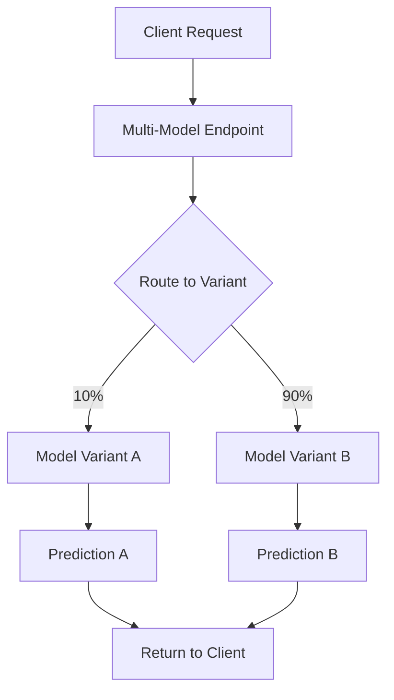

**Category:** Cloud Provider AI Services
**Difficulty:** Intermediate
**Reading time:** 6 min read

---

SageMaker Multi-Model Endpoints allow deploying multiple models to a single endpoint, reducing costs and infrastructure complexity. This approach enables A/B testing, canary deployments, and model ensemble strategies while sharing compute resources across models.

- **Model Variant** — individual model configuration serving requests with specific weight or traffic percentage
- **Traffic Distribution** — allocation of requests across variants based on weights or patterns
- **A/B Testing** — comparing two model variants by routing traffic to each and measuring performance
- **Canary Deployment** — gradually increasing traffic to new models while monitoring metrics
- **Model Grouping** — organizing multiple models under single endpoint for management efficiency

Multi-model endpoints host multiple model variants simultaneously on shared instances. Each variant has its own configuration including Docker image, instance count, and traffic weight. Endpoint routes requests to variants based on configured traffic percentages. A/B testing distributes traffic proportionally, allowing metrics comparison. Canary deployments start with small traffic percentages to new models, gradually increasing as confidence grows. Variants can serve different versions of the same model or entirely different models. Resource sharing reduces overall cost compared to separate endpoints. CloudWatch metrics track performance per variant, enabling data-driven decisions. Updates to individual variants don't require endpoint recreation.

- A/B testing model improvements before full rollout
- Gradual canary deployment of new model versions
- Comparing different algorithms against production baseline
- Ensemble predictions combining multiple model outputs
- Cost-efficient hosting of multiple similar models
- Model comparison in machine learning experimentation

| Advantage | Disadvantage |
|-----------|--------------|
| Resource sharing reduces overall costs | Single endpoint represents single point of failure |
| A/B testing and canary deployments simplified | Variant management complexity increases |
| Easy traffic shifting without code changes | Monitoring multiple variants more complex |
| Gradual rollout reduces deployment risk | Limited to models fitting in shared memory |
| Comparison metrics integrated in CloudWatch | Instance provisioning less flexible |

- [AWS SageMaker model hosting](aws-sagemaker-model-hosting.md)
- [SageMaker real-time inference](sagemaker-real-time-inference.md)
- [SageMaker model monitor](sagemaker-model-monitor.md)

---
*Part of the [Cloud Provider AI Services](../index.md) category · [Back to Master Index](../../index.md)*
