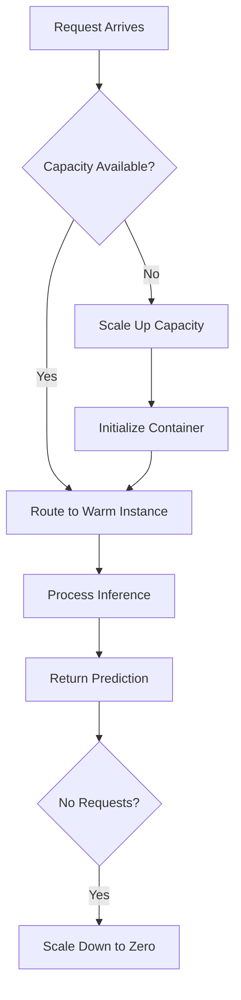

**Category:** Cloud Provider AI Services
**Difficulty:** Intermediate
**Reading time:** 6 min read

---

SageMaker Serverless Inference eliminates the need to manage and pay for compute instances by automatically scaling based on demand. This approach provides cost-efficient inference for bursty or unpredictable workloads without manual scaling configuration or reserved capacity.

- **Automatic Scaling** — AWS manages instance provisioning transparently based on request volume
- **Cold Start** — initial latency when first request arrives and infrastructure initializes
- **Pay-per-use Pricing** — charges based on actual inference requests, not instance hours
- **Provisioned Concurrency** — option to pre-warm capacity for predictable performance
- **Invocation Metrics** — tracking requests served and compute resources consumed

Serverless inference invokes endpoints that scale to zero when unused. When requests arrive, AWS automatically provisions capacity within seconds. For first request to cold endpoint, cold start latency (typically 20-60 seconds) occurs while container initializes. Subsequent requests complete faster if capacity remains provisioned. Provisioned concurrency option pre-warms containers for lower latency at additional cost. Scaling responds to CloudWatch metrics, adding capacity when request rate increases. Per-invocation pricing means you pay only for requests processed, not idle capacity. Suitable for variable workloads like seasonal applications, ad-hoc analytics, or development/testing scenarios.

- Development and testing environments with sporadic usage
- Seasonal applications with unpredictable traffic patterns
- On-demand model scoring triggered by business events
- API endpoints serving highly variable request rates
- Cost-conscious scenarios where predictability isn't required
- Proof-of-concept and prototype inference services

| Advantage | Disadvantage |
|-----------|--------------|
| Cost-effective for variable workloads | Cold starts add initial latency |
| No pre-provisioning or capacity planning required | Not suitable for latency-critical applications |
| Automatic scaling eliminates manual management | Unpredictable response times |
| Pay only for actual usage | Learning curve for cost prediction |
| Suitable for development/testing | Limited to non-production use cases often |

- [AWS SageMaker model hosting](aws-sagemaker-model-hosting.md)
- [SageMaker real-time inference](sagemaker-real-time-inference.md)
- [SageMaker batch transform](sagemaker-batch-transform.md)

---
*Part of the [Cloud Provider AI Services](../index.md) category · [Back to Master Index](../../index.md)*
