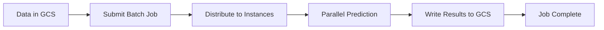

**Category:** Cloud Provider AI Services
**Difficulty:** Intermediate
**Reading time:** 6 min read

---

Vertex AI Batch Prediction processes large datasets asynchronously through scalable infrastructure. This approach optimizes cost for non-real-time predictions and enables efficient handling of massive datasets.

- **Batch Job** — asynchronous prediction operation on large datasets
- **Parallel Processing** — distributing data across instances
- **Cloud Storage Integration** — reading input and writing output to GCS
- **Job Monitoring** — tracking batch job progress and status
- **Cost Optimization** — paying only for compute during active processing

Batch prediction jobs specify input data in Cloud Storage and desired output location. Vertex AI distributes data chunks across compute instances for parallel processing. Each instance applies the model to assigned data and writes predictions. Jobs execute asynchronously without blocking other operations. Job progress can be monitored through APIs and Cloud Console. Upon completion, predictions are available in output location. Failed jobs can be retried with backoff strategies. Compute scales automatically based on data size.

- Monthly customer scoring for campaigns
- Model evaluation on large test sets
- Large-scale feature extraction
- Batch inference for report generation
- Processing historical data for analysis
- Multi-model comparison on datasets

| Advantage | Disadvantage |
|-----------|--------------|
| Cost-effective for large-scale processing | Not suitable for real-time predictions |
| Parallel processing for high throughput | Results only available after completion |
| Efficient handling of massive datasets | Setup and monitoring complexity |
| No idle compute costs | Network transfer overhead |
| Scalable to any data size | Longer end-to-end latency |

- [Google Vertex AI predictions](google-vertex-ai-predictions.md)
- [Vertex AI online prediction](vertex-ai-online-prediction.md)
- [Vertex AI Model Garden](vertex-ai-model-garden.md)

---
*Part of the [Cloud Provider AI Services](../index.md) category · [Back to Master Index](../../index.md)*
