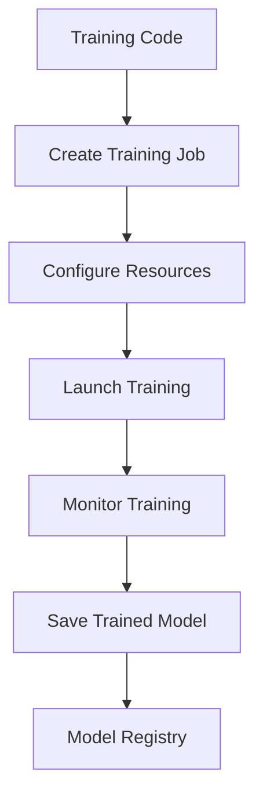

**Category:** Cloud Provider AI Services
**Difficulty:** Intermediate
**Reading time:** 6 min read

---

Vertex AI Custom Training enables training custom ML models using your own code and data. This approach provides flexibility for specialized requirements while leveraging Google Cloud's managed infrastructure and monitoring.

- **Custom Code** — running your training scripts on managed infrastructure
- **Distributed Training** — multi-machine training for large models
- **Hyperparameter Tuning** — automated optimization of model parameters
- **GPU/TPU Support** — specialized accelerators for faster training
- **Model Registry Integration** — automatic model versioning and tracking

Custom training starts by containerizing training code with all dependencies. Teams create training jobs specifying compute requirements, hyperparameters, and output location. Vertex AI provisions requested resources (CPU, GPU, TPU) and runs the training script. Distributed training coordinates across multiple machines for faster convergence on large models. Hyperparameter tuning automates parameter optimization through trial-and-error. Training progress is monitored through CloudWatch-like integration. Upon completion, models are automatically registered for later deployment.

- Training specialized models not available pre-built
- Custom data preprocessing and feature engineering
- Domain-specific model architectures
- Advanced hyperparameter tuning
- Transfer learning from custom baselines
- Multi-task learning implementations

| Advantage | Disadvantage |
|-----------|--------------|
| Full flexibility for custom approaches | Requires expertise in training code |
| Distributed training simplifies scaling | Infrastructure management complexity |
| Automated hyperparameter tuning | Longer time-to-first-model |
| Integration with model registry | Cost of compute resources |
| Support for custom frameworks | Debugging more challenging |

- [Google Vertex AI predictions](google-vertex-ai-predictions.md)
- [Vertex AI Model Garden](vertex-ai-model-garden.md)
- [Vertex AI online prediction](vertex-ai-online-prediction.md)

---
*Part of the [Cloud Provider AI Services](../index.md) category · [Back to Master Index](../../index.md)*
