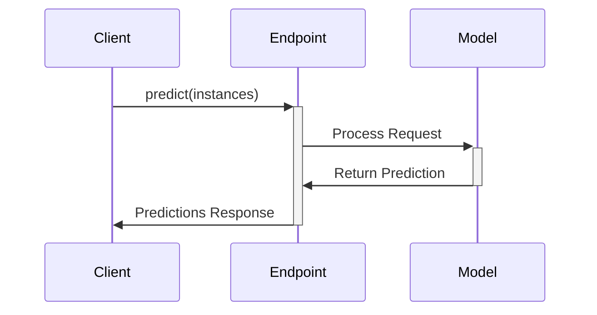

**Category:** Cloud Provider AI Services
**Difficulty:** Intermediate
**Reading time:** 6 min read

---

Vertex AI Online Prediction provides low-latency real-time inference through managed endpoints. This synchronous approach suits applications requiring immediate responses such as fraud detection and interactive services.

- **Synchronous Inference** — request-response pattern for immediate predictions
- **Low Latency** — response times measured in milliseconds for interactive applications
- **Auto-scaling** — automatic instance adjustment based on demand
- **REST API** — standard HTTP interface for application integration
- **Request/Response Routing** — load balancing across model instances

Online prediction endpoints accept requests in real-time through REST APIs. Applications format input data according to model specifications and submit requests to the endpoint. Vertex AI routes requests to healthy instances, balancing load. Each instance processes the request, applies the model, and returns predictions. Response time depends on network latency, request size, and model complexity. Auto-scaling monitors CPU, memory, and request metrics, adjusting instance counts. CloudWatch metrics track latency and error rates. Models can be updated without endpoint recreation.

- Fraud detection for real-time transactions
- Recommendation engines for e-commerce
- Sentiment analysis for customer communications
- Real-time image classification
- Dynamic pricing systems
- Risk scoring for lending

| Advantage | Disadvantage |
|-----------|--------------|
| Immediate responses for interactive apps | Continuous instances cost significant money |
| Built-in load balancing and scaling | Limited batching opportunities |
| Easy integration with GCP ecosystem | Cold start latency possible |
| Comprehensive monitoring included | Requires careful capacity planning |
| Model updates without downtime | Less cost-efficient than batch |

- [Google Vertex AI predictions](google-vertex-ai-predictions.md)
- [Vertex AI batch prediction](vertex-ai-batch-prediction.md)
- [Vertex AI custom training](vertex-ai-custom-training.md)

---
*Part of the [Cloud Provider AI Services](../index.md) category · [Back to Master Index](../../index.md)*
