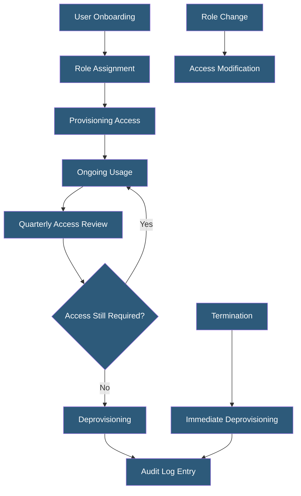

**Category:** Compliance & Regulations
**Difficulty:** Intermediate
**Reading time:** 6 min read

---

Access control compliance ensures that only authorized individuals can access sensitive systems and data, with access granted based on least privilege principles and regularly reviewed to remove unnecessary permissions. Nearly every compliance framework — GDPR, HIPAA, PCI DSS, SOC 2, ISO 27001 — mandates documented access controls as a foundational security requirement.

- **Least Privilege** — users and systems have access only to the minimum resources necessary for their role
- **RBAC (Role-Based Access Control)** — permissions assigned to roles rather than individuals, with users assigned to appropriate roles
- **Privileged Access Management (PAM)** — tools and processes controlling elevated access to critical systems
- **Access Review** — periodic audit of who has access to what systems, removing unnecessary permissions
- **Separation of Duties** — ensuring no single person can complete a sensitive transaction end-to-end without another's involvement
- **Just-in-Time (JIT) Access** — temporary, time-limited privilege elevation replacing standing privileged access
- **MFA (Multi-Factor Authentication)** — required by PCI DSS 4.0 and SOC 2 for all access to sensitive systems

Access control compliance spans the entire identity lifecycle: provisioning, ongoing management, review, and deprovisioning. During provisioning, access should be granted based on documented business need with manager approval. Role-based access control assigns standard permission sets to job functions, preventing one-off permission grants that accumulate over time into over-privileged accounts.

Privileged access — administrative access to production servers, databases, cloud infrastructure, and security systems — requires additional controls. PAM solutions vault shared credentials, record privileged sessions, and enforce just-in-time access patterns where elevated permissions are granted for a specific task window and automatically revoked afterward. PCI DSS 4.0 requires MFA for all administrative access to the CDE; most frameworks strongly recommend or require MFA for privileged access.

Access reviews are the operational mechanism for maintaining least privilege over time. Quarterly reviews for privileged accounts, and at minimum annual reviews for standard user access, require managers to certify that each access grant remains appropriate. When employees change roles, their old access must be removed (role changes commonly lead to permission accumulation). When employees leave, immediate deprovisioning is critical — a common finding in SOC 2 audits is terminated employees retaining active accounts.

Service accounts and API keys present a distinct challenge: they often have broad permissions, are rarely reviewed, and credentials may be embedded in code or configuration files. Inventory of all service accounts, regular rotation of credentials, use of short-lived credentials via IAM roles (rather than long-lived API keys), and least-privilege policies scoped to specific resources are key compliance practices.

- SOC 2 audit requirement for quarterly privileged access reviews with documented evidence
- PCI DSS mandate for MFA on all access to the cardholder data environment
- HIPAA minimum necessary standard limiting ePHI access to specific job functions
- ISO 27001 requirement for formal access control policy and procedures
- Cloud infrastructure access management using IAM roles with short-lived credentials instead of static keys

| Advantage | Disadvantage |
|-----------|--------------|
| Limits blast radius of compromised credentials | Over-restrictive access impedes developer productivity |
| Regular reviews catch orphaned and over-privileged accounts | Quarterly reviews are operationally demanding at scale |
| JIT access eliminates standing privileged access risk | PAM solutions add complexity and cost to infrastructure |
| RBAC simplifies permission management in growing organizations | Role design requires upfront investment to avoid role explosion |

- [Logging and Audit Trails](logging-and-audit-trails.md)
- [PCI DSS Compliance](pci-dss-compliance.md)
- [SOC 2 Certification](soc-2-certification.md)

---
*Part of the [Compliance & Regulations](index.md) category · [Back to Master Index](../../index.md)*
