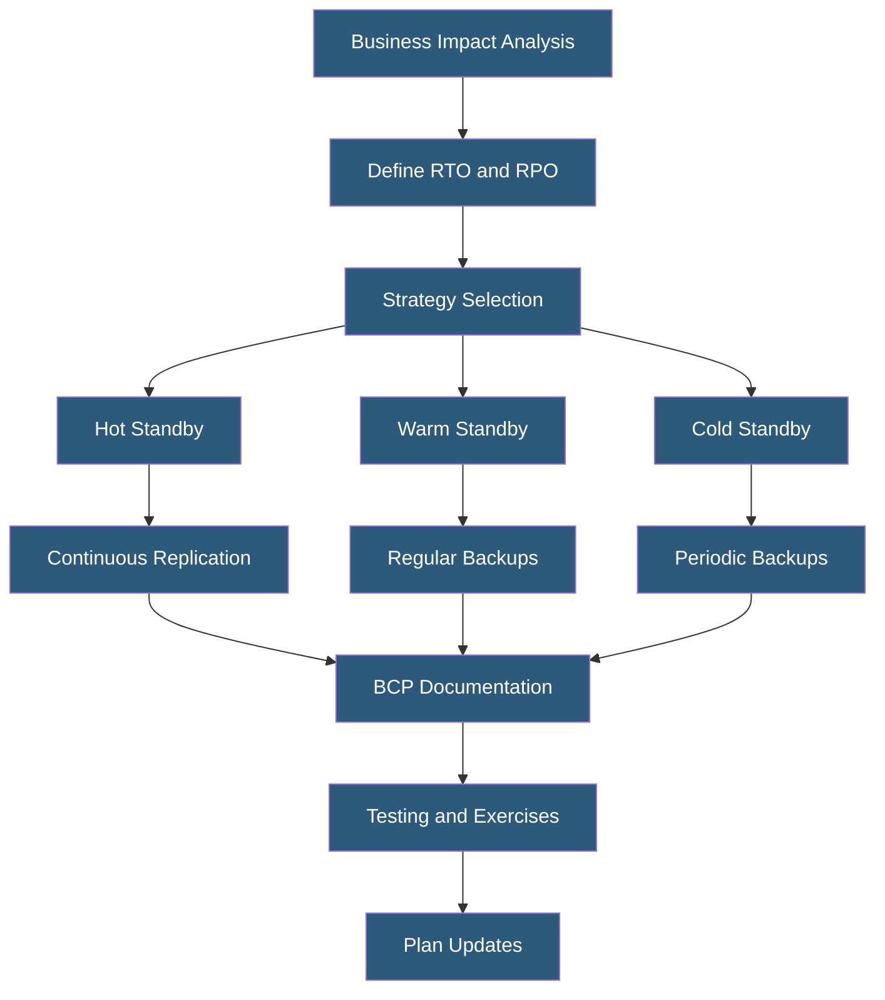

**Category:** Compliance & Regulations
**Difficulty:** Intermediate
**Reading time:** 6 min read

---

Business continuity planning (BCP) defines how an organization maintains essential operations during and after disruptive events, from natural disasters to cyberattacks. Compliance frameworks including ISO 22301, ISO 27001, SOC 2, HIPAA, and PCI DSS require documented BCP with tested recovery procedures, Recovery Time Objectives (RTOs), and Recovery Point Objectives (RPOs).

- **RTO (Recovery Time Objective)** — maximum acceptable time for a system or process to be restored after an incident
- **RPO (Recovery Point Objective)** — maximum acceptable data loss measured in time (e.g., 4-hour RPO means backups every 4 hours)
- **BIA (Business Impact Analysis)** — assessment identifying critical business functions and quantifying impact of disruption
- **DR (Disaster Recovery)** — technical subset of BCP focused on restoring IT systems after catastrophic failure
- **Failover** — automatic or manual switching to a redundant system when the primary fails
- **ISO 22301** — international standard for Business Continuity Management Systems (BCMS)
- **Tabletop Exercise** — discussion-based scenario walkthrough testing plan without actual system disruption

BCP begins with a Business Impact Analysis identifying which business functions are critical, the consequences of disruption over time (hours, days, weeks), and the dependencies between functions. The BIA drives RTO and RPO targets for each critical function — payment processing might require a 15-minute RTO and 5-minute RPO, while internal reporting tools might tolerate 24-hour RTO and 8-hour RPO. These targets directly determine the technical architecture and cost of recovery solutions.

Recovery strategies range from hot standby (fully operational parallel environment with continuous replication, enabling near-instant failover) to warm standby (scaled-down environment regularly updated, requiring 30–60 minutes to scale up) to cold standby (documented procedures and pre-provisioned resources, requiring hours to days to restore). Cloud architectures enable intermediate strategies — pre-configured infrastructure-as-code that can be deployed in minutes into a secondary region with recent data restored from cloud backups.

For hosting environments, BCP must address both infrastructure failures (hardware failure, datacenter outage, cloud region failure) and security incidents (ransomware, data corruption). These require different recovery approaches: infrastructure failures typically use warm or hot standby with automated failover, while security incidents require clean, verified backup restoration to avoid bringing compromised data back into production.

Compliance frameworks require annual BCP testing — at minimum through tabletop exercises, and ideally through failover drills that actually invoke recovery procedures. SOC 2 Availability criteria require evidence of tested recovery procedures. ISO 27001 Annex A Control 5.29 requires ICT readiness for business continuity. HIPAA requires contingency planning as an addressable implementation specification. Test results must be documented and plan updates made based on lessons learned.

- Cloud hosting provider maintaining multi-region active-active architecture for 99.99% SLA compliance
- SaaS company testing annual DR failover to secondary AWS region with 4-hour RTO target
- Healthcare organization BCP covering ransomware scenario with clean backup restoration procedure
- Financial services firm maintaining sub-second RPO for transaction systems using synchronous database replication
- Compliance team documenting BCP for SOC 2 Availability TSC evidence package

| Advantage | Disadvantage |
|-----------|--------------|
| Reduces downtime and data loss during disruptive events | Hot standby environments can cost 50–100% of primary infrastructure cost |
| Meets regulatory requirements across SOC 2, ISO 27001, HIPAA | RTOs of minutes require continuous investment in redundancy |
| BIA prioritization focuses investment on truly critical systems | Annual testing is minimum — untested plans often fail when invoked |
| Cloud architectures enable cost-effective tiered recovery strategies | Complex multi-region architectures introduce operational and data consistency challenges |

- [Disaster Recovery Compliance](disaster-recovery-compliance.md)
- [Incident Response Plans](incident-response-plans.md)
- [SOC 2 Certification](soc-2-certification.md)

---
*Part of the [Compliance & Regulations](index.md) category · [Back to Master Index](../../index.md)*
