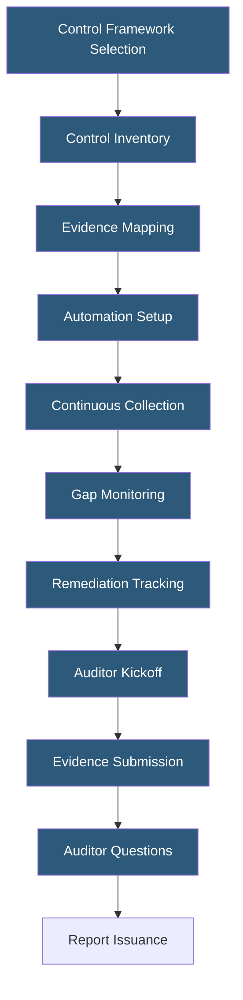

**Category:** Compliance & Regulations
**Difficulty:** Intermediate
**Reading time:** 6 min read

---

Compliance audit preparation involves building and maintaining continuous evidence collection systems, control documentation, and organizational readiness to withstand scrutiny from third-party auditors. Shifting from point-in-time "audit season" panic to year-round compliance operations dramatically reduces audit costs and improves audit outcomes.

- **Control Objective** — the goal a specific control is designed to achieve (e.g., "prevent unauthorized access to production")
- **Evidence** — documentation proving a control operated as designed during the audit period
- **Continuous Control Monitoring** — automated systems that verify controls are operating in real-time
- **Audit Readiness Platform** — tools like Vanta, Drata, or Secureframe that automate evidence collection
- **Compensating Control** — alternative control that achieves the same objective when the primary control cannot be implemented
- **Management Response** — formal response to auditor findings explaining remediation plans and timelines
- **Audit Trail** — immutable chronological record demonstrating control operation

Effective audit preparation starts months before the audit engagement, ideally running as a continuous operation year-round. Organizations should begin with a complete control inventory mapping every required control to the responsible owner, the evidence that demonstrates it, and the system or tool that generates that evidence. This mapping becomes the foundation for automation.

Modern compliance platforms connect to cloud providers (AWS, GCP, Azure), identity providers (Okta, Active Directory), code repositories (GitHub, GitLab), and ticketing systems (Jira, ServiceNow) to automatically collect evidence: user access lists, MFA enrollment status, encryption configurations, patch histories, security training completions, and change management records. Automated evidence collection eliminates the manual scramble of gathering screenshots and exports during audit season.

Gap monitoring identifies control failures in real-time. When a new employee is added without completing security training, or when MFA is disabled on an account, the compliance platform raises an alert rather than letting it accumulate into an audit finding. Remediation should be tracked in tickets with completion evidence attached.

During the audit, organized evidence packages reduce auditor time and improve outcomes. Auditors typically test a sample of controls across the period; having automated evidence for every instance (rather than a few screenshots) gives auditors confidence in control consistency. Preparing a control narrative — a description of how each control works and why it is effective — helps auditors understand the organization's posture without lengthy back-and-forth. When exceptions do occur, a prepared management response with root cause analysis and remediation timeline signals organizational maturity.

- SaaS companies preparing for their first SOC 2 Type II audit
- Hosting providers maintaining ISO 27001 with annual surveillance audits
- Healthcare platforms undergoing HIPAA risk analysis and control assessment
- Financial services firms subject to multiple concurrent compliance frameworks
- Startups building compliance infrastructure before enterprise sales cycles begin

| Advantage | Disadvantage |
|-----------|--------------|
| Continuous monitoring reduces audit findings | Compliance platform tools add subscription cost ($15,000–$50,000/year) |
| Year-round readiness eliminates "audit season" crunch | Initial control inventory and automation setup is time-intensive |
| Automated evidence is more defensible than manual screenshots | Automation gaps require manual processes for non-integrated systems |
| Faster audit completion with organized evidence packages | Cross-framework compliance multiplies control documentation burden |

- [SOC 2 Certification](soc-2-certification.md)
- [ISO 27001 Certification](iso-27001-certification.md)
- [Compliance Documentation](compliance-documentation.md)

---
*Part of the [Compliance & Regulations](index.md) category · [Back to Master Index](../../index.md)*
