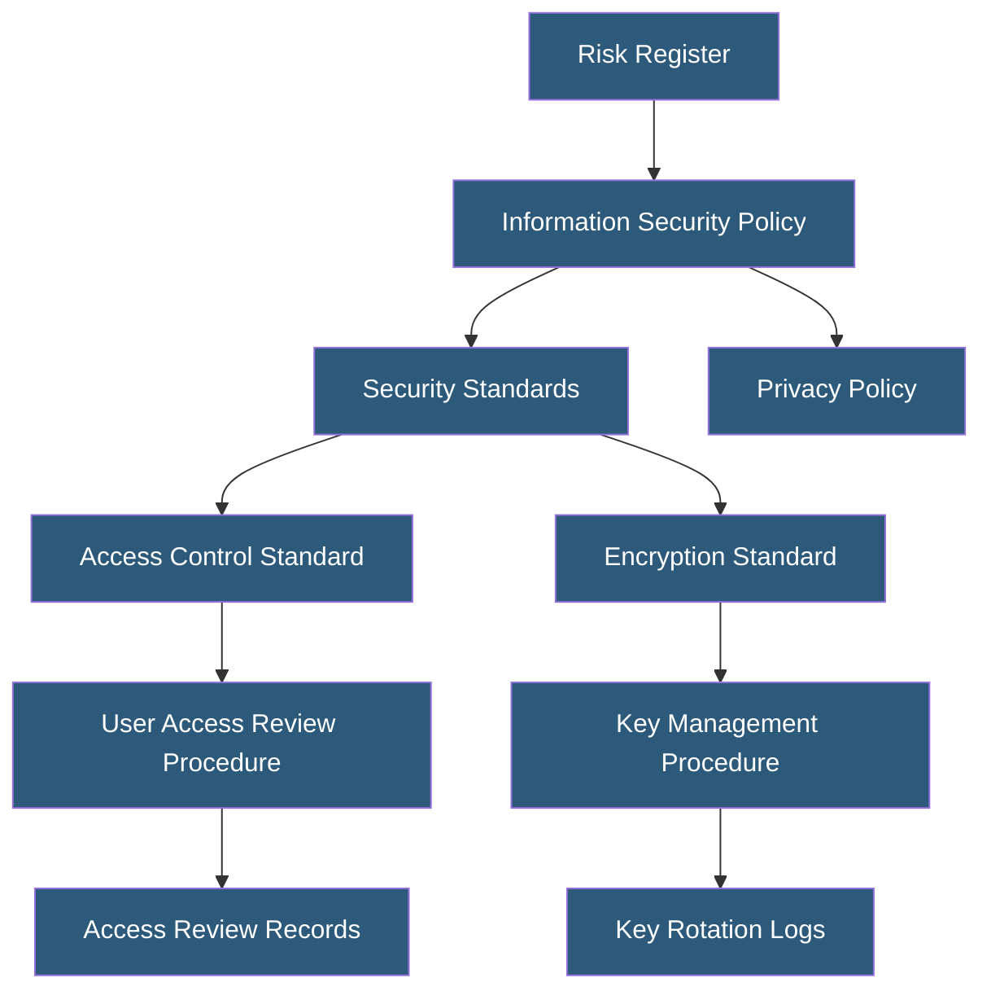

**Category:** Compliance & Regulations
**Difficulty:** Beginner
**Reading time:** 5 min read

---

Compliance documentation encompasses the policies, procedures, records, and evidence artifacts that demonstrate an organization meets its regulatory obligations. Well-structured documentation is both a legal requirement under frameworks like GDPR and ISO 27001 and a practical tool for maintaining consistent security and privacy operations across teams.

- **Policy** — high-level statement of organizational intent and direction (e.g., Information Security Policy)
- **Procedure** — step-by-step instructions for implementing a policy (e.g., User Access Review Procedure)
- **Standard** — specific mandatory requirements within a domain (e.g., Password Complexity Standard)
- **Guideline** — recommended but non-mandatory best practices supporting standards
- **Record** — evidence that a procedure was followed (e.g., completed access review log)
- **Document Control** — version management and approval workflows ensuring documents are current and authorized
- **Retention Schedule** — policy defining how long different document types must be kept

Compliance documentation follows a hierarchical structure with policies at the top and operational records at the bottom. Policies set the "what and why" — they are approved by senior leadership and change infrequently. Standards define the "how much" — specific requirements like "passwords must be 12+ characters with complexity." Procedures define "how" — step-by-step workflows employees follow. Records prove that procedures were actually executed.

Document control is critical: every policy and procedure document should have a version number, effective date, owner, approver, and next review date. GDPR Article 30 requires a Record of Processing Activities (RoPA), and ISO 27001 requires documented evidence for every applicable control. Without version control and approval workflows, organizations cannot demonstrate to auditors that their documentation was current during the audit period.

For hosting environments, key documents include: an Information Security Policy, Acceptable Use Policy, Data Classification Policy, Access Control Policy and Procedure, Incident Response Plan, Business Continuity Plan, Vendor Management Policy, Change Management Procedure, and Backup and Recovery Procedure. These should be stored in a centralized, access-controlled repository — not in individual employees' email folders.

Annual review cycles are the minimum expectation; documents should also be reviewed after significant changes to the environment, major incidents, or when regulatory requirements change. Records (evidence) must be retained per applicable regulations — GDPR requires 3-year retention for some records, HIPAA 6 years, PCI DSS 1 year for certain logs, and SOC 2 auditors typically examine a 12-month period.

- Building a documentation library for a first SOC 2 Type II audit
- Establishing GDPR accountability documentation per Article 5(2)
- Onboarding employees to consistent security procedures across a growing team
- Responding to enterprise customer security questionnaires with policy documents
- Demonstrating ISO 27001 ISMS documentation completeness to certification auditors

| Advantage | Disadvantage |
|-----------|--------------|
| Demonstrates accountability to regulators and customers | Creating and maintaining documentation requires dedicated resources |
| Consistent procedures reduce human error in security operations | Outdated documentation can be worse than no documentation |
| Accelerates audit processes with organized evidence | Over-documentation creates noise and reduces readability |
| Enables employee onboarding and knowledge transfer | Document management tools add cost and administrative overhead |

- [Compliance Audit Preparation](compliance-audit-preparation.md)
- [SOC 2 Certification](soc-2-certification.md)
- [Logging and Audit Trails](logging-and-audit-trails.md)

---
*Part of the [Compliance & Regulations](index.md) category · [Back to Master Index](../../index.md)*
