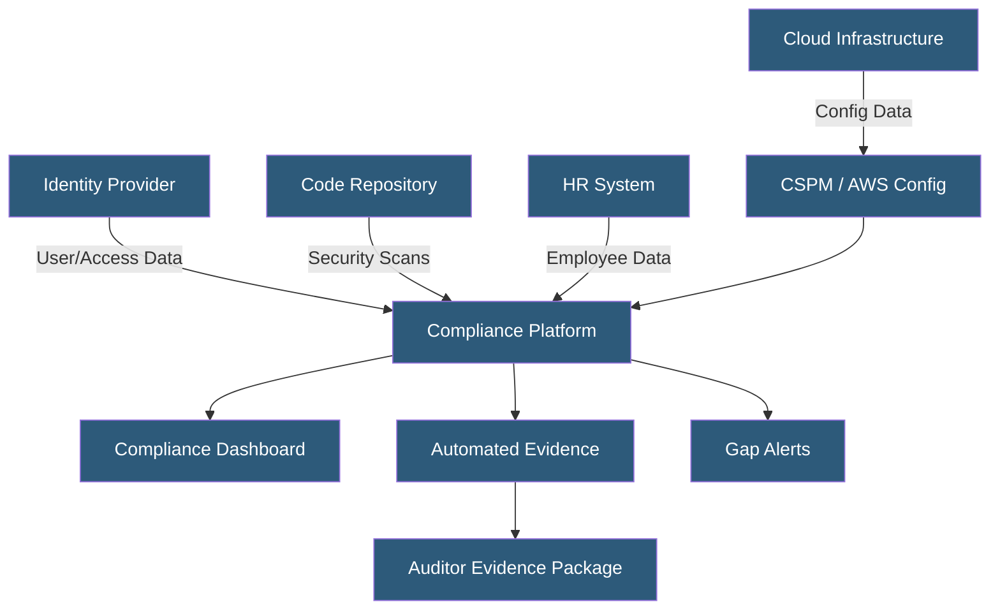

**Category:** Compliance & Regulations
**Difficulty:** Intermediate
**Reading time:** 6 min read

---

Compliance monitoring automation replaces manual, periodic control checks with continuous, automated verification that security controls are operating as designed. Tools like Vanta, Drata, Secureframe, and cloud-native services (AWS Security Hub, Azure Policy) provide real-time visibility into compliance posture and automatically collect audit evidence throughout the year.

- **Continuous Control Monitoring** — automated, real-time verification of control operation rather than point-in-time sampling
- **Compliance Platform** — SaaS tools (Vanta, Drata, Secureframe, Tugboat Logic) that integrate with tech stack to automate evidence collection
- **Policy as Code** — infrastructure and security policies defined in code and automatically enforced (e.g., AWS Config rules, OPA)
- **Drift Detection** — automated identification when infrastructure configuration deviates from compliant baselines
- **AWS Config / Azure Policy** — cloud-native services continuously evaluating resource configurations against compliance rules
- **CSPM (Cloud Security Posture Management)** — tools monitoring cloud configurations for compliance and security misconfigurations
- **Alerting Threshold** — defined control failure rate triggering notification to compliance teams for remediation

Compliance monitoring automation integrates with the organization's existing technology stack to continuously collect evidence and detect control failures. Modern compliance platforms connect to cloud providers (reading resource configurations, security group rules, encryption settings), identity providers (monitoring MFA enrollment, user counts, access reviews), code repositories (scanning for secrets, checking branch protection), HR systems (tracking employee onboarding and security training completion), and ticketing systems (verifying change management processes).

At the infrastructure level, cloud-native tools provide real-time compliance evaluation. AWS Config evaluates resource configurations against managed rules (e.g., "S3 buckets must not be public," "RDS instances must be encrypted") and custom rules written in Lambda or as Config Rules. AWS Security Hub aggregates findings from Config, GuardDuty, Inspector, and third-party tools into a centralized compliance score against CIS Benchmarks, PCI DSS, and other frameworks. Similar capabilities exist in Azure Policy and GCP Security Command Center.

Policy as Code uses tools like Open Policy Agent (OPA) or Terraform Sentinel to enforce compliance at the infrastructure provisioning stage — preventing non-compliant resources from being created rather than detecting them after the fact. Conftest can validate Kubernetes manifests, Dockerfiles, and Terraform plans against policies before deployment.

When controls fail, automated alerting routes issues to responsible owners via Slack, Jira, or email. The compliance platform tracks remediation progress and maintains evidence of both the failure and the fix. For SOC 2 audits, this automated evidence collection produces a comprehensive audit package with timestamped records covering the entire audit period, rather than a handful of screenshots scrambled together at audit time.

- SaaS startup using Drata to automate SOC 2 Type II evidence collection across AWS, GitHub, and Okta
- Hosting provider using AWS Security Hub for continuous PCI DSS compliance monitoring
- Enterprise security team using CSPM to detect and alert on cloud misconfiguration in real-time
- Platform engineering team implementing OPA policies to prevent non-compliant Kubernetes deployments
- ISO 27001 holder automating annual internal audit evidence collection to reduce audit preparation time

| Advantage | Disadvantage |
|-----------|--------------|
| Real-time compliance visibility vs quarterly point-in-time reviews | Compliance platform subscriptions cost $15,000–$60,000+ annually |
| Automated evidence collection reduces audit preparation time by 50–70% | Integration setup requires engineering time and API access |
| Continuous monitoring catches control failures before they become audit exceptions | Alert fatigue if alert thresholds are not carefully calibrated |
| Policy as Code prevents compliance drift at deployment time | Coverage gaps remain for non-integrated systems requiring manual evidence |

- [Compliance Audit Preparation](compliance-audit-preparation.md)
- [Logging and Audit Trails](logging-and-audit-trails.md)
- [Third-Party Risk Management](third-party-risk-management.md)

---
*Part of the [Compliance & Regulations](index.md) category · [Back to Master Index](../../index.md)*
