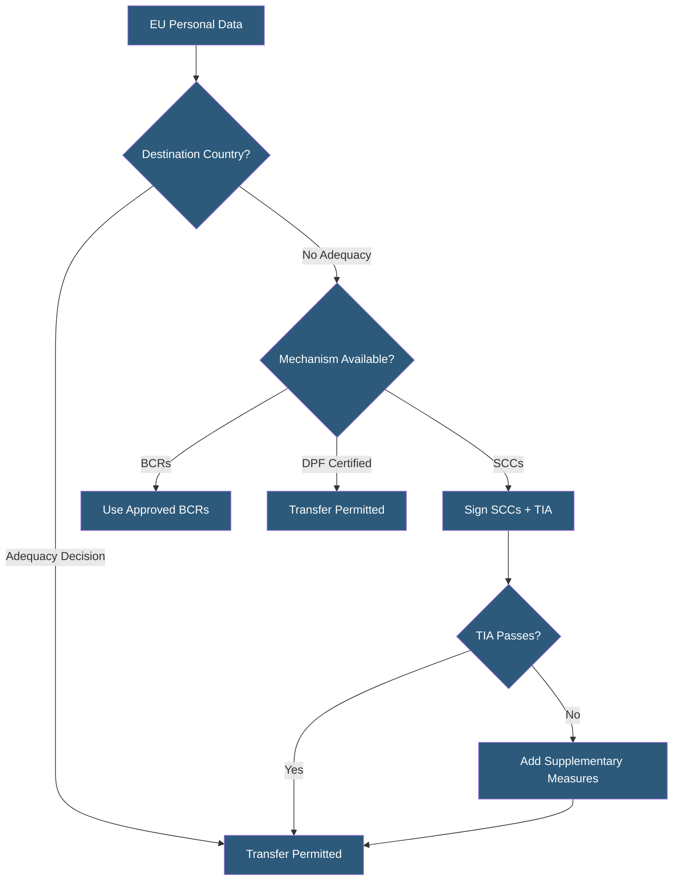

**Category:** Compliance & Regulations
**Difficulty:** Advanced
**Reading time:** 7 min read

---

Cross-border data transfers involve moving personal data from one country or jurisdiction to another, subject to legal restrictions designed to ensure that data protection standards are maintained regardless of where data travels. GDPR Chapter V establishes a hierarchy of transfer mechanisms, from adequacy decisions to standard contractual clauses, that govern transfers from the EU to third countries.

- **Adequacy Decision** — European Commission ruling that a third country provides equivalent data protection (e.g., UK, Japan, Israel)
- **Standard Contractual Clauses (SCCs)** — EU Commission-approved contract terms providing transfer safeguards; 2021 version is current
- **Binding Corporate Rules (BCRs)** — intra-group transfer mechanism approved by supervisory authority for multinational companies
- **Transfer Impact Assessment (TIA)** — evaluation of whether a destination country's laws undermine SCC protections
- **EU-US Data Privacy Framework** — adequacy decision for US organizations certified under the DPF (adopted July 2023)
- **Supplementary Measures** — additional technical or contractual safeguards (e.g., encryption) layered on top of SCCs
- **Chapter V Derogations** — limited exceptions allowing transfers without a formal mechanism (e.g., explicit consent, vital interests)

When personal data moves from the EU/EEA to a country without an adequacy decision (including China, India, and many others), organizations must implement one of the approved transfer mechanisms. Standard Contractual Clauses (SCCs) are the most widely used: the 2021 EU SCCs replaced the prior versions and offer four modules covering different controller/processor relationships. Controllers and processors sign the relevant module, which imposes contractual obligations on the data importer equivalent to GDPR standards.

Following the Schrems II ruling (2020), SCCs alone are no longer sufficient — organizations must also conduct Transfer Impact Assessments (TIAs) evaluating whether the destination country's surveillance laws and government access rights would undermine the protections in the SCCs. If a TIA reveals problematic laws (e.g., broad national security surveillance), supplementary measures must be added: end-to-end encryption where the importer cannot access plaintext, pseudonymization so that transferred data cannot identify individuals, or contractual provisions prohibiting disclosure to government authorities without legal notice to the data exporter.

The EU-US Data Privacy Framework (DPF), adopted in July 2023, restored a relatively straightforward transfer mechanism for transfers to certified US organizations. However, DPF faces ongoing legal challenges and organizations should maintain SCCs as a backup. For intra-group international transfers in multinational corporations, Binding Corporate Rules provide a more permanent mechanism approved directly by supervisory authorities, though approval takes 18–24 months.

Cloud providers have adapted their DPAs to include the 2021 SCCs and typically conduct their own TIAs for their infrastructure locations. Organizations using these providers should verify that the specific data processing regions are covered by the provider's SCCs and TIA documentation.

- European SaaS company using US-based analytics or monitoring vendors
- Multinational hosting provider transferring customer data across its global datacenter network
- Healthcare platform sharing patient data between EU and non-EU research institutions
- E-commerce business using a US-headquartered payment processor from EU storefronts
- Global enterprise implementing BCRs to govern intra-company transfers across 50 countries

| Advantage | Disadvantage |
|-----------|--------------|
| Legal framework enables legitimate global data flows | TIA complexity varies significantly by destination country |
| SCCs are widely understood and accepted by vendors | DPF adequacy decisions face repeated legal challenges |
| BCRs provide operational simplicity for large multinationals | BCR approval process is lengthy and resource-intensive |
| Supplementary measures provide additional protection | Encryption-based measures may conflict with legitimate data processing needs |

- [Data Residency Requirements](data-residency-requirements.md)
- [Standard Contractual Clauses](standard-contractual-clauses.md)
- [Data Processing Agreements](data-processing-agreements.md)

---
*Part of the [Compliance & Regulations](index.md) category · [Back to Master Index](../../index.md)*
