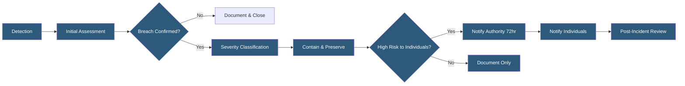

**Category:** Compliance & Regulations
**Difficulty:** Intermediate
**Reading time:** 6 min read

---

Data breach notification procedures define the technical and organizational workflows for detecting, assessing, and reporting unauthorized access to or disclosure of personal data. Regulations like GDPR (72-hour notification), HIPAA (60-day notification), and various US state laws impose strict timelines and content requirements on breach notifications to authorities and affected individuals.

- **Personal Data Breach** — accidental or unlawful destruction, loss, alteration, unauthorized disclosure, or access to personal data
- **72-Hour Rule** — GDPR requirement to notify supervisory authority within 72 hours of becoming aware of a breach
- **Breach Severity Classification** — assessment of risk to individuals: no notification required, authority-only, or individual + authority
- **SIEM (Security Information and Event Management)** — platform aggregating logs and alerts to detect breach indicators
- **Forensic Preservation** — securing evidence of the breach for investigation without destroying artifacts
- **Data Processor Obligation** — processors must notify controllers without undue delay upon discovering a breach
- **Notification Fatigue** — risk of over-notifying authorities for low-risk incidents, degrading signal quality

Breach notification procedures integrate technical detection capabilities with legal and communications workflows. Detection typically originates from SIEM alerts, anomaly detection systems, threat intelligence feeds, or external disclosure (e.g., security researcher report or law enforcement notification). Upon detection, the incident response team performs an initial triage to confirm whether a breach has occurred and scope the affected data.

Severity classification determines notification obligations. Under GDPR, three outcomes are possible: (1) no notification required if the breach is unlikely to result in risk to individuals (e.g., encrypted data stolen with no key access); (2) authority notification required but not individual notification for moderate-risk incidents; (3) both authority and individual notification required for high-risk incidents. GDPR notification to the supervisory authority must include: nature of the breach, categories and approximate number of data subjects and records affected, likely consequences, and measures taken or proposed.

The 72-hour GDPR clock starts when the organization "becomes aware" — which courts and regulators interpret as when there is reasonable certainty a breach has occurred, not when investigation is complete. Organizations may make initial notifications with available information and provide supplementary details as the investigation progresses. HIPAA operates differently — a 60-day clock from discovery of the breach, with affected individuals and HHS notified, plus media notification for breaches affecting 500+ residents in a state. US state breach notification laws vary significantly; 50 different state laws create complex notification matrices for national incidents.

- Cloud hosting provider detecting unauthorized access to a shared storage bucket containing customer data
- SaaS platform discovering a SQL injection attack that exposed user records
- Healthcare system identifying ransomware affecting servers containing ePHI
- E-commerce site learning of a payment skimmer inserted into their checkout flow
- Insider threat investigation revealing unauthorized bulk data export by a terminated employee

| Advantage | Disadvantage |
|-----------|--------------|
| Legal compliance avoids regulatory fines | 72-hour notification window requires 24/7 incident response capability |
| Timely notification limits harm to affected individuals | Premature notification with incomplete information can cause confusion |
| Documented procedures reduce chaos during high-stress incidents | Multiple conflicting regulatory requirements complicate global notifications |
| Post-incident reviews drive security improvements | Public breach disclosures can damage brand reputation and customer trust |

- [Incident Response Plans](incident-response-plans.md)
- [Logging and Audit Trails](logging-and-audit-trails.md)
- [GDPR Compliance for Hosting](gdpr-compliance-for-hosting.md)

---
*Part of the [Compliance & Regulations](index.md) category · [Back to Master Index](../../index.md)*
