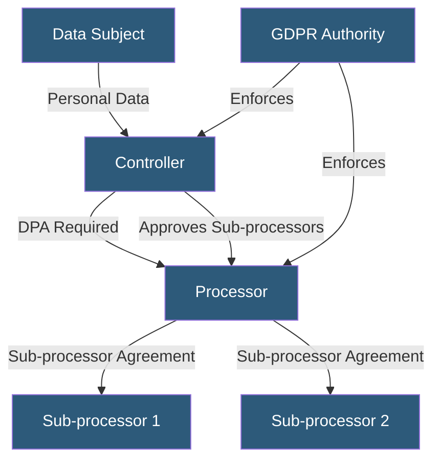

**Category:** Compliance & Regulations
**Difficulty:** Intermediate
**Reading time:** 6 min read

---

Data Processing Agreements (DPAs) are legally binding contracts required under GDPR Article 28 between data controllers and data processors, establishing the terms under which processors may handle personal data on behalf of controllers. Hosting providers, cloud platforms, and SaaS vendors are typically processors requiring DPAs with all customers who send them personal data.

- **Controller** — entity that determines the purpose and means of processing personal data
- **Processor** — entity that processes personal data solely on the controller's documented instructions
- **Sub-processor** — third party engaged by a processor to assist with processing (requires controller approval)
- **Processing Instructions** — documented scope and limitations of what the processor may do with the data
- **Audit Rights** — controller's right to audit or inspect the processor's compliance with the DPA
- **Liability Allocation** — contractual provisions determining responsibility for breaches and regulatory fines
- **Standard Contractual Clauses (SCCs)** — EU Commission-approved contract terms for cross-border data transfers

A DPA must be in place before any personal data flows from a controller to a processor. Under GDPR Article 28, the DPA must specify: the subject matter, duration, nature and purpose of processing, the type of personal data and categories of data subjects, and the obligations and rights of the controller. Critically, the processor may only process data on documented instructions from the controller and must notify the controller if those instructions violate applicable law.

DPAs must address data security, requiring processors to implement appropriate technical and organizational measures. They must ensure personnel handling personal data are subject to confidentiality obligations. They must assist controllers with fulfilling data subject rights requests (access, erasure, portability) and with regulatory obligations (DPIAs, breach notifications). They must delete or return all personal data at the end of the contract. They must make available all information necessary to demonstrate compliance and allow audits.

Sub-processor management is a significant operational challenge. Processors must obtain controller authorization before engaging sub-processors, either specific approval for each sub-processor or general authorization with a right to object to new additions. Major cloud providers maintain public sub-processor lists and offer DPA templates online (AWS DPA, Google Cloud DPA, Azure DPA) that flow down these obligations to their sub-processors. When a processor uses a sub-processor, the processor remains fully liable to the controller for the sub-processor's performance.

For cross-border transfers within DPAs, where data moves outside the EEA to countries lacking an adequacy decision, DPAs must incorporate Standard Contractual Clauses (SCCs) — the 2021 EU SCCs are currently the primary mechanism for lawful transfers to third countries including the US.

- SaaS company signing DPAs with all EU enterprise customers before onboarding
- Cloud hosting provider maintaining a standard DPA for all European customers
- Healthcare platform ensuring BAAs (HIPAA equivalent of DPAs) cover all service vendors
- Marketing automation tool publishing a DPA and sub-processor list for customer transparency
- Multinational corporation auditing its entire vendor ecosystem for missing DPAs

| Advantage | Disadvantage |
|-----------|--------------|
| Creates legally enforceable privacy obligations on processors | Negotiating custom DPAs with large vendors is often not possible |
| Clarifies accountability between parties in case of breach | Sub-processor chains create complex liability webs |
| Standardized SCCs reduce legal complexity for cross-border transfers | DPA management at scale (100s of vendors) requires dedicated tooling |
| Demonstrates GDPR compliance to regulators | Controller audit rights are rarely exercised in practice |

- [Subprocessor Management](subprocessor-management.md)
- [Cross-Border Data Transfers](cross-border-data-transfers.md)
- [GDPR Compliance for Hosting](gdpr-compliance-for-hosting.md)

---
*Part of the [Compliance & Regulations](index.md) category · [Back to Master Index](../../index.md)*
