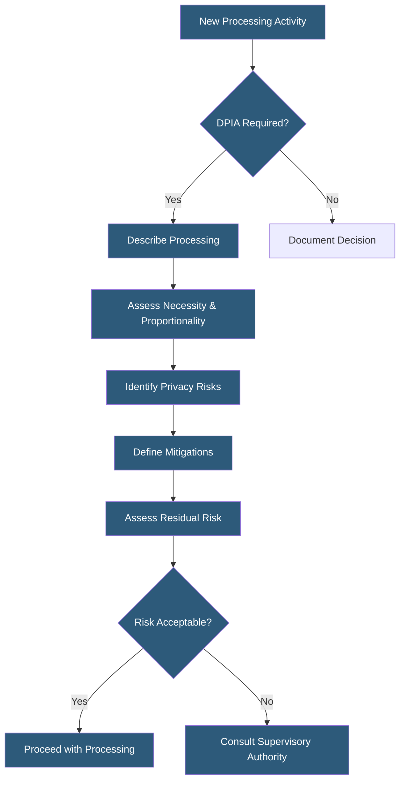

**Category:** Compliance & Regulations
**Difficulty:** Intermediate
**Reading time:** 6 min read

---

A Data Protection Impact Assessment (DPIA) is a structured process for identifying and minimizing privacy risks before deploying new systems or processing activities that involve personal data. Under GDPR Article 35, DPIAs are mandatory for processing activities that are likely to result in high risk to individuals' rights and freedoms.

- **High Risk Processing** — activities such as systematic profiling, large-scale processing of special categories, or systematic monitoring of public areas
- **Data Flow Mapping** — documenting how personal data moves through systems, from collection to deletion
- **Risk Assessment Matrix** — framework evaluating likelihood and severity of privacy risks
- **Mitigation Measures** — technical or organizational controls implemented to reduce identified risks
- **Residual Risk** — remaining risk after mitigations are applied, which must be acceptable or require DPA consultation
- **Supervisory Authority Consultation** — required when residual risk remains high after mitigation measures
- **Privacy by Design** — engineering principle of building privacy protections into systems from the outset

DPIAs are triggered when a new processing activity is likely to result in high risk to individuals. GDPR identifies specific triggers including systematic and extensive profiling with automated decision-making, large-scale processing of special category data (health, biometric, criminal records), and systematic monitoring of publicly accessible areas. Many organizations apply a screening checklist to all new projects to determine DPIA necessity.

The DPIA methodology has three core components. First, a systematic description of the envisioned processing — what data is collected, from whom, for what purpose, on what legal basis, who has access, and what technical measures are in place. Second, an assessment of necessity and proportionality — is the processing limited to what is required for the stated purpose? Third, a risk assessment evaluating specific threats: unauthorized access, data loss, unintended disclosure, loss of control by data subjects, and inability to exercise rights.

For each identified risk, the DPIA documents the likelihood, severity, and proposed mitigations. Technical measures might include pseudonymization, encryption, access controls, data minimization, or anonymization. Organizational measures include staff training, data processing agreements with vendors, and retention policies. After mitigations, residual risk is evaluated. If it remains high, the organization must consult the supervisory authority before proceeding. DPIAs must be reviewed when the nature of the processing changes significantly and kept on file to demonstrate accountability under GDPR.

- Deploying behavioral analytics tracking individual users across a platform
- Launching a new health-related mobile application collecting medical data
- Implementing employee monitoring software tracking productivity metrics
- Migrating customer databases to a new cloud provider in a different jurisdiction
- Introducing AI-based automated decision-making into customer-facing processes

| Advantage | Disadvantage |
|-----------|--------------|
| Identifies privacy risks before systems are built | Time-consuming process requiring cross-functional input |
| Demonstrates accountability to regulators | May delay project timelines for new features |
| Reduces costly post-deployment remediation | DPIA quality highly dependent on team expertise |
| Builds privacy culture within engineering teams | No standard format — inconsistency across organizations |

- [GDPR Compliance for Hosting](gdpr-compliance-for-hosting.md)
- [Privacy by Design Principles](privacy-by-design-principles.md)
- [Data Processing Agreements](data-processing-agreements.md)

---
*Part of the [Compliance & Regulations](index.md) category · [Back to Master Index](../../index.md)*
