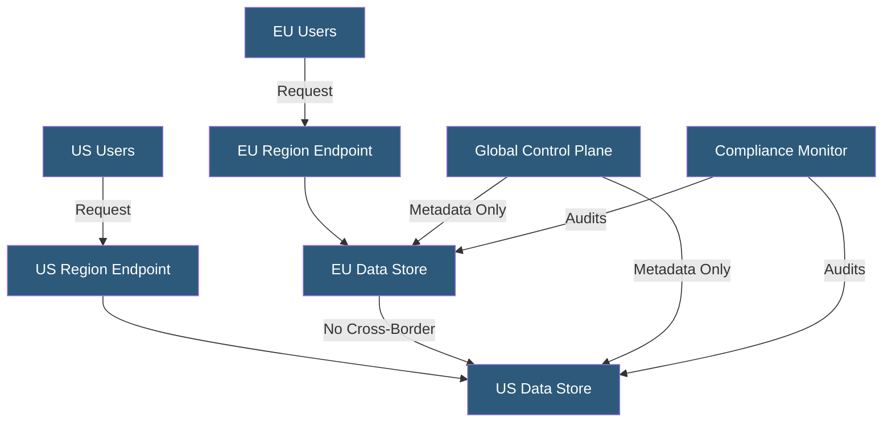

**Category:** Compliance & Regulations
**Difficulty:** Intermediate
**Reading time:** 6 min read

---

Data residency requirements mandate that certain categories of data must be stored and processed within specific geographic boundaries, driven by national laws, industry regulations, or contractual obligations. Hosting architectures must be designed with explicit regional controls to satisfy these constraints without sacrificing performance or availability.

- **Data Residency** — the requirement that data physically resides within a specific country or region
- **Data Sovereignty** — the concept that data is subject to the laws of the jurisdiction where it resides
- **Data Localization** — stricter form requiring data to be processed locally, not just stored locally
- **Availability Zone (AZ)** — isolated datacenter within a cloud region used to enforce residency
- **Region Lock** — cloud configuration preventing data replication to unauthorized geographic regions
- **Geo-Restriction** — CDN or DNS policy preventing data from being served from non-compliant locations
- **Cross-Border Transfer** — movement of data from one jurisdiction to another, often requiring legal basis

Data residency is enforced through a combination of cloud provider configuration, contractual controls, and technical architecture decisions. Cloud providers like AWS, Azure, and GCP offer dedicated regions and explicit settings to prevent data from leaving a geographic boundary, including options to disable cross-region replication and restrict backup targets.

At the application layer, residency requires careful routing logic — users in a regulated jurisdiction must be identified (typically by account registration country or billing address) and their data must be directed to compliant infrastructure. This often means maintaining separate database clusters, object storage buckets, and encryption key stores per region.

Key management is a critical residency concern: encryption keys must reside in the same jurisdiction as the data they protect, typically via cloud HSMs or dedicated key management services (KMS) in the required region. Using a global KMS in a foreign jurisdiction technically means a foreign entity could decrypt locally stored data, violating residency intent.

Backup and disaster recovery add complexity — off-site backups are a standard practice, but copying backups to another country may violate residency laws. Solutions include in-country backup facilities, encrypted backups with keys stored locally, or country-specific DR sites. Ongoing monitoring via data lineage tools and cloud audit logs is essential to detect and alert on any inadvertent cross-border transfers.

- Russian law (Federal Law 242-FZ) requiring Russian citizen data on Russian servers
- German banking regulations requiring financial data to remain in Germany
- Healthcare platforms in Australia subject to Australian Privacy Act data localization
- EU-based SaaS companies maintaining separate EU data stores for GDPR compliance
- Government cloud deployments requiring data to remain within national infrastructure

| Advantage | Disadvantage |
|-----------|--------------|
| Meets legal and regulatory requirements | Increases infrastructure cost with duplicate regional stacks |
| Reduces jurisdictional risk | Higher latency for globally distributed teams |
| Simplifies data governance | Complicates disaster recovery across regions |
| Builds enterprise customer confidence | Multi-region architecture adds operational complexity |

- [GDPR Compliance for Hosting](gdpr-compliance-for-hosting.md)
- [Cross-Border Data Transfers](cross-border-data-transfers.md)
- [Encryption Requirements](encryption-requirements.md)

---
*Part of the [Compliance & Regulations](index.md) category · [Back to Master Index](../../index.md)*
