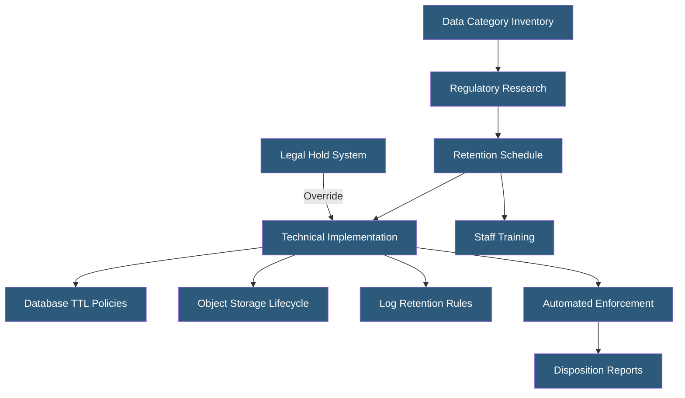

**Category:** Compliance & Regulations
**Difficulty:** Beginner
**Reading time:** 5 min read

---

Data retention policies define how long different categories of data must be kept and when they must be securely deleted, balancing regulatory retention requirements against privacy obligations to minimize data. Effective retention policies are implemented through automated enforcement in storage systems, databases, and backup infrastructure.

- **Retention Schedule** — documented table mapping data categories to minimum and maximum retention periods
- **Legal Hold** — suspension of normal retention schedules when data is relevant to litigation or regulatory investigation
- **Data Minimization** — GDPR principle requiring data to be kept only as long as necessary for its purpose
- **Automated Deletion** — technical mechanisms (database TTLs, lifecycle policies, scheduled jobs) enforcing retention limits
- **Retention Trigger** — event starting the retention clock (account creation, last activity, contract end, employment termination)
- **Disposition** — the process of securely deleting or anonymizing data at end of retention period
- **Conflicting Requirements** — situations where one regulation requires retention while another requires deletion

Data retention begins with a complete data inventory identifying all categories of data, where they are stored, and what purpose they serve. This is then matched against regulatory requirements: GDPR requires data to be kept only as long as necessary for its stated purpose (storage limitation principle); HIPAA requires 6-year retention for records related to policies and procedures; PCI DSS requires 1-year online and 3-year archive retention for transaction logs; employment laws in various jurisdictions require retention of employee records for 3–7 years after separation.

The resulting retention schedule maps each data category to minimum retention (the shortest legal hold period) and maximum retention (the latest the data must be deleted). For many categories, the minimum equals the maximum, providing clear deletion targets. For some categories (e.g., audit logs), multiple regulations with different requirements may apply simultaneously — the longest mandatory retention period governs.

Technical enforcement uses platform-native features: AWS S3 lifecycle rules can automatically transition objects to cheaper storage and then delete them; database TTL columns trigger automated record deletion; log management systems like Elasticsearch have index lifecycle management (ILM) policies. These automated mechanisms are more reliable than manual cleanup processes and produce audit evidence of disposition.

Legal hold systems must be able to override automated deletion for specific data subjects or time periods when litigation or investigation is anticipated. Integration between legal hold management and data systems ensures that data subject to a hold is preserved even when its normal retention period has passed. Regular disposition reporting — documenting what data was deleted, when, and by what mechanism — provides evidence of retention policy compliance.

- SaaS platform automating deletion of free-tier user data after 90 days of inactivity
- Healthcare provider enforcing 6-year retention for medical records under HIPAA
- Financial services firm applying 7-year retention to transaction records per SEC requirements
- E-commerce site setting automated purge of payment card data immediately after transaction processing
- HR platform managing jurisdiction-specific employee record retention across 40 countries

| Advantage | Disadvantage |
|-----------|--------------|
| Reduces privacy liability by limiting personal data retained | Multiple conflicting regulatory requirements require careful reconciliation |
| Automated enforcement is more reliable than manual processes | Implementing automated deletion across complex legacy systems is difficult |
| Reduces storage costs by eliminating unnecessary data accumulation | Legal holds require override mechanisms that complicate automated systems |
| Demonstrates GDPR storage limitation compliance | Overly aggressive retention may delete data needed for dispute resolution |

- [GDPR Compliance for Hosting](gdpr-compliance-for-hosting.md)
- [Right to Be Forgotten Implementation](right-to-be-forgotten-implementation.md)
- [Logging and Audit Trails](logging-and-audit-trails.md)

---
*Part of the [Compliance & Regulations](index.md) category · [Back to Master Index](../../index.md)*
