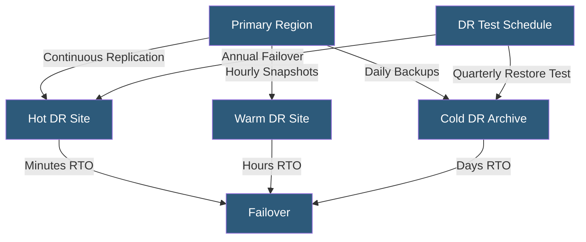

**Category:** Compliance & Regulations
**Difficulty:** Intermediate
**Reading time:** 6 min read

---

Disaster recovery compliance requires organizations to document, implement, and regularly test technical procedures for restoring IT systems and data following catastrophic failure. Compliance frameworks mandate formal DR plans, defined RTOs and RPOs, and evidence that recovery procedures have been tested and can actually meet the stated objectives.

- **DR Plan** — documented procedures for restoring systems after a disaster, separate from broader BCP
- **Recovery Time Objective (RTO)** — maximum time allowed to restore a system to operational status
- **Recovery Point Objective (RPO)** — maximum acceptable data loss measured as time since last backup/replication point
- **Failover Testing** — actually invoking recovery procedures to validate they work under realistic conditions
- **Geo-Redundancy** — distribution of systems and data across geographic locations to survive regional disasters
- **Backup Integrity Testing** — regular verification that backups can successfully restore data
- **DR Runbook** — step-by-step recovery procedure for specific failure scenarios

Disaster recovery compliance begins with formalizing the DR plan as a documented artifact with version control, named owners, and defined review schedules. The plan must specify RTOs and RPOs for each critical system, map the technical recovery procedures to achieve those objectives, define the decision authority for declaring a disaster and invoking recovery, and identify the communication chain to notify stakeholders during recovery.

Technical DR architectures in cloud environments typically use cross-region replication for storage (S3 Cross-Region Replication, Azure GRS, GCS dual-region buckets), database read replicas or managed failover capabilities (RDS Multi-AZ, Aurora Global Database, Cloud SQL with replicas), and infrastructure-as-code (Terraform, CloudFormation) enabling the entire infrastructure stack to be reproduced in a secondary region within minutes. DNS failover (Route 53 health checks, Azure Traffic Manager) provides automated or manual cutover of traffic to the DR site.

The compliance requirement that consistently trips organizations in audits is proof of testing. Documenting a recovery procedure is insufficient — auditors expect evidence that the procedure was executed and the RTO/RPO targets were validated. Annual failover testing for critical systems is the minimum expectation for SOC 2 Availability and ISO 27001. Backup integrity testing (restoring a backup to a test environment and verifying data completeness) should occur at least quarterly, with results documented.

Compliance-specific DR considerations include data residency — DR sites must be in compliant jurisdictions matching the primary data store's regulatory requirements. Healthcare DR must ensure ePHI in the DR environment is protected with equivalent HIPAA safeguards. PCI DSS DR environments are in scope for PCI compliance if they store, process, or transmit cardholder data.

- Healthcare system documenting HIPAA-compliant DR procedures with 4-hour RTO for clinical systems
- Financial services platform maintaining synchronous replication with 0 RPO for transaction databases
- SaaS company performing annual DR test invoking failover to secondary AWS region with documented results
- Hosting provider offering geo-redundant hosting with contractual RTO/RPO SLA commitments
- Government contractor meeting FISMA requirements for backup and recovery in FedRAMP authorization

| Advantage | Disadvantage |
|-----------|--------------|
| Validates recovery capabilities before a real disaster occurs | DR infrastructure and replication costs can equal 50–100% of primary costs |
| Satisfies auditor requirements for evidence of tested recovery procedures | Testing DR in production-connected environments risks data loss or corruption |
| Geo-redundancy provides regional disaster resilience | Cross-region latency adds complexity to synchronous replication architectures |
| IaC-based DR enables rapid, repeatable environment reconstruction | DR plans quickly become outdated without disciplined change management |

- [Business Continuity Planning](business-continuity-planning.md)
- [Regulatory Reporting Requirements](regulatory-reporting-requirements.md)
- [Data Retention Policies](data-retention-policies.md)

---
*Part of the [Compliance & Regulations](index.md) category · [Back to Master Index](../../index.md)*
