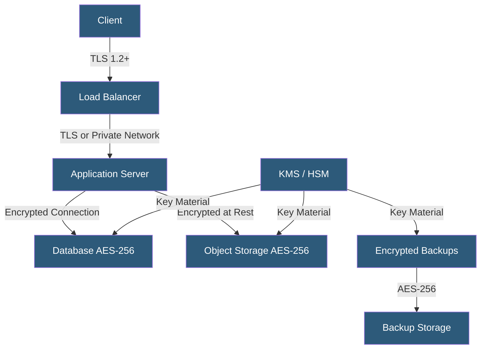

**Category:** Compliance & Regulations
**Difficulty:** Intermediate
**Reading time:** 6 min read

---

Encryption requirements in compliance frameworks mandate specific cryptographic standards for protecting data at rest and in transit. While most regulations specify outcomes (e.g., "appropriate security measures") rather than specific algorithms, industry standards and regulatory guidance converge on AES-256 for storage and TLS 1.2+ for transmission as baseline requirements for personal and sensitive data.

- **Encryption at Rest** — cryptographic protection of stored data on disks, databases, and backups
- **Encryption in Transit** — protection of data moving across networks using TLS/SSL protocols
- **Key Management** — processes for generating, storing, rotating, and destroying cryptographic keys
- **HSM (Hardware Security Module)** — tamper-resistant hardware device for secure key storage and cryptographic operations
- **AES-256** — Advanced Encryption Standard with 256-bit keys; current gold standard for data at rest
- **TLS 1.3** — latest Transport Layer Security version with improved performance and security over TLS 1.2
- **End-to-End Encryption (E2EE)** — encryption where only endpoints can decrypt; intermediaries including the provider cannot access plaintext

Regulatory encryption requirements span multiple frameworks. GDPR treats encryption as a recommended pseudonymization/security measure that can reduce notification obligations after a breach if stolen data was properly encrypted. HIPAA lists encryption as an "addressable" safeguard (effectively required unless a documented equivalent measure exists). PCI DSS requires strong cryptography (effectively AES-256 or equivalent) for PANs at rest and TLS for transmission. FIPS 140-2 (now FIPS 140-3) is the US government standard for validated cryptographic modules.

At rest, cloud providers offer server-side encryption (SSE) as a default or opt-in feature. AWS SSE-S3 uses AES-256 managed by AWS; SSE-KMS uses customer-managed keys in AWS KMS; SSE-C uses customer-provided keys. For compliance, customer-managed keys (BYOK — Bring Your Own Key) provide stronger assurance that the provider cannot access data. Databases should use transparent data encryption (TDE) at minimum, with application-layer encryption for the most sensitive fields (e.g., SSNs, PANs) providing defense in depth.

In transit, TLS 1.0 and 1.1 are deprecated — PCI DSS explicitly prohibits them; NIST deprecated them in 2021. TLS 1.2 with strong cipher suites is the minimum; TLS 1.3 is preferred for new implementations due to its removal of vulnerable cipher suites and improved handshake performance. Certificate management including automated renewal (via Let's Encrypt or ACM), HSTS headers, OCSP stapling, and certificate transparency logging are all components of a mature in-transit encryption posture.

Key management is as important as the encryption itself: a properly encrypted database with keys stored in plaintext on the same server provides minimal additional protection. Keys must be stored separately from the data they protect, with strict access controls, audit logging, and rotation policies.

- Healthcare platform encrypting ePHI at rest with customer-managed KMS keys for HIPAA compliance
- E-commerce site enforcing TLS 1.2+ and disabling weak cipher suites for PCI DSS compliance
- SaaS company implementing BYOK for enterprise customers with data sovereignty requirements
- Government contractor meeting FIPS 140-2 validated encryption requirements
- Backup infrastructure encrypting all backup data before off-site transfer

| Advantage | Disadvantage |
|-----------|--------------|
| Reduces breach impact — encrypted stolen data is often not a reportable breach | Encryption key management adds operational complexity |
| Meets regulatory requirements across GDPR, HIPAA, PCI DSS | Performance overhead of encryption at scale (mitigated by hardware acceleration) |
| BYOK provides strong assurance against provider access | Customer-managed key loss can cause permanent data loss |
| E2EE protects data even from the hosting provider | E2EE limits server-side processing and search capabilities |

- [Access Control Compliance](access-control-compliance.md)
- [Data Residency Requirements](data-residency-requirements.md)
- [PCI DSS Compliance](pci-dss-compliance.md)

---
*Part of the [Compliance & Regulations](index.md) category · [Back to Master Index](../../index.md)*
