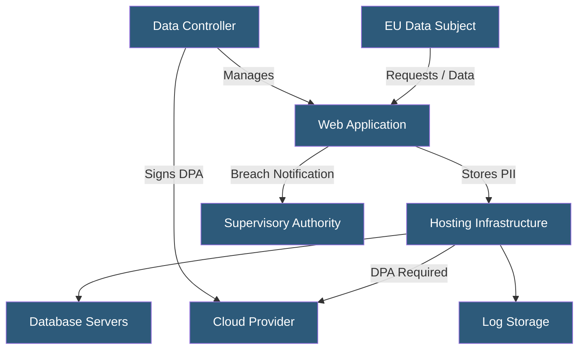

**Category:** Compliance & Regulations
**Difficulty:** Intermediate
**Reading time:** 6 min read

---

The General Data Protection Regulation (GDPR) establishes strict rules for how hosting providers and their customers collect, store, and process personal data of EU residents. Compliance requires both technical controls and documented legal frameworks that govern data handling across the entire infrastructure stack.

- **Data Controller** — the entity that determines the purposes and means of processing personal data
- **Data Processor** — a third party (e.g., hosting provider) that processes data on behalf of a controller
- **Personal Data** — any information relating to an identified or identifiable natural person
- **Data Processing Agreement (DPA)** — contractual obligation defining how processors handle controller data
- **Lawful Basis** — one of six legal grounds required to justify processing personal data
- **Data Subject Rights** — GDPR-guaranteed rights including access, rectification, erasure, and portability
- **Supervisory Authority** — national body responsible for enforcing GDPR in each EU member state

GDPR compliance for hosting begins with mapping every location where personal data is stored or transited. Hosting providers act as data processors and must sign Data Processing Agreements (DPAs) with each customer acting as a controller. These agreements specify retention limits, subprocessor lists, security standards, and breach notification timelines (72 hours to supervisory authority).

At the infrastructure level, compliance requires encryption at rest (typically AES-256) and in transit (TLS 1.2+), strict access controls with audit logging, and data residency controls ensuring EU personal data remains within approved jurisdictions. Many providers offer EU-only data regions backed by contractual guarantees.

Technical implementation includes pseudonymization of data wherever possible, automated data retention enforcement through database TTL policies or scheduled purges, and mechanisms to fulfill data subject requests — particularly the right to erasure ("right to be forgotten"), which requires locating all copies of data including backups.

Logging must be designed carefully: web server logs often capture IP addresses (personal data under GDPR), requiring anonymization, shortened retention periods, or explicit consent. GDPR compliance is not a one-time certification but an ongoing operational discipline requiring regular Data Protection Impact Assessments (DPIAs) for high-risk processing activities.

- SaaS platforms serving EU customers that must sign DPAs with cloud hosting providers
- E-commerce sites implementing consent management for analytics and marketing cookies
- Healthcare applications storing patient data with strict cross-border transfer restrictions
- Multi-tenant platforms enforcing per-tenant data isolation and deletion workflows
- Log management pipelines applying IP anonymization for regulatory compliance

| Advantage | Disadvantage |
|-----------|--------------|
| Builds user trust and brand reputation | Significant implementation and audit overhead |
| Reduces risk of large regulatory fines (up to 4% global revenue) | Restricts architectural flexibility for data replication |
| Encourages good data hygiene practices | Right-to-erasure conflicts with backup integrity |
| Creates clear contractual accountability | Ongoing monitoring and documentation burden |

- [Data Residency Requirements](data-residency-requirements.md)
- [Data Protection Impact Assessment](data-protection-impact-assessment.md)
- [Data Processing Agreements](data-processing-agreements.md)

---
*Part of the [Compliance & Regulations](index.md) category · [Back to Master Index](../../index.md)*
