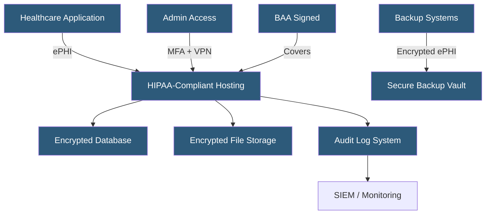

**Category:** Compliance & Regulations
**Difficulty:** Advanced
**Reading time:** 7 min read

---

The Health Insurance Portability and Accountability Act (HIPAA) establishes requirements for protecting Protected Health Information (PHI) in healthcare hosting environments. Cloud and hosting providers serving healthcare customers must execute Business Associate Agreements (BAAs) and implement specific administrative, physical, and technical safeguards.

- **PHI (Protected Health Information)** — individually identifiable health information in any format
- **ePHI** — electronic PHI requiring specific technical safeguards under the Security Rule
- **BAA (Business Associate Agreement)** — contract required when a vendor handles PHI on behalf of a covered entity
- **Covered Entity** — healthcare providers, health plans, and healthcare clearinghouses subject to HIPAA
- **Business Associate** — vendor or subcontractor handling PHI on behalf of a covered entity
- **Minimum Necessary Standard** — access to PHI limited to what is required for the specific task
- **HITECH Act** — 2009 legislation strengthening HIPAA enforcement and breach notification requirements

HIPAA compliance in hosting is governed by three rules: the Privacy Rule (governs use and disclosure of PHI), the Security Rule (technical and physical safeguards for ePHI), and the Breach Notification Rule (notification timelines and procedures). Hosting providers are typically Business Associates and must sign BAAs with all covered entity customers before any PHI can transit or reside in their infrastructure.

The Security Rule mandates three categories of safeguards. Administrative safeguards include workforce training, risk analysis, and contingency planning. Physical safeguards require facility access controls, workstation policies, and device disposal procedures. Technical safeguards demand access controls (unique user IDs, automatic logoff), audit controls (hardware and software activity logging), integrity controls (detecting unauthorized ePHI alterations), and transmission security (encryption for all ePHI in transit).

Encryption is an "addressable" specification under HIPAA — organizations must implement it or document why alternative measures provide equivalent protection. In practice, encryption is the universal standard. At rest, ePHI databases and file stores use AES-256. In transit, TLS 1.2 or 1.3 is required for all ePHI transmissions. Audit logs must capture all access to ePHI and be tamper-evident; log retention periods are typically set at 6 years. Breach notification requirements mandate notification to affected individuals within 60 days, with HHS notification and public media notice for breaches affecting 500+ residents of a state.

- Electronic Health Record (EHR) systems hosted on cloud infrastructure
- Telehealth platforms storing video session recordings and patient data
- Medical imaging storage with DICOM file hosting
- Health insurance portals processing claims and member data
- Clinical trial data management platforms

| Advantage | Disadvantage |
|-----------|--------------|
| Enables hosting healthcare applications legally | BAA availability limits cloud provider choices |
| Structured safeguards reduce breach risk | Audit logging and monitoring add storage and cost overhead |
| HITECH strengthens breach deterrence | Risk analysis must be repeated with infrastructure changes |
| Clear accountability between covered entities and BAs | No formal certification — compliance is self-assessed |

- [GDPR Compliance for Hosting](gdpr-compliance-for-hosting.md)
- [Encryption Requirements](encryption-requirements.md)
- [Logging and Audit Trails](logging-and-audit-trails.md)

---
*Part of the [Compliance & Regulations](index.md) category · [Back to Master Index](../../index.md)*
