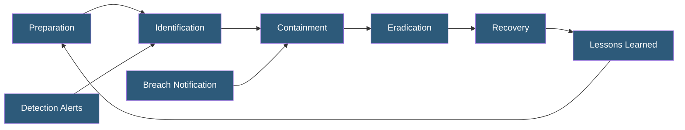

**Category:** Compliance & Regulations
**Difficulty:** Intermediate
**Reading time:** 6 min read

---

An incident response plan (IRP) is a documented framework defining how an organization detects, contains, eradicates, and recovers from security incidents. Regulatory frameworks including SOC 2, ISO 27001, HIPAA, and PCI DSS all require formal incident response procedures, and regulators increasingly scrutinize the quality of response plans during audits and following breaches.

- **PICERL** — Preparation, Identification, Containment, Eradication, Recovery, Lessons Learned; standard IR lifecycle phases
- **Incident Severity Classification** — tiered system (P1–P4 or Critical/High/Medium/Low) driving escalation and response timelines
- **CSIRT (Computer Security Incident Response Team)** — designated team responsible for incident response execution
- **Runbook** — step-by-step operational procedure for responding to a specific incident type
- **Tabletop Exercise** — discussion-based simulation testing plan without actual system impact; required for compliance maturity
- **Chain of Custody** — documented evidence handling procedures ensuring forensic integrity
- **Mean Time to Contain (MTTC)** — key metric measuring average time from incident detection to containment

An effective incident response plan begins in the Preparation phase: establishing the CSIRT team with defined roles, deploying detection tooling (SIEM, EDR, IDS/IPS), creating incident classification criteria, drafting runbooks for common incident types (ransomware, data breach, account compromise, DDoS), establishing communication templates, and testing the plan through tabletop exercises.

During Identification, potential incidents are detected through monitoring alerts, user reports, or external notifications. Triage involves determining whether an event is a confirmed incident and classifying its severity. Severity classification drives escalation — a P1 (Critical) incident might require CEO notification within 30 minutes and incident commander engagement, while a P3 might be handled during business hours by the security team alone. Compliance frameworks require that classification criteria and escalation paths be documented.

Containment strategies depend on incident type. Short-term containment may involve isolating affected systems from the network, revoking compromised credentials, blocking malicious IPs at the firewall, or taking snapshots of compromised systems for forensic preservation. Long-term containment maintains business continuity while the root cause is being addressed — running clean backup systems while investigating the primary environment.

Post-incident requirements include both technical remediation documentation and regulatory reporting. GDPR's 72-hour notification, HIPAA's 60-day notification, and state breach notification laws create overlapping deadlines that must be built into the plan. Lessons learned reviews must document root cause, timeline, what worked and didn't, and specific improvements implemented — these are evidence artifacts reviewed in SOC 2 and ISO 27001 audits.

- SOC 2 audit requiring documented incident response policy with evidence of annual tabletop exercise
- Healthcare organization activating incident response plan following ransomware attack affecting ePHI systems
- Cloud hosting provider managing a customer data breach with GDPR 72-hour notification requirement
- SaaS company responding to account credential stuffing attack affecting multiple customer accounts
- Financial services firm conducting quarterly incident response drills with cross-functional teams

| Advantage | Disadvantage |
|-----------|--------------|
| Structured response reduces chaos and mean time to contain | Plans require regular maintenance to stay current with evolving threats |
| Documented plans satisfy regulatory compliance requirements | Tabletop exercises only partially simulate real incident pressure |
| Post-incident reviews drive security program improvement | Building 24/7 CSIRT capability is expensive for smaller organizations |
| Pre-defined communication templates speed regulatory notifications | Over-prescriptive plans can be inflexible in novel incident scenarios |

- [Data Breach Notification Procedures](data-breach-notification-procedures.md)
- [Business Continuity Planning](business-continuity-planning.md)
- [Logging and Audit Trails](logging-and-audit-trails.md)

---
*Part of the [Compliance & Regulations](index.md) category · [Back to Master Index](../../index.md)*
