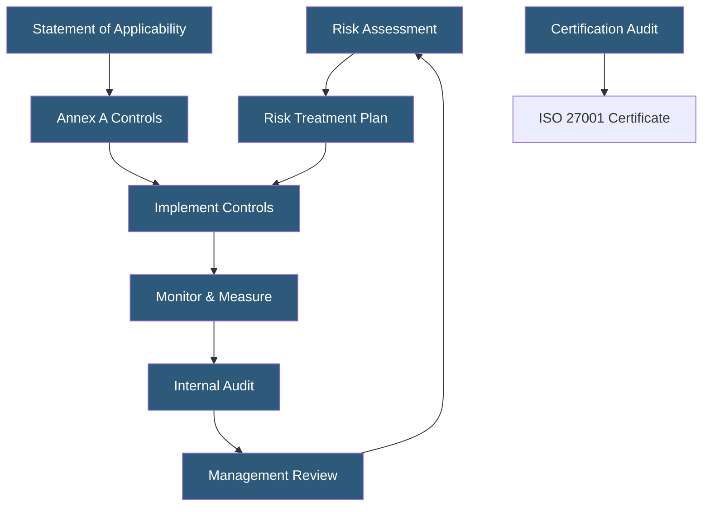

**Category:** Compliance & Regulations
**Difficulty:** Advanced
**Reading time:** 7 min read

---

ISO/IEC 27001 is an internationally recognized standard for Information Security Management Systems (ISMS), providing a systematic approach to managing sensitive information security risks. Certification requires a formal audit by an accredited certification body and demonstrates organizational commitment to security governance across people, processes, and technology.

- **ISMS (Information Security Management System)** — the overall management framework for information security policies and controls
- **Annex A Controls** — 93 controls in ISO 27001:2022 organized across four themes: Organizational, People, Physical, and Technological
- **Statement of Applicability (SoA)** — document declaring which Annex A controls apply to the organization and why
- **Risk Register** — documented inventory of identified risks with likelihood, impact, and treatment decisions
- **Certification Body** — accredited third-party auditor that issues the ISO 27001 certificate
- **Surveillance Audit** — annual check between 3-year certification cycles to verify ongoing compliance
- **PDCA Cycle** — Plan-Do-Check-Act continuous improvement methodology underlying the standard

ISO 27001 certification involves establishing, implementing, maintaining, and continually improving an ISMS. The standard follows the Plan-Do-Check-Act cycle applied to information security risks. Organizations begin by defining the ISMS scope — which business units, locations, and information assets are covered — then conducting a formal risk assessment to identify threats, vulnerabilities, and business impacts.

Based on the risk assessment, organizations select applicable controls from Annex A and document their choices in the Statement of Applicability (SoA). The SoA must justify included controls and explicitly exclude controls with rationale. In hosting environments, key controls include asset management (inventorying all servers and data), cryptography (encryption policies), physical security, access control, supplier relationships (cloud provider security), incident management, and business continuity.

The certification audit has two stages: Stage 1 is a documentation review confirming the ISMS is properly designed; Stage 2 is an on-site audit where auditors interview staff, test controls, and review evidence. Successful completion results in a 3-year certificate with annual surveillance audits. ISO 27001:2022 introduced new controls around cloud security, threat intelligence, data masking, and secure coding — particularly relevant for hosting providers. The certification is internationally recognized and often preferred over SOC 2 in European and Asian markets.

- Hosting providers targeting enterprise contracts in European markets
- Government-adjacent organizations needing internationally recognized security certification
- Organizations seeking a framework that covers physical, administrative, and technical controls holistically
- Companies pursuing GDPR compliance using ISO 27001 as a structural foundation
- MSPs demonstrating security maturity to multinational clients

| Advantage | Disadvantage |
|-----------|--------------|
| Globally recognized across markets and industries | Certification process typically takes 12–18 months |
| Comprehensive framework covering all security domains | Ongoing surveillance audits add annual cost |
| Publicly verifiable certificate (unlike SOC 2) | Less familiar to US-based enterprise security teams vs SOC 2 |
| Supports regulatory compliance in multiple jurisdictions | Implementation requires significant internal resource commitment |

- [SOC 2 Certification](soc-2-certification.md)
- [Compliance Audit Preparation](compliance-audit-preparation.md)
- [Third-Party Risk Management](third-party-risk-management.md)

---
*Part of the [Compliance & Regulations](index.md) category · [Back to Master Index](../../index.md)*
