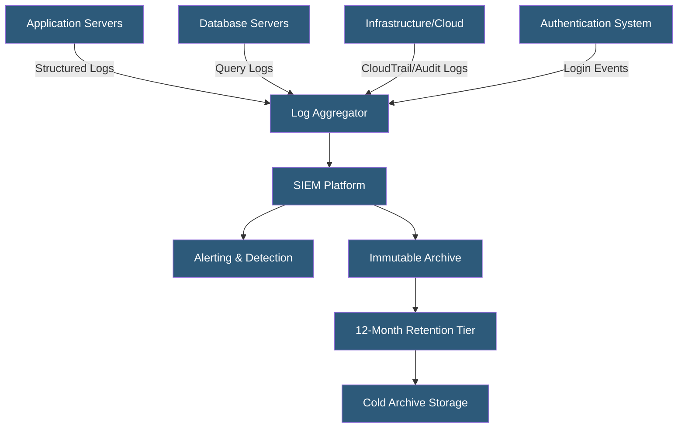

**Category:** Compliance & Regulations
**Difficulty:** Intermediate
**Reading time:** 6 min read

---

Compliance logging requirements mandate the collection, protection, and retention of system activity records that demonstrate security controls are operating as designed and enable investigation of security incidents. Audit trails must be tamper-evident, comprehensive across critical systems, and retained for specified periods to satisfy frameworks including PCI DSS, HIPAA, SOC 2, and ISO 27001.

- **Audit Trail** — chronological record of system activities linking actions to specific users or processes
- **Log Integrity** — protection of logs from tampering, deletion, or modification by unauthorized parties
- **SIEM (Security Information and Event Management)** — platform centralizing log collection, correlation, and alerting
- **Log Retention** — required storage duration for different log types (PCI DSS: 1 year; HIPAA: 6 years for audit controls)
- **Immutable Logging** — write-once storage mechanisms preventing retrospective log modification
- **Log Correlation** — connecting events across systems to reconstruct incident timelines
- **PII in Logs** — privacy risk when logs inadvertently capture personal data such as IP addresses or query parameters

Compliance logging requires identifying what events must be logged, centralizing collection, protecting log integrity, and ensuring appropriate retention. PCI DSS Requirement 10 specifies what must be logged in cardholder data environments: all individual user access, all root/administrative actions, access to audit logs themselves, invalid logical access attempts, use of identification/authentication mechanisms, initialization/stopping/pausing of audit logs, and creation/deletion of system-level objects.

Log centralization via a SIEM is essential: logs stored only on the systems they describe can be tampered with by an attacker who has compromised that system. Shipping logs to a separate, dedicated log management platform (Splunk, Elastic, Datadog Logs, AWS CloudWatch) immediately upon generation ensures that even a fully compromised server cannot retroactively erase its activity. For highest assurance, write-once storage or WORM (Write Once, Read Many) log buckets prevent any modification.

Structured logging — JSON-formatted logs with consistent fields — dramatically improves both compliance reporting and incident investigation compared to unstructured text. Standard fields should include timestamp (UTC, millisecond precision), source system, actor identity, action, resource affected, outcome, and session/request identifier. Consistent identifiers enable correlation across systems — connecting a web request ID through the load balancer, application server, and database logs.

Privacy compliance creates tension with comprehensive logging: web server access logs capturing IP addresses may constitute personal data under GDPR. Mitigation strategies include IP anonymization (masking the last octet), shortened retention for detailed access logs versus longer retention for security events, and separate logging pipelines for security versus operational purposes with different access controls and retention schedules.

- PCI DSS Requirement 10 compliance requiring logs of all access to cardholder data
- SOC 2 audit evidence demonstrating that access control monitoring controls operated during the audit period
- HIPAA requirement to implement hardware and software activity monitoring for ePHI systems
- Incident response team reconstructing attack timeline from correlated logs across 20 services
- GDPR accountability requirement demonstrating when and how personal data was accessed

| Advantage | Disadvantage |
|-----------|--------------|
| Enables post-incident forensic investigation | High log volume drives significant storage costs |
| Demonstrates compliance control effectiveness to auditors | PII in logs creates GDPR compliance challenges |
| Centralized SIEM enables real-time threat detection | Centralized logging creates a high-value attack target |
| Tamper-evident logs provide legal evidence quality records | Structured logging requires application development investment |

- [Access Control Compliance](access-control-compliance.md)
- [Compliance Monitoring Automation](compliance-monitoring-automation.md)
- [Incident Response Plans](incident-response-plans.md)

---
*Part of the [Compliance & Regulations](index.md) category · [Back to Master Index](../../index.md)*
