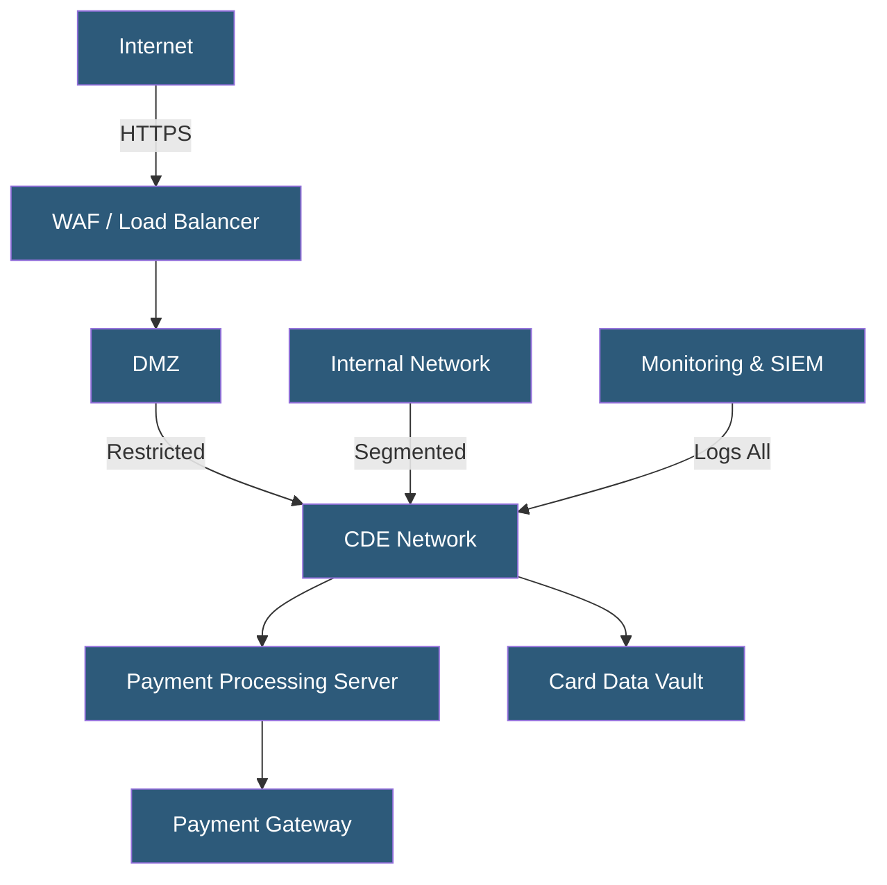

**Category:** Compliance & Regulations
**Difficulty:** Advanced
**Reading time:** 7 min read

---

Payment Card Industry Data Security Standard (PCI DSS) is a set of security requirements for organizations that handle cardholder data, including hosting environments that process, store, or transmit credit card information. Version 4.0 introduces enhanced requirements around authentication, encryption, and continuous monitoring.

- **Cardholder Data Environment (CDE)** — systems that store, process, or transmit cardholder data and are in scope for PCI DSS
- **Primary Account Number (PAN)** — the 16-digit card number that must be protected at all times
- **Network Segmentation** — isolating the CDE from other network zones to reduce scope
- **QSA (Qualified Security Assessor)** — certified auditor who validates PCI DSS compliance
- **SAQ (Self-Assessment Questionnaire)** — self-attestation form for merchants with limited card data exposure
- **Tokenization** — replacing card data with a non-sensitive token to reduce CDE scope
- **ASV (Approved Scanning Vendor)** — company certified to perform external vulnerability scans required quarterly

PCI DSS compliance in hosting environments centers on defining and minimizing the Cardholder Data Environment (CDE). Every system that touches cardholder data — directly or through network connectivity — falls in scope. Proper network segmentation using firewalls, VLANs, and microsegmentation is the primary technique for limiting scope, as systems isolated from the CDE may be excluded from full audit requirements.

The standard covers 12 core requirement domains: network controls, configuration standards, cardholder data protection, cryptographic transmission, anti-malware, secure development, access control, identity management, physical security, monitoring, security testing, and information security policies. In practice, hosting teams focus heavily on encryption (TLS 1.2+ for all transmissions, AES-256 for stored PANs), access control (MFA required for all CDE access since PCI DSS v4.0), and logging (all access to cardholder data must be logged with 12-month retention).

Quarterly external vulnerability scans by an ASV and annual penetration testing are mandatory. Internal vulnerability scans must be performed at least quarterly and after significant changes. Change management processes must be documented with evidence. Web application security is addressed through either a WAF or annual code review of all public-facing applications. Cloud-hosted CDEs require shared responsibility documentation clearly delineating which controls the provider handles versus the customer.

- E-commerce platforms storing or processing credit card transactions
- Hosting providers offering PCI-compliant infrastructure for merchants
- SaaS payment platforms with Level 1 merchant status
- Hospitality systems handling card-present and card-not-present transactions
- Healthcare billing systems processing patient payment cards

| Advantage | Disadvantage |
|-----------|--------------|
| Protects against card data breaches and associated fines | High implementation cost, especially for Level 1 compliance |
| Enables acceptance of major card brands | Annual QSA audits are expensive and time-consuming |
| Clear technical baseline reduces security ambiguity | Scope creep can bring unexpected systems into CDE |
| Drives adoption of strong security practices | PCI DSS v4.0 customized approach adds complexity |

- [Encryption Requirements](encryption-requirements.md)
- [Access Control Compliance](access-control-compliance.md)
- [Penetration Testing Requirements](penetration-testing-requirements.md)

---
*Part of the [Compliance & Regulations](index.md) category · [Back to Master Index](../../index.md)*
