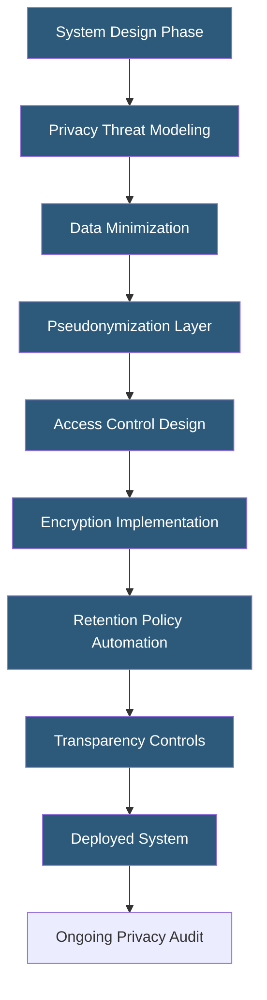

**Category:** Compliance & Regulations
**Difficulty:** Beginner
**Reading time:** 5 min read

---

Privacy by Design (PbD) is a framework developed by Dr. Ann Cavoukian that embeds privacy protections into the architecture and operation of IT systems from inception, rather than treating privacy as an afterthought. GDPR Article 25 codifies PbD as a legal requirement for data controllers, making it a fundamental engineering discipline for modern hosting environments.

- **Proactive not Reactive** — prevent privacy incidents before they occur rather than remediating afterward
- **Privacy as the Default** — systems should automatically protect privacy without requiring user action
- **Privacy Embedded into Design** — privacy is a core component, not a bolt-on feature
- **Full Functionality** — privacy and functionality are not zero-sum; both can be achieved simultaneously
- **End-to-End Security** — security throughout the entire data lifecycle, from collection to deletion
- **Visibility and Transparency** — operations are open to scrutiny by users and regulators
- **Respect for User Privacy** — keep systems user-centric, maintaining strong user defaults and notice

Privacy by Design requires integrating privacy considerations into every stage of the software development lifecycle. During requirements gathering, engineers and privacy officers identify what personal data is necessary, establish the minimum data set, and define retention limits before any code is written. This prevents the common antipattern of collecting excessive data "just in case it becomes useful."

In system architecture, PbD manifests as structural choices: separating identifiers from behavioral data (pseudonymization), building data deletion workflows that reach all downstream systems including backups, implementing granular access controls so each service touches only the data it needs, and designing APIs that expose only necessary fields rather than full records.

At the hosting infrastructure level, PbD principles translate to: default-encrypted databases and file stores, audit logging turned on at deployment rather than added later, automated data retention policies using TTLs or scheduled purges, and monitoring alerts for unusual data access patterns. Consent and preference management systems give users genuine control over their data, with those preferences propagated consistently across all data stores.

Privacy threat modeling — similar to security threat modeling but focused on privacy risks — should occur at design reviews. Teams evaluate each data flow asking: what is the harm if this data is exposed, who should have access and why, and what happens to this data at the end of its lifecycle. This structured approach surfaces privacy risks during the lowest-cost phase to fix them.

- Designing a new user registration flow that collects only essential fields
- Building analytics systems using differential privacy to prevent individual re-identification
- Architecting a multi-tenant SaaS where tenant data is cryptographically isolated
- Implementing a healthcare portal with consent-gated data sharing between providers
- Developing mobile apps with on-device processing to minimize server-side data collection

| Advantage | Disadvantage |
|-----------|--------------|
| Prevents costly post-deployment privacy remediation | Requires privacy expertise integrated into engineering teams |
| Satisfies GDPR Article 25 legal requirements | Can slow initial development when privacy requirements are complex |
| Builds user trust and reduces breach impact | Data minimization may limit future analytics capabilities |
| Reduces regulatory investigation risk | Default-private settings may reduce product engagement metrics |

- [GDPR Compliance for Hosting](gdpr-compliance-for-hosting.md)
- [Data Protection Impact Assessment](data-protection-impact-assessment.md)
- [Right to Be Forgotten Implementation](right-to-be-forgotten-implementation.md)

---
*Part of the [Compliance & Regulations](index.md) category · [Back to Master Index](../../index.md)*
