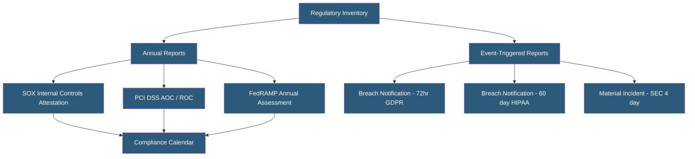

**Category:** Compliance & Regulations
**Difficulty:** Intermediate
**Reading time:** 5 min read

---

Regulatory reporting requirements obligate organizations to submit structured compliance documentation to government agencies and regulatory bodies on defined schedules or following triggering events. These span data breach notifications, financial reporting controls attestations, environmental compliance reports, and industry-specific disclosures that hosting and infrastructure providers must navigate.

- **Material Event Reporting** — obligation to report significant security events to regulators within defined timeframes
- **Annual Attestation** — yearly formal declaration of compliance status submitted to a regulatory body
- **SAR (Suspicious Activity Report)** — financial institutions' requirement to report suspicious transactions to FinCEN
- **SOX (Sarbanes-Oxley)** — US law requiring public companies to attest to the effectiveness of internal controls over financial reporting
- **FedRAMP** — US government cloud security authorization framework requiring continuous monitoring reporting to agencies
- **PCI DSS Report on Compliance (ROC)** — formal report submitted by Level 1 merchants to card brands annually
- **Notification Trigger** — specific event (breach, system change, service interruption) requiring regulatory notification

Regulatory reporting obligations vary significantly by industry, geography, and company type. Public companies in the US must comply with SOX requirements — specifically, management must annually assess and certify the effectiveness of internal controls over financial reporting (ICFR) in the 10-K filing, and material cybersecurity incidents must now be disclosed in 8-K filings within four business days under new SEC rules effective December 2023.

For payment processors and merchants, PCI DSS requires submission of an Attestation of Compliance (AOC) to acquiring banks and card brands. Level 1 merchants must submit a Report on Compliance (ROC) prepared by a QSA annually. For government cloud providers, FedRAMP requires continuous monitoring (ConMon) reports submitted monthly to agency authorizing officials, covering vulnerability scan results, plan of action and milestone (POA&M) updates, and significant change notifications.

Hosting providers operating in the EU handling personal data must register with or maintain a Record of Processing Activities (RoPA) and be prepared to provide it to supervisory authorities upon request. In some EU jurisdictions, registration with the national DPA is still required. Financial services hosting in the UK must comply with FCA operational resilience reporting requirements. Healthcare hosting must be prepared to submit HIPAA breach reports to HHS for incidents affecting 500+ individuals, and these are publicly listed on HHS's "Wall of Shame."

Regulatory reporting requires a compliance calendar: a mapped schedule of all recurring submission deadlines, responsible owners, required inputs, and approval workflows. Missed deadlines are frequently treated as compliance violations independent of whether the underlying substantive compliance is achieved.

- Public SaaS company implementing SEC cybersecurity disclosure procedures for material incident reporting
- Level 1 PCI merchant coordinating annual ROC submission with QSA and acquiring bank
- FedRAMP Authorized cloud provider managing monthly continuous monitoring reports to multiple agency customers
- Healthcare hosting provider tracking HHS breach reporting thresholds and submission requirements
- EU-based hosting company maintaining RoPA and preparing for supervisory authority information requests

| Advantage | Disadvantage |
|-----------|--------------|
| Structured reporting creates accountability and audit trail | Multiple overlapping regulatory deadlines require dedicated compliance resources |
| Public reporting creates market incentives for security improvement | Regulatory penalties for late or inaccurate reporting are significant |
| Standardized formats enable industry benchmarking | Reporting requirements change frequently with regulatory amendments |
| Evidence collection for reporting improves internal security visibility | Reporting disclosures can expose organizational weaknesses publicly |

- [Compliance Documentation](compliance-documentation.md)
- [Compliance Audit Preparation](compliance-audit-preparation.md)
- [Data Breach Notification Procedures](data-breach-notification-procedures.md)

---
*Part of the [Compliance & Regulations](index.md) category · [Back to Master Index](../../index.md)*
