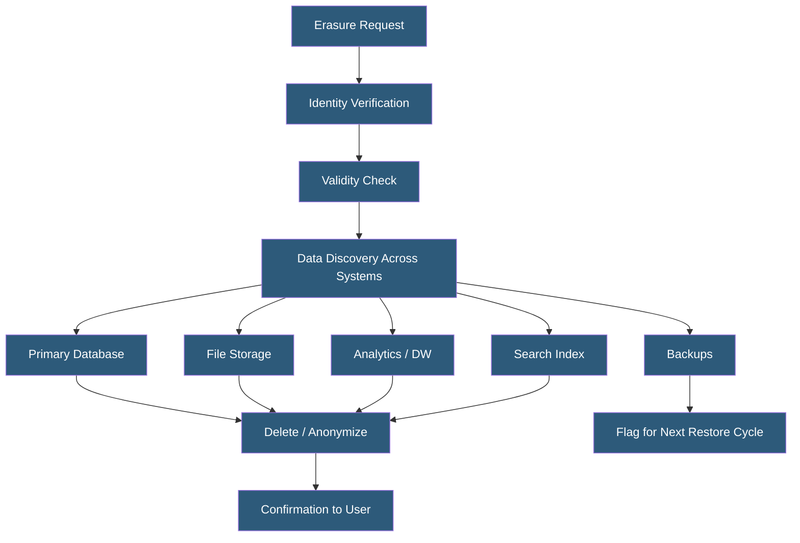

**Category:** Compliance & Regulations
**Difficulty:** Advanced
**Reading time:** 7 min read

---

The right to erasure (commonly called the "right to be forgotten") under GDPR Article 17 allows individuals to request deletion of their personal data when it is no longer necessary, consent is withdrawn, or other specific conditions are met. Implementing this right in production hosting environments is technically complex due to distributed data stores, backups, and downstream data propagation.

- **Erasure Request** — formal request by a data subject to delete their personal data
- **Identifiable Data** — any data that can directly or indirectly identify an individual
- **Pseudonymization** — replacing direct identifiers with tokens, enabling functional deletion by destroying the key
- **Data Mapping** — complete inventory of all systems storing personal data, essential for complete erasure
- **Backup Complication** — personal data in immutable backups cannot be selectively deleted without restoring and reprocessing
- **Retention Exception** — erasure can be refused when data is needed for legal claims, compliance, or public interest
- **Erasure Confirmation** — organizations must confirm deletion within one month of receiving the request

Implementing the right to erasure begins with comprehensive data mapping — organizations must know every system where personal data resides. This includes primary databases, file storage, search indexes, data warehouses, analytics systems, CDN caches, third-party integrations, and backups. Without complete data mapping, erasure cannot be reliably executed.

For primary data stores, erasure workflows typically either hard-delete records or anonymize them by replacing identifying fields with placeholder values (enabling referential integrity preservation where foreign keys must remain). For distributed systems, erasure must propagate to all replicas and caches. CDN purge APIs can clear cached responses. Search indexes require document deletion APIs. Third-party data processors (email marketing tools, analytics platforms, CRM systems) must receive deletion requests under the terms of their DPAs.

The backup problem is the most technically challenging aspect. Encrypted backups cannot have individual records surgically removed. The most practical approach is pseudonymization: if personal data is stored using a pseudonym (a token), destroying the mapping table between tokens and real identities renders backup data permanently unidentifiable without constituting a traditional deletion. For systems that must retain raw backups, documenting the backup lifecycle and ensuring that restored data will be re-processed through the deletion queue provides defensible compliance. A 30-day response window (extendable to 90 days for complex cases) applies from the date of the verified request.

- User account deletion on social media platforms requiring removal across all systems
- GDPR erasure workflows in e-commerce platforms with order history considerations
- Healthcare portals handling patient requests to delete non-mandatory health records
- Marketing platforms purging subscriber data when consent is withdrawn
- Analytics pipelines using pseudonymization to enable functional erasure from historical datasets

| Advantage | Disadvantage |
|-----------|--------------|
| Legal compliance with GDPR and similar regulations | Technically complex across distributed and legacy systems |
| Builds user trust through demonstrated privacy control | Conflicts with backup integrity and audit trail requirements |
| Pseudonymization enables scalable erasure architecture | Requires ongoing data mapping maintenance as systems evolve |
| Reduces data liability by limiting long-term personal data retention | Third-party erasure propagation is difficult to verify |

- [Privacy by Design Principles](privacy-by-design-principles.md)
- [Data Retention Policies](data-retention-policies.md)
- [GDPR Compliance for Hosting](gdpr-compliance-for-hosting.md)

---
*Part of the [Compliance & Regulations](index.md) category · [Back to Master Index](../../index.md)*
