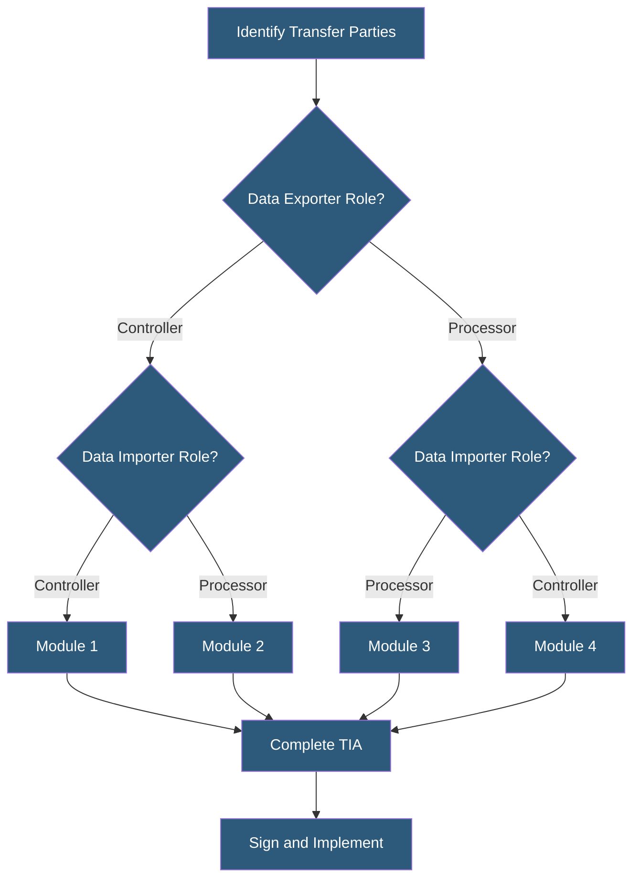

**Category:** Compliance & Regulations
**Difficulty:** Intermediate
**Reading time:** 6 min read

---

Standard Contractual Clauses (SCCs) are pre-approved contract terms issued by the European Commission that provide a legal basis for transferring personal data from the EU/EEA to third countries lacking an adequacy decision. The 2021 SCCs replaced earlier versions and introduced a modular structure covering four different transfer scenarios.

- **2021 SCCs** — European Commission Decision 2021/914 replacing the 2010 controller-to-processor and 2004 controller-to-controller SCCs
- **Module 1** — Controller to Controller transfers (e.g., sharing marketing data with a US CRM partner)
- **Module 2** — Controller to Processor transfers (e.g., EU company using a US cloud provider)
- **Module 3** — Processor to Processor transfers (e.g., EU SaaS provider's subprocessor in the US)
- **Module 4** — Processor to Controller transfers (e.g., US analytics provider sending aggregated data back to EU client)
- **Transfer Impact Assessment (TIA)** — mandatory assessment of destination country surveillance laws before relying on SCCs
- **Docking Clause** — provision allowing additional parties to accede to an existing SCC agreement

SCCs are non-negotiable in their core clauses — neither party may modify the pre-approved text — but the 2021 SCCs include optional clauses and annexes where parties can specify technical details, security measures, processing purposes, and governing law. Organizations select the appropriate module based on whether they are acting as controllers or processors on each side of the transfer.

The 2021 SCCs must be incorporated into the broader data processing agreement rather than standing alone. Annex I describes the parties, the transfer, and the purpose. Annex II describes the technical and organizational security measures. Annex III lists sub-processors (for Module 2 and 3). The clauses contain obligations such as: informing data subjects of the transfer and their rights, using data only for specified purposes, implementing specified security measures, cooperating with supervisory authority investigations, and ensuring sub-processors are bound by equivalent terms.

Following Schrems II, organizations must document a Transfer Impact Assessment before relying on SCCs. The TIA evaluates whether the laws of the destination country (particularly government access to data) would prevent the data importer from complying with the SCC obligations. For transfers to the US, organizations typically rely on the Data Privacy Framework where applicable, or document that SCCs with supplementary measures (such as encryption) provide adequate protection.

Many major cloud and SaaS providers have incorporated the 2021 SCCs into their DPA templates. Organizations should verify that providers have executed Module 2 SCCs covering controller-to-processor transfers and that the relevant processing regions are covered. The old 2010 SCCs had a validity deadline of December 27, 2022; organizations still relying on them must have transitioned.

- EU e-commerce company using a US-based customer support platform for ticket management
- European data controller transferring HR data to a US-based HRIS system
- EU SaaS vendor ensuring its US-based infrastructure provider has signed Module 2 SCCs
- Multinational processor onboarding a new US subprocessor for data analytics workloads
- Legal team assessing whether existing SCC coverage covers a new data processing activity

| Advantage | Disadvantage |
|-----------|--------------|
| Legally robust mechanism accepted across all EU member states | TIA requirement adds significant compliance analysis overhead |
| Modular 2021 structure covers most transfer scenarios | Non-negotiable core text limits customization for specific situations |
| Widely understood and used by global technology companies | Some destination country laws make effective TIA nearly impossible |
| Can be incorporated into existing DPAs at scale | Schrems legal challenges create ongoing uncertainty about long-term validity |

- [Cross-Border Data Transfers](cross-border-data-transfers.md)
- [Privacy Shield Framework](privacy-shield-framework.md)
- [Data Processing Agreements](data-processing-agreements.md)

---
*Part of the [Compliance & Regulations](index.md) category · [Back to Master Index](../../index.md)*
