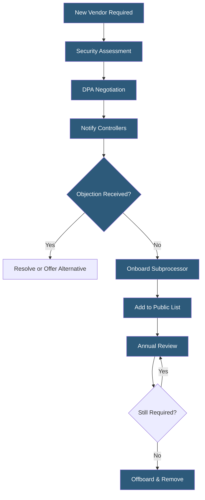

**Category:** Compliance & Regulations
**Difficulty:** Intermediate
**Reading time:** 6 min read

---

Subprocessor management involves maintaining oversight of all third-party vendors that a data processor engages to help process personal data on behalf of controllers. Under GDPR, processors bear full liability for their subprocessors' compliance and must maintain transparent, up-to-date lists of subprocessors with mechanisms for controller objection.

- **Subprocessor** — a third party engaged by a processor to carry out specific processing activities on the controller's personal data
- **Subprocessor List** — public or contractually disclosed inventory of all entities engaged as subprocessors
- **Objection Right** — controller's contractual right to object to new subprocessor additions before they go live
- **Onward Transfer** — data flowing from processor to subprocessor, requiring appropriate safeguards
- **Vendor Security Assessment** — evaluation of a potential subprocessor's security posture before engagement
- **Subprocessor Agreement** — contract flowing down equivalent data protection obligations from processor to subprocessor
- **Notification Period** — advance notice (typically 30–60 days) processors must give controllers before adding subprocessors

Subprocessor management is a continuous operational discipline for any organization acting as a data processor. When a SaaS company or hosting provider uses third-party services that touch customer personal data — cloud infrastructure providers, error monitoring tools, support platforms, payment processors, email delivery services — each becomes a subprocessor requiring a formal agreement and disclosure to controllers.

The management lifecycle begins with vendor onboarding: before engaging a new subprocessor, processors should conduct a security assessment (reviewing SOC 2 reports, ISO 27001 certificates, penetration test summaries, or completing a security questionnaire), negotiate a DPA that imposes at minimum the same obligations the processor has accepted from its controllers, and verify that cross-border transfer mechanisms are in place if the subprocessor is outside the EEA.

Controllers must be notified in advance of new subprocessors — typical contractual terms give controllers 30 days to object. If a controller objects and the processor cannot resolve the objection or offer an alternative service not involving the contested subprocessor, either party may have the right to terminate the contract. In practice, controllers rarely exercise objection rights, but the mechanism must exist.

Public subprocessor lists — maintained as versioned web pages with change history — have become the industry standard. Major cloud providers (AWS, Google, Salesforce) publish detailed subprocessor lists updated as their supply chains change. Processors should mirror this practice, linking to their subprocessor list in their DPA and main privacy policy. Annual reviews should verify that listed subprocessors are still in use, that their certifications remain current, and that offboarded vendors are removed and data return/destruction is confirmed.

- SaaS platform maintaining a public subprocessor list with 30-day change notification
- Cloud hosting provider auditing 50+ infrastructure vendors for DPA coverage
- Healthcare software vendor ensuring all subprocessors meet HIPAA Business Associate requirements
- European B2B software company managing subprocessor objection requests from enterprise customers
- Startup building subprocessor governance infrastructure ahead of enterprise sales

| Advantage | Disadvantage |
|-----------|--------------|
| Legal compliance with GDPR Article 28 obligations | Managing large subprocessor inventories requires dedicated tooling |
| Transparency builds enterprise customer trust | Subprocessor DPA negotiation with major vendors is often non-negotiable |
| Structured onboarding reduces security risk from third parties | Notification periods can delay time-sensitive vendor integrations |
| Annual reviews identify and remove unnecessary data exposure | Processor remains fully liable even with compliant subprocessor agreements |

- [Data Processing Agreements](data-processing-agreements.md)
- [Third-Party Risk Management](third-party-risk-management.md)
- [Vendor Security Assessments](vendor-security-assessments.md)

---
*Part of the [Compliance & Regulations](index.md) category · [Back to Master Index](../../index.md)*
