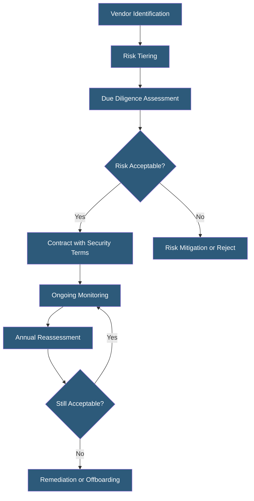

**Category:** Compliance & Regulations
**Difficulty:** Intermediate
**Reading time:** 6 min read

---

Third-party risk management (TPRM) is the process of identifying, assessing, and mitigating risks introduced by vendors, suppliers, and service providers who access organizational systems or data. Regulatory frameworks including SOC 2, ISO 27001, PCI DSS, and HIPAA all require documented vendor risk management programs, recognizing that organizations inherit their vendors' security posture.

- **Inherent Risk** — baseline risk a vendor relationship presents before any controls are applied
- **Residual Risk** — remaining risk after vendor controls and contractual protections are evaluated
- **Vendor Tiering** — categorizing vendors by access level and data handling to prioritize assessment depth
- **Security Questionnaire** — standardized questionnaire (often SIG, CAIQ, or custom) assessing vendor security controls
- **Fourth-Party Risk** — risks introduced by vendors' vendors — the supply chain beyond direct relationships
- **Right to Audit** — contractual clause giving the organization the right to audit vendor security practices
- **Vendor Offboarding** — structured process ensuring data return/deletion and access revocation when vendors are terminated

TPRM begins with comprehensive vendor inventory — many organizations discover they have 3–10x more vendor relationships than they realized, including SaaS tools procured by individual teams without central IT knowledge. Shadow IT discovery tools can identify unauthorized vendor relationships. Once inventoried, vendors are tiered by risk: Tier 1 (access to critical data or systems — deep assessment required), Tier 2 (limited access or non-sensitive data — lighter assessment), Tier 3 (no data access — minimal assessment).

Due diligence for Tier 1 vendors includes reviewing security certifications (SOC 2 Type II, ISO 27001), conducting security questionnaires, reviewing penetration test summaries, evaluating financial stability, assessing regulatory compliance alignment, and reviewing incident history. Questionnaire frameworks like the Standardized Information Gathering (SIG) questionnaire or the Consensus Assessments Initiative Questionnaire (CAIQ) for cloud vendors provide consistent assessment structures.

Contractual protections formalize the risk allocation: security requirements in SLAs, data handling terms in DPAs, right to audit clauses, breach notification timelines, and indemnification provisions. SOC 2 and PCI DSS require that vendors meeting key control requirements be formally assessed and documented. ISO 27001 requires supplier relationships to be managed as part of the ISMS with documented security requirements for all relevant suppliers.

Ongoing monitoring is equally important as initial due diligence. Vendor risk platforms (SecurityScorecard, BitSight, UpGuard) continuously monitor external vendor signals — open ports, SSL certificate health, data breach history, phishing susceptibility scores — providing early warning of deteriorating vendor security without requiring manual re-assessment.

- SaaS company performing annual vendor reviews as part of SOC 2 Type II compliance
- Hosting provider assessing infrastructure vendors before they access production environments
- Healthcare organization conducting HIPAA Business Associate risk assessment on all ePHI-handling vendors
- Financial services firm managing fourth-party risk in cloud supply chains
- Enterprise procurement team building vendor security requirements into RFP evaluation criteria

| Advantage | Disadvantage |
|-----------|--------------|
| Reduces inherited risk from vendor security incidents | Comprehensive vendor inventories are difficult to maintain at scale |
| Meets regulatory requirements across SOC 2, ISO 27001, PCI DSS, HIPAA | Assessment costs (time and money) scale linearly with vendor count |
| Continuous monitoring provides earlier warning than annual reviews | Vendor questionnaire fatigue leads to copy-paste responses of limited value |
| Contractual security requirements create legal accountability | Right-to-audit clauses are rarely exercised but costly when invoked |

- [Vendor Security Assessments](vendor-security-assessments.md)
- [Subprocessor Management](subprocessor-management.md)
- [Compliance Audit Preparation](compliance-audit-preparation.md)

---
*Part of the [Compliance & Regulations](index.md) category · [Back to Master Index](../../index.md)*
