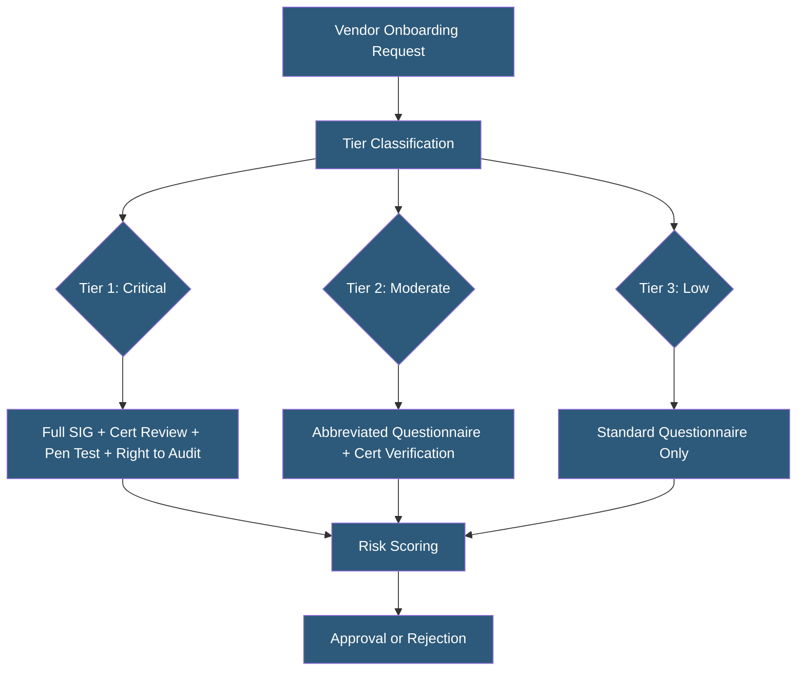

**Category:** Compliance & Regulations
**Difficulty:** Intermediate
**Reading time:** 5 min read

---

Vendor security assessments evaluate whether third-party providers meet an organization's security and compliance requirements before they are granted access to systems or data. Assessments range from lightweight questionnaire reviews for low-risk vendors to comprehensive audits of Tier 1 vendors handling sensitive data or critical infrastructure components.

- **SIG (Standardized Information Gathering)** — widely adopted vendor questionnaire covering 20 risk domains; maintained by Shared Assessments
- **CAIQ (Consensus Assessments Initiative Questionnaire)** — Cloud Security Alliance questionnaire specifically designed for cloud vendor assessment
- **SOC 2 Report Review** — reviewing independent auditor's report as evidence of vendor controls rather than conducting custom assessment
- **Penetration Test Summary** — vendor-provided executive summary of recent penetration testing results and remediation status
- **Security Rating** — continuously-updated external score from platforms like SecurityScorecard or BitSight measuring observable vendor security signals
- **Risk Acceptance** — documented decision to proceed with a vendor despite identified security gaps, with compensating controls
- **Remediation Tracking** — monitoring vendor progress on addressing security gaps identified during assessment

Vendor security assessments are sized to the risk the vendor relationship presents. For Tier 1 vendors with access to sensitive data or critical systems, the assessment combines multiple evidence sources: reviewing the vendor's SOC 2 Type II report (focus on the auditor's opinion, exceptions noted, and the coverage period), requesting completion of a security questionnaire like the SIG Core or CAIQ, reviewing a recent penetration test executive summary, and checking for active certifications (ISO 27001, PCI DSS compliance letter).

The SIG questionnaire covers 20 domains including access control, cloud and virtualization, cybersecurity incident management, physical and environmental controls, and privacy. Vendors complete it once and can share with multiple assessment requestors, reducing questionnaire fatigue. The CAIQ is preferred for cloud-native vendors because it maps directly to Cloud Security Alliance's Cloud Controls Matrix (CCM).

Questionnaire responses should be validated, not accepted at face value. Cross-checking stated controls against the vendor's SOC 2 report exceptions, publicly known breaches, or security rating signals reveals inconsistencies. Automated security rating platforms (SecurityScorecard, BitSight, UpGuard) provide continuously-updated external signals including open port exposure, SSL certificate health, patching velocity, and data breach history without requiring vendor cooperation.

When gaps are identified, the assessment workflow should produce either a remediation plan with timeline (tracked to closure before vendor engagement), a risk acceptance with compensating controls documented and approved by appropriate authority, or a vendor rejection. Tier 1 assessments should be repeated annually and triggered by significant vendor changes (new products, acquisitions, reported incidents).

- Cloud hosting provider assessing a new hardware vendor before granting datacenter access
- SaaS company evaluating a new CRM tool that will hold customer personal data
- Healthcare organization reviewing a new medical imaging vendor's security before HIPAA BAA execution
- Financial services firm refreshing annual assessments of 50+ Tier 1 technology vendors
- Startup building vendor security program infrastructure ahead of SOC 2 audit

| Advantage | Disadvantage |
|-----------|--------------|
| Identifies security gaps before vendors access sensitive data | Assessment process adds weeks to vendor onboarding timelines |
| SOC 2 report review is efficient for well-certified vendors | Large vendors often refuse to customize security practices based on customer requests |
| Security ratings provide continuous monitoring without vendor cooperation | Security rating platforms can produce false positives from external scanning |
| Documented assessments satisfy regulatory third-party risk requirements | Assessment quality depends heavily on vendor's questionnaire response accuracy |

- [Third-Party Risk Management](third-party-risk-management.md)
- [SOC 2 Certification](soc-2-certification.md)
- [Compliance Audit Preparation](compliance-audit-preparation.md)

---
*Part of the [Compliance & Regulations](index.md) category · [Back to Master Index](../../index.md)*
