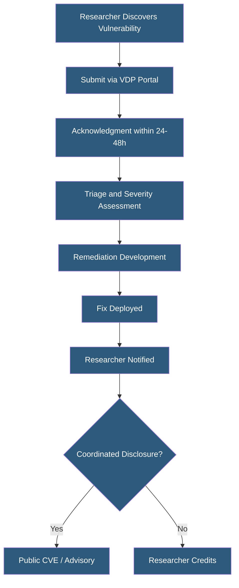

**Category:** Compliance & Regulations
**Difficulty:** Intermediate
**Reading time:** 5 min read

---

Vulnerability disclosure policies (VDPs) define the rules under which external security researchers may report security vulnerabilities to an organization and how those reports will be handled. A well-designed VDP creates a legal safe harbor for good-faith researchers, establishes response timelines, and reduces the risk that vulnerabilities are sold to adversaries or disclosed publicly before remediation.

- **Coordinated Vulnerability Disclosure (CVD)** — process where researcher and organization work together on remediation before public disclosure
- **Safe Harbor** — legal protection for researchers acting in good faith under the VDP's defined scope
- **Bug Bounty** — extension of a VDP that offers financial rewards for qualifying vulnerability reports
- **Responsible Disclosure** — researcher-side obligation to give the organization reasonable time to remediate before publishing
- **Scope** — systems and domains included in the VDP (in-scope) versus excluded systems (out-of-scope)
- **SLA (Service Level Agreement)** — commitments on how quickly the organization will acknowledge, triage, and respond to reports
- **CVE (Common Vulnerabilities and Exposures)** — standardized identifier assigned to publicly disclosed vulnerabilities

A VDP document published on the organization's website (typically at the well-known URI `/.well-known/security.txt` per RFC 9116, and linked from the main site) defines the program scope, safe harbor terms, submission channel, and response commitments. The safe harbor language is critical: it assures researchers that testing within scope using defined methods will not result in legal action under the Computer Fraud and Abuse Act (CFAA) or equivalent laws, encouraging legitimate researchers to report rather than ignore or sell vulnerabilities.

The submission channel is typically a web form, email alias (security@domain.com), or platform like HackerOne or Bugcrowd. Platform-hosted programs provide triage tooling, duplicate detection, researcher reputation scoring, and structured communication workflows. Upon receiving a report, the organization should acknowledge within 24–48 hours, provide an initial severity assessment within 5 business days, and communicate a remediation timeline. Industry standard disclosure timelines (from Google Project Zero's 90-day policy to broader practice) give organizations 90 days to remediate before the researcher may publish.

For compliance purposes, ISO 27001 Annex A Control 6.8 (Reporting of Information Security Events) addresses VDPs as part of the broader security event reporting program. Several US government agencies and CISA guidelines encourage VDPs as a cybersecurity best practice. PCI DSS v4.0 Requirement 6.3.1 requires processes for receiving and responding to security vulnerability information, which a VDP satisfies.

Bug bounty programs add financial incentives on top of VDP protections. Programs run on platforms like HackerOne, Bugcrowd, or Intigriti offer tiered rewards based on vulnerability severity (CVSS scoring) and business impact. Payouts range from $100 for low-severity findings to $50,000+ for critical remote code execution vulnerabilities in production systems.

- Cloud hosting provider publishing a VDP to channel security researcher reports away from social media
- SaaS company launching a bug bounty program to crowdsource security testing from 100,000+ researchers
- Government agency complying with CISA Binding Operational Directive 20-01 requiring VDP for .gov domains
- Enterprise organization using a private bug bounty program for targeted assessment by vetted researchers
- Open source infrastructure project creating a responsible disclosure process for security issues

| Advantage | Disadvantage |
|-----------|--------------|
| Channels researcher discoveries into controlled remediation workflow | Managing high-volume reports requires dedicated security triage resources |
| Safe harbor reduces risk of legal conflict with good-faith researchers | Poorly scoped VDPs invite testing of production customer systems |
| Bug bounties attract skilled researchers who find real vulnerabilities | Duplicate reports and low-quality submissions consume triage time |
| Demonstrates security maturity to customers and partners | Public disclosure timelines create remediation pressure for complex vulnerabilities |

- [Penetration Testing Requirements](penetration-testing-requirements.md)
- [Incident Response Plans](incident-response-plans.md)
- [Compliance Monitoring Automation](compliance-monitoring-automation.md)

---
*Part of the [Compliance & Regulations](index.md) category · [Back to Master Index](../../index.md)*
