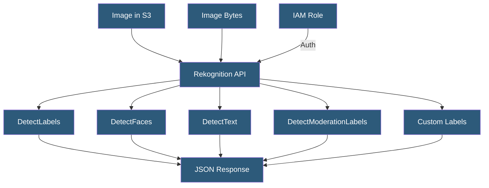

**Category:** Computer Vision Model Hosting
**Difficulty:** Intermediate
**Reading time:** 6 min read

---

Amazon Rekognition is AWS's managed computer vision service providing object detection, facial analysis, celebrity recognition, text extraction, content moderation, and custom label training through a fully managed API. It integrates natively with AWS services and offers pay-per-use pricing without infrastructure management.

- **DetectLabels** — identifies objects, scenes, and concepts in images with confidence scores
- **DetectFaces** — locates faces and returns attributes (age estimate, emotions, pose, landmarks)
- **CompareFaces** — 1:1 face similarity comparison returning a confidence score
- **SearchFacesByImage** — 1:N face search against a collection (face database) for identification
- **Custom Labels** — transfer learning feature training domain-specific models on user-provided images
- **Content Moderation** — detecting explicit, suggestive, violence, and disturbing content
- **Streaming Video Analysis** — real-time analysis of Kinesis Video Streams for continuous inference

Amazon Rekognition integrates directly with S3 — images can be passed by S3 bucket/key reference rather than inline bytes, eliminating re-upload overhead for images already in AWS. IAM authentication handles authorization, enabling fine-grained access control using standard AWS policies. The API is available across AWS regions with independent pricing per region.

The `DetectLabels` call returns a hierarchical label structure: an image of a dog playing fetch in a park returns labels at multiple levels — Animal → Dog → Golden Retriever — with bounding boxes and confidence scores. The label taxonomy is maintained by AWS and updated periodically. `DetectText` extracts text from images using OCR optimized for scene text (signs, labels, license plates) returning word-level bounding boxes and a full page-level string.

Facial recognition uses a Collection abstraction: `IndexFaces` adds face embeddings to a named collection with associated metadata (user IDs); `SearchFacesByImage` queries the collection to identify individuals from a new photo. Collections support millions of faces with sub-second lookup. For content moderation, the response includes a Moderation Label hierarchy (e.g., Explicit Nudity → Graphic Male Nudity) with confidence scores, and a MinConfidence threshold filters results.

Custom Labels enables domain-specific detection training. Users upload images through the Rekognition console or API, annotate with bounding boxes or image-level labels, and train a model on Rekognition's managed GPU infrastructure. Training a custom model takes 30–90 minutes depending on dataset size. The deployed model is accessed through a `DetectCustomLabels` call against a specific model ARN, with billing for the hours the custom model endpoint remains running.

- Social platform using content moderation API to filter uploaded images automatically
- Building access control system using face collections for employee identification
- News platform extracting text from photographs for search indexing
- E-commerce product feed using object detection to verify image content matches listing
- Industrial safety system using custom labels to detect PPE compliance

| Advantage | Disadvantage |
|-----------|--------------|
| Native AWS integration with IAM, S3, and Lambda | Higher per-image cost than self-hosted open-source models at scale |
| No infrastructure to manage; automatic scaling | Custom Labels model endpoints billed hourly even without traffic |
| Facial recognition collections support millions of faces | Facial recognition use restricted in some regions due to privacy regulations |
| Content moderation API covers broad range of harmful content categories | DetectLabels taxonomy is opaque — cannot add custom concepts without Custom Labels |

- [Google Cloud Vision API](google-cloud-vision-api.md)
- [Azure Computer Vision API](azure-computer-vision-api.md)
- [Object Detection APIs](object-detection-apis.md)

---
*Part of the [Computer Vision Model Hosting](index.md) category · [Back to Master Index](../../index.md)*
