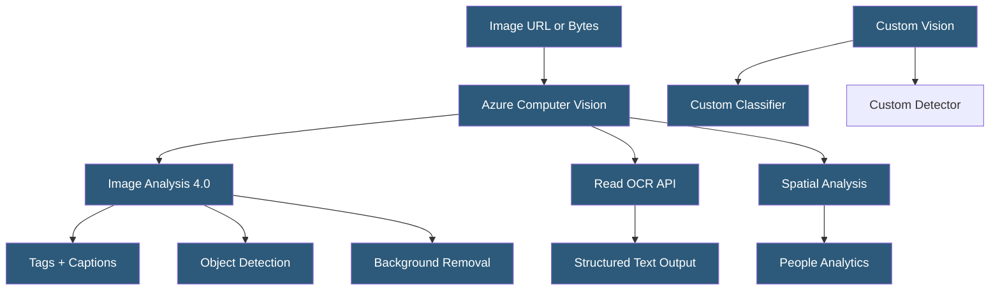

**Category:** Computer Vision Model Hosting
**Difficulty:** Intermediate
**Reading time:** 6 min read

---

Azure Computer Vision is Microsoft's managed CV service offering image analysis, OCR, face detection, spatial analysis for video, and custom model training via Custom Vision. The 4.0 API consolidates multiple capabilities into a single Image Analysis endpoint and introduces Florence-based foundation model features including dense captioning and image segmentation.

- **Image Analysis 4.0** — unified endpoint supporting tags, captions, dense captions, object detection, people detection, and smart crops
- **Florence** — Microsoft's large multimodal vision model powering new Azure Computer Vision capabilities
- **Read API** — Azure's OCR service optimized for document extraction; part of Azure AI Document Intelligence
- **Spatial Analysis** — video analytics detecting people presence, crossing, and distancing in camera feeds
- **Custom Vision** — Azure's service for training image classification and object detection models
- **Smart Crops** — automatically generated thumbnail crops focusing on the most visually interesting region
- **Background Removal** — Azure 4.0 feature segmenting foreground subjects from backgrounds

Azure Computer Vision 4.0's Image Analysis endpoint accepts images via URL or uploaded bytes and returns analysis results based on requested visual features: `TAGS` (descriptive labels), `CAPTION` (natural language description), `DENSE_CAPTIONS` (captions for detected regions), `OBJECTS` (object bounding boxes), `PEOPLE` (person locations), `SMART_CROPS` (thumbnail regions), and `READ` (inline OCR). The Florence foundation model powers captioning and dense captioning, providing more natural language descriptions than keyword-based approaches.

The Read API (also integrated into Azure AI Document Intelligence) is Azure's flagship OCR service, particularly strong for dense structured documents: forms, receipts, invoices, and contracts. It returns a hierarchical structure of pages, lines, words, and bounding polygons with high accuracy on printed and handwritten text. The async endpoint processes large documents returning a result URL polled for completion.

Spatial Analysis deploys container-based software to edge devices (NVIDIA GPU servers) connected to camera feeds. It runs person detection models locally and computes zone analytics: counting people entering/exiting defined regions, measuring time spent, detecting crowding, and measuring inter-person distances. All video processing occurs locally — only aggregate analytics (counts, events) are transmitted, addressing privacy concerns about cloud video streaming.

Custom Vision provides a simple GUI for training custom image classifiers and object detectors. Models are exported to CoreML, TensorFlow, ONNX, or can remain in Azure as hosted endpoints. Azure Custom Vision is particularly accessible for non-ML teams due to its drag-and-drop training interface and automatic smart labeling using active learning suggestions.

- Accessibility application generating image captions for visually impaired users
- Document processing pipeline extracting structured data from invoices and receipts
- Retail store using Spatial Analysis to measure dwell time in product zones
- Media company using background removal for thumbnail generation automation
- Hospital using Custom Vision for radiology image classification without ML team

| Advantage | Disadvantage |
|-----------|--------------|
| Azure ecosystem integration with Active Directory and Azure Storage | Azure-specific pricing and region availability |
| Florence foundation model produces high-quality natural language descriptions | 4.0 API features availability varies by Azure region |
| Spatial Analysis edge container enables privacy-safe video analytics | Spatial Analysis requires compatible NVIDIA GPU hardware on premises |
| Read API is among the best for structured document extraction | Custom Vision training costs and per-prediction billing adds up at scale |

- [Amazon Rekognition API](amazon-rekognition-api.md)
- [Azure Custom Vision Service](azure-custom-vision-service.md)
- [Document AI Services](document-ai-services.md)

---
*Part of the [Computer Vision Model Hosting](index.md) category · [Back to Master Index](../../index.md)*
