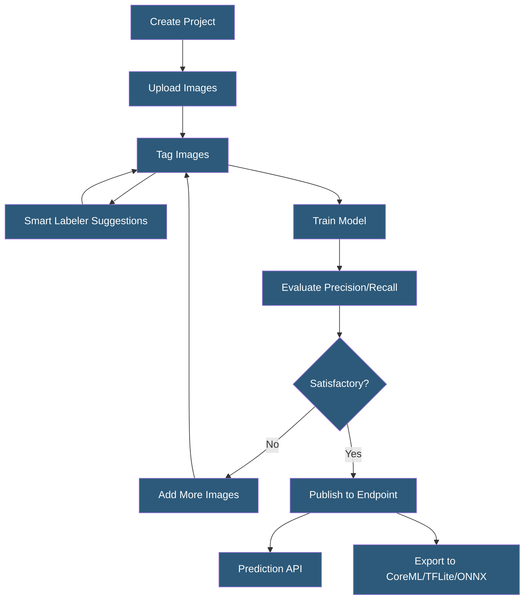

**Category:** Computer Vision Model Hosting
**Difficulty:** Beginner
**Reading time:** 5 min read

---

Azure Custom Vision Service is Microsoft's managed transfer learning platform enabling image classification and object detection model training through a graphical interface or REST API. It requires minimal ML expertise and provides multiple export formats for deploying custom models to cloud endpoints or edge devices.

- **Classification Project** — trains a model to assign one or more category labels to entire images
- **Object Detection Project** — trains a model to locate and identify objects with bounding boxes
- **Smart Labeler** — active learning feature suggesting labels for unlabeled images based on the current model
- **Quick Training** — faster but less accurate training option suitable for rapid iteration
- **Advanced Training** — longer training with more compute for higher accuracy production models
- **Compact Domain** — model variant optimized for export to mobile/edge (smaller, faster, exportable)
- **Probability Threshold** — minimum confidence score at which predictions are counted as positive

Azure Custom Vision requires a minimum of 15 images per class for classification and 15 images with at least 1 box annotated per class for detection. The GUI allows uploading images from disk or URL, then tagging them with class labels via click-and-type or drag-to-draw (for detection). The Smart Labeler feature runs the current model on untagged images and presents confidence-ordered suggestions, allowing rapid bulk labeling by confirming or rejecting proposals.

Training is triggered by clicking "Train" and selecting Quick Training (15–30 minutes) or Advanced Training (hours, higher accuracy). The platform displays precision-recall curves and per-class metrics post-training. The probability threshold slider on the evaluation page allows operators to tune the precision-recall tradeoff for the specific application — higher thresholds reduce false positives; lower thresholds reduce missed detections.

Published models receive a prediction API endpoint that accepts images and returns classification probabilities or detection bounding boxes. The API response format is JSON with probabilities and bounding box coordinates in normalized [0,1] space. Export functionality supports TensorFlow (SavedModel/TFLite), CoreML, ONNX, OpenVINO, and a Docker container format — but exportable models require selecting a "Compact" domain during project creation, which trades some accuracy for portability.

Iteration management maintains multiple trained model versions. Each iteration is evaluated independently, and operators choose which iteration to publish to the prediction endpoint, enabling safe rollback if a new training run degrades accuracy.

- Non-profit training a model to classify wildlife camera trap photos by species
- HR platform training logo detection to identify company affiliations in profile photos
- Small retailer training a shelf auditing model without ML engineering resources
- Hospital administrator training a simple image classifier for document type routing
- Developer prototyping a custom detection model before investing in production ML pipeline

| Advantage | Disadvantage |
|-----------|--------------|
| GUI-driven training requires no Python or ML knowledge | Exportable compact models sacrifice accuracy vs cloud-only models |
| Smart Labeler accelerates annotation for iterative training | Limited architecture options — cannot tune model architecture |
| Azure integration enables easy pipeline with Blob Storage and Functions | 15-image minimum per class is low; real accuracy requires 100s of examples |
| Multiple export formats cover most deployment targets | Prediction endpoint billed per 1,000 transactions; costs accumulate at scale |

- [Azure Computer Vision API](azure-computer-vision-api.md)
- [Image Classification Services](image-classification-services.md)
- [On-Device Inference Optimization](on-device-inference-optimization.md)

---
*Part of the [Computer Vision Model Hosting](index.md) category · [Back to Master Index](../../index.md)*
