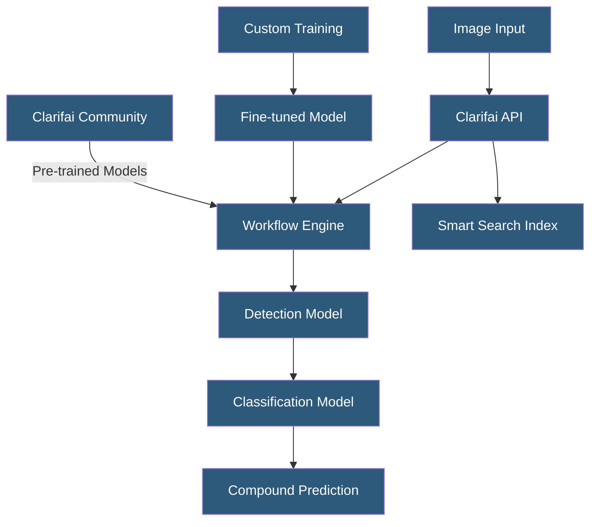

**Category:** Computer Vision Model Hosting
**Difficulty:** Intermediate
**Reading time:** 6 min read

---

Clarifai is a full-stack AI platform providing pre-trained computer vision models, custom model training, and production deployment infrastructure through a unified API. It offers both ready-to-use models for common CV tasks and tooling for building domain-specific custom models without deep ML expertise.

- **Clarifai App** — organizational unit containing datasets, models, workflows, and API keys
- **Concept** — Clarifai's term for a classification label or detection class used consistently across models
- **Workflow** — chained sequence of models executed on a single input; enables compound predictions
- **Model Version** — immutable snapshot of trained model weights deployed to a specific endpoint
- **Input** — image, video, or text submitted to Clarifai for prediction; stored with metadata and annotations
- **Smart Search** — visual similarity search using image embeddings to find related images in a dataset
- **Clarifai Community** — marketplace of publicly shared models, datasets, and workflows

Clarifai exposes computer vision capabilities through a REST API centered on the concept of Inputs (images with associated predictions and annotations) and Models (neural networks producing predictions). The platform ships with production-ready general models: General Image Recognition (1000 concepts covering common objects), Food, Travel, Wedding, NSFW content moderation, Face detection, and Celebrity recognition. These require no training — developers submit images and receive structured prediction results immediately.

Custom model training on Clarifai uses a transfer learning approach. Developers create a dataset of inputs, annotate them with concepts using the web GUI or API, and trigger training. Clarifai fine-tunes the model on the custom dataset, typically within minutes for small datasets. The trained model is versioned and deployed instantly to the same API endpoint format.

Workflows are Clarifai's most powerful deployment pattern: chaining models sequentially so the output of one model feeds into the next. A moderation workflow might run a general detector, then filter detected regions through NSFW and violence classifiers, then run OCR on detected text regions — all in a single API call. Visual similarity search uses image embedding models to build searchable indices, enabling "find similar products" features without traditional metadata search.

The platform provides SDKs for Python, JavaScript, Java, and other languages. Pricing is based on input processing operations rather than API calls, with different rates for different model types. Clarifai Community enables sharing and reusing models across the platform, building a catalog of domain-specific models for medical imaging, industrial inspection, and other verticals.

- Content moderation platform using Clarifai NSFW and violence detection for user-generated content
- E-commerce site using visual similarity search for "find similar products" recommendations
- News agency using celebrity recognition and logo detection in submitted photos
- HR platform using Clarifai face detection for employee photo processing
- Custom retail model training for specific product category recognition

| Advantage | Disadvantage |
|-----------|--------------|
| Pre-trained models enable immediate deployment without training | Per-operation pricing becomes expensive at high inference volumes |
| Workflow composition enables complex multi-model pipelines without code | Less flexibility than self-hosted solutions for advanced architectures |
| Community model marketplace reduces custom training requirements | Limited model architecture choices compared to open-source alternatives |
| Automatic model versioning simplifies rollback | Data sent to cloud; not suitable for highly sensitive imagery without enterprise agreement |

- [Clarifai Model Gallery](clarifai-model-gallery.md)
- [Object Detection APIs](object-detection-apis.md)
- [Image Classification Services](image-classification-services.md)

---
*Part of the [Computer Vision Model Hosting](index.md) category · [Back to Master Index](../../index.md)*
