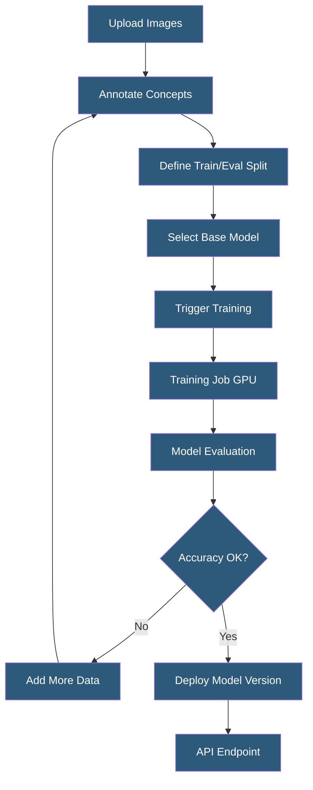

**Category:** Computer Vision Model Hosting
**Difficulty:** Intermediate
**Reading time:** 5 min read

---

Clarifai's custom model training enables developers to fine-tune computer vision models on proprietary datasets using transfer learning from pre-trained base models. The platform handles infrastructure management, training orchestration, and model versioning, making custom CV models accessible without deep ML engineering expertise.

- **Transfer Learning** — fine-tuning a pre-trained model on new data, leveraging learned visual features
- **Positive / Negative Concepts** — training labels in Clarifai; positive examples show the concept, negative examples don't
- **Training Trigger** — initiating a new model training run; creates a new versioned model checkpoint
- **Eval Set** — held-out subset of inputs used to measure trained model accuracy before deployment
- **Embedding Layer** — intermediate model representation capturing visual semantics, used for similarity search
- **Region Annotations** — bounding box labels enabling object detection model training on Clarifai
- **Iteration** — training epoch count; more iterations improve accuracy up to diminishing returns

Clarifai custom model training uses a transfer learning paradigm: the platform fine-tunes a pre-trained visual backbone (typically ResNet, EfficientNet, or a CLIP visual encoder) on user-provided labeled data. This approach requires significantly less data than training from scratch — 50–200 images per class often produce acceptable accuracy for classification tasks, while detection models typically require 500+ annotated examples.

The training process is abstracted behind a simple API call or GUI trigger. The platform manages GPU provisioning, hyperparameter selection (learning rate schedule, batch size, augmentation), and model persistence. Users configure the number of training iterations (epochs) and select the base model architecture. A higher-capacity base model (larger architecture) generally achieves better accuracy but increases inference cost.

Post-training evaluation displays accuracy metrics per concept: precision, recall, F1, and confusion matrix. Clarifai shows which concepts are being confused with each other, guiding focused data collection. If concept A is consistently misclassified as concept B, adding more diverse training examples of A — especially those visually similar to B — improves the decision boundary.

Custom models receive a versioned API endpoint at the same URL pattern as built-in models, enabling transparent swapping of custom models into existing workflows. Multiple model versions can coexist, enabling A/B testing of model improvements before full traffic migration. Active learning features can route low-confidence predictions from the deployed model back to a labeling queue for annotation, creating a continuous improvement loop.

- Apparel retailer training a model to classify garments by style, color, and category
- Medical device company building a custom skin lesion classification model
- Insurance company training damage detection model on proprietary claim imagery
- Consumer goods brand training logo and product recognition for brand monitoring
- Security company training face attribute classification for access control

| Advantage | Disadvantage |
|-----------|--------------|
| No ML engineering required — training via GUI or simple API call | Less control over architecture and training configuration than PyTorch |
| Fast training turnaround (minutes for small datasets) | Accuracy ceiling is lower than specialized architectures for complex tasks |
| Automatic versioning and same API endpoint as platform models | Annotation done in Clarifai format; migration to other platforms requires conversion |
| Active learning integration for continuous improvement | Clarifai infrastructure dependency — no self-hosted option for custom models |

- [Clarifai AI Platform](clarifai-ai-platform.md)
- [Image Classification Services](image-classification-services.md)
- [Computer Vision Model Versioning](computer-vision-model-versioning.md)

---
*Part of the [Computer Vision Model Hosting](index.md) category · [Back to Master Index](../../index.md)*
