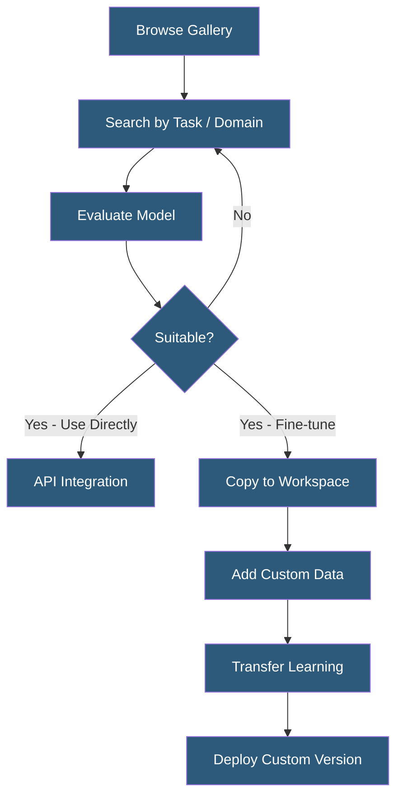

**Category:** Computer Vision Model Hosting
**Difficulty:** Beginner
**Reading time:** 5 min read

---

The Clarifai Model Gallery (Community) is a marketplace of publicly shared pre-trained models, datasets, and workflows covering computer vision, NLP, and multimodal tasks. It reduces model development time by providing reusable starting points fine-tunable on domain-specific data.

- **Community Model** — publicly shared model available to all Clarifai users for inference or fine-tuning
- **Star Rating** — quality signal for community models based on user ratings and usage statistics
- **Model Version** — specific trained checkpoint; community models may expose multiple versions
- **Copy Model** — action duplicating a community model into your own workspace for fine-tuning
- **Inference Credits** — consumption unit for running predictions; shared across all models in an account
- **Foundation Models** — large pre-trained base models (CLIP, BLIP, open-source LLMs) available for inference
- **Domain Packs** — curated collections of models for specific industries (medical, retail, manufacturing)

The Clarifai Model Gallery surfaces publicly available models through search and browse interfaces. Users filter by task type (classification, detection, segmentation, embedding, generation), modality (image, video, text, audio), and domain (medical, retail, food, safety). Each model page shows the model architecture, input/output specification, example results, usage statistics, and API integration code snippets.

Pre-trained models can be used directly via API without any training by adding them to a workflow or calling the model endpoint directly. Developers submit a test image through the gallery UI to evaluate model performance before committing to integration. For models requiring fine-tuning, the "Copy" action duplicates the model's architecture and weights into the user's workspace, where additional training data can be added and transfer learning applied.

The gallery includes Clarifai's own maintained models alongside community contributions. Clarifai's general visual recognition models (General, Food, Travel, NSFW) are continuously updated with improved versions while maintaining stable API endpoints. The CLIP and BLIP multimodal models enable zero-shot classification (classifying images based on natural language descriptions without task-specific training) and image captioning.

Foundation model access in the gallery allows developers to run inference on large models (Llama, Mistral, Stable Diffusion) without managing GPU infrastructure, paying per inference operation. This positions Clarifai as an alternative to dedicated inference providers like Replicate for serving community foundation models.

- Developer evaluating multiple food recognition models before selecting one for a restaurant app
- Startup using Clarifai's NSFW model immediately without training for content platform moderation
- Researcher fine-tuning a general detection model on a specialized scientific imaging dataset
- Enterprise reusing a proprietary internal model shared across Clarifai workspaces within the organization
- Product manager evaluating gallery demo images before approving model integration budget

| Advantage | Disadvantage |
|-----------|--------------|
| Immediate access to production-ready models without training | Community model quality varies significantly without guaranteed accuracy benchmarks |
| Gallery discovery accelerates identifying starting points for custom models | Fine-tuning workflow is simpler but less flexible than PyTorch/HuggingFace training |
| Zero-shot CLIP models reduce training data requirements for new categories | Inference credits costs scale rapidly with high-volume prediction workloads |
| Foundation model access without GPU infrastructure management | API dependency creates vendor lock-in for production applications |

- [Clarifai AI Platform](clarifai-ai-platform.md)
- [Clarifai Custom Models](clarifai-custom-models.md)
- [Image Classification Services](image-classification-services.md)

---
*Part of the [Computer Vision Model Hosting](index.md) category · [Back to Master Index](../../index.md)*
