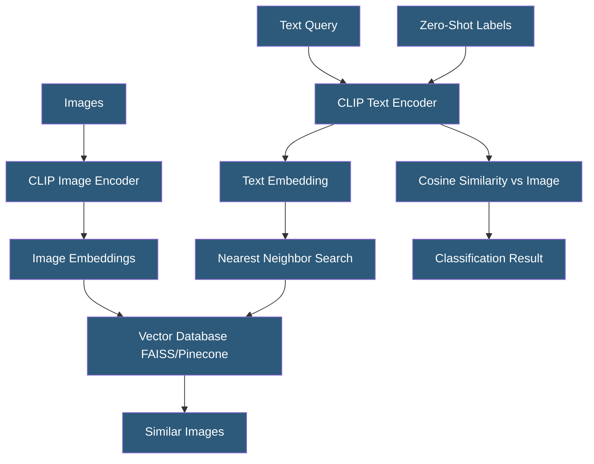

**Category:** Computer Vision Model Hosting
**Difficulty:** Advanced
**Reading time:** 6 min read

---

OpenAI's CLIP (Contrastive Language-Image Pre-Training) is a multimodal foundation model that learns joint image-text representations, enabling zero-shot image classification, text-to-image search, and image similarity computations without task-specific training. Deploying CLIP for production requires efficient embedding computation and vector indexing infrastructure.

- **Image Encoder** — ViT or ResNet backbone producing 512 or 768-dimensional image embeddings
- **Text Encoder** — transformer model producing embeddings in the same space as image embeddings
- **Cosine Similarity** — primary metric for comparing CLIP embeddings; measures angular distance in embedding space
- **Zero-Shot Classification** — classifying images by comparing image embeddings to text embeddings of class names
- **Embedding Cache** — pre-computed image embeddings stored in a vector database for fast retrieval
- **FAISS** — Facebook AI Similarity Search library for efficient approximate nearest neighbor search
- **OpenCLIP** — open-source CLIP reimplementation with models trained on larger datasets (LAION)

CLIP's dual-encoder architecture maps images and text into a shared 512-dimensional (ViT-B/32) or 768-dimensional (ViT-L/14) embedding space where semantically similar content is close in vector space. The embedding quality enables several powerful downstream applications without any additional training.

Zero-shot classification works by computing text embeddings for class label strings (e.g., "a photo of a cat", "a photo of a dog") and comparing them to the image embedding using cosine similarity. The class with highest similarity wins. CLIP achieves ~75% top-1 accuracy on ImageNet without any ImageNet training — a remarkable result that demonstrates the power of language supervision. For domain-specific classes, framing the text prompt as "a photo of [concept] in [context]" typically outperforms bare class names.

Text-to-image search is CLIP's most commercially deployed application. A catalog of images has its embeddings pre-computed and indexed in a vector database (FAISS, Pinecone, Weaviate, Qdrant). A text query is encoded to an embedding, and approximate nearest neighbor search retrieves the most similar images in milliseconds across millions of vectors. This powers "describe what you're looking for" search interfaces.

Serving CLIP efficiently requires batching: encoding multiple images in a single forward pass dramatically improves throughput. Using FP16 precision halves memory and speeds computation with negligible accuracy impact. For large catalogs, pre-computing and caching all image embeddings offline (not real-time) is the standard approach — only new uploads require real-time encoding.

- Visual search engine enabling text queries against an image catalog ("find photos with red umbrellas")
- Dataset curation using CLIP embeddings to cluster similar images and identify duplicates
- Content moderation using zero-shot classification for novel harmful content categories
- E-commerce "shop by photo" feature matching uploaded images against product catalog
- Medical imaging research clustering patient scans by visual similarity for pattern discovery

| Advantage | Disadvantage |
|-----------|--------------|
| Zero-shot classification requires no labeled training data per new category | Zero-shot accuracy lower than fine-tuned supervised models for domain-specific tasks |
| Unified image-text embedding enables diverse downstream applications | Large ViT-L/14 model requires significant GPU memory for inference |
| Pre-computing embeddings enables millisecond-scale search over millions of images | Embedding quality depends on CLIP's training distribution — unusual domains may perform poorly |
| OpenCLIP provides open-source alternatives with larger training datasets | Text encoding must be carefully engineered — vague prompts produce poor results |

- [Segment Anything Model Hosting](segment-anything-model-hosting.md)
- [Image Classification Services](image-classification-services.md)
- [Computer Vision Model Versioning](computer-vision-model-versioning.md)

---
*Part of the [Computer Vision Model Hosting](index.md) category · [Back to Master Index](../../index.md)*
