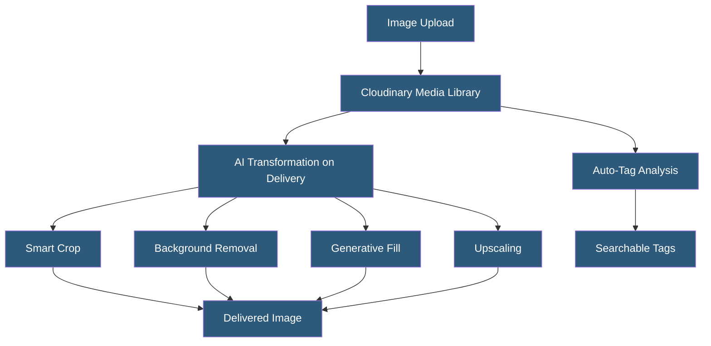

**Category:** Computer Vision Model Hosting
**Difficulty:** Intermediate
**Reading time:** 5 min read

---

Cloudinary embeds AI-powered image analysis capabilities directly into its media management platform, enabling automatic tagging, background removal, object-aware cropping, and content moderation as part of image upload and transformation pipelines. These features operate without requiring separate CV API integrations.

- **Auto Tagging** — automatic assignment of descriptive labels to uploaded images using AI vision models
- **Background Removal** — AI-based background segmentation integrated into Cloudinary transformation URLs
- **Generative Fill** — AI extending image backgrounds using Stable Diffusion-style generation
- **Smart Crop** — object-detection-aware cropping that keeps primary subjects in frame regardless of aspect ratio
- **Content-Aware Padding** — AI fills extended canvas with contextually appropriate content
- **Cloudinary AI** — collective name for Cloudinary's ML-powered transformation and analysis features
- **Gravity: Subject** — transformation parameter using AI to identify and center the primary subject

Cloudinary's AI features integrate into its transformation URL syntax, making them accessible without additional API calls or infrastructure. Background removal is invoked by adding `e_background_removal` to a Cloudinary transformation URL — Cloudinary runs the segmentation model on first request, returns the subject on a transparent background, and caches the result for subsequent requests. The same pattern applies to `e_upscale` (AI super-resolution) and `e_generative_fill` (canvas extension).

Smart cropping (`c_thumb,g_auto`) uses face detection and object detection to identify the most important region of an image, generating crops that maintain subject centering regardless of how the source image was framed. This is particularly valuable for responsive web design where product or person images need consistent framing across portrait, landscape, and square crops. The `g_subject` gravity option uses a more advanced model to identify primary subjects including animals and objects, not just faces.

Auto-tagging on upload requires enabling the Cloudinary AI add-on. Upon image ingestion, Cloudinary runs the image through integrated vision APIs (Google Vision, Amazon Rekognition, or Cloudinary's own models depending on configuration) and stores the results as searchable metadata tags in the media library. These tags enable programmatic or GUI-based searching: "show me all images containing 'beach'."

AI credits are consumed per transformation — background removal, generative fill, and upscaling each consume credits from the account's AI credit allocation. Unlike per-API-call pricing, Cloudinary bundles AI capabilities with its media management subscription, reducing integration complexity for teams already using Cloudinary.

- E-commerce platform automatically removing product photo backgrounds at upload time
- Fashion retailer applying smart cropping for consistent model photo thumbnails across devices
- News media company using auto-tagging to make photo library searchable by visual content
- Marketing team using generative fill to adapt product photos to different aspect ratios
- Travel platform enriching destination photo metadata with automatic location and scene tags

| Advantage | Disadvantage |
|-----------|--------------|
| AI features integrated into existing Cloudinary media pipeline, no separate integration | AI features consume credits with potentially surprising billing at scale |
| Transformation URL syntax enables lazy application of AI without pre-processing | Less control over underlying model selection compared to dedicated CV APIs |
| Smart crop and background removal available through CDN transformation URL | Quality varies — background removal struggles with hair and transparent objects |
| Generative fill extends creative options for marketing teams without Photoshop | AI capabilities require Cloudinary premium plans or add-ons |

- [Amazon Rekognition API](amazon-rekognition-api.md)
- [Image Classification Services](image-classification-services.md)
- [Object Detection APIs](object-detection-apis.md)

---
*Part of the [Computer Vision Model Hosting](index.md) category · [Back to Master Index](../../index.md)*
