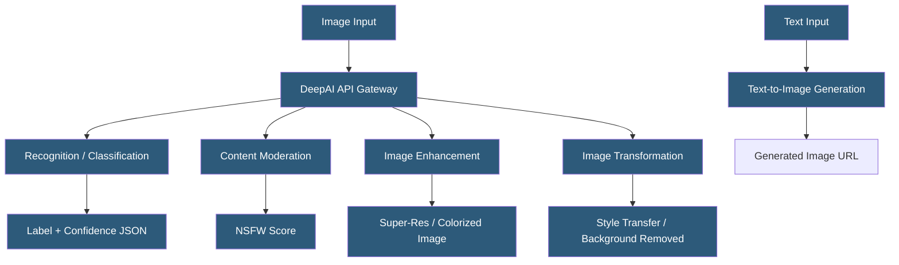

**Category:** Computer Vision Model Hosting
**Difficulty:** Beginner
**Reading time:** 5 min read

---

DeepAI offers a collection of accessible computer vision and image generation APIs covering colorization, style transfer, super-resolution, background removal, and image recognition. It targets developers seeking quick integration of AI image capabilities without building ML infrastructure.

- **Image Recognition API** — returns object labels and confidence scores using a pretrained ImageNet model
- **NSFW Detection** — content moderation API classifying image content as safe, suggestive, or explicit
- **Image Colorization** — converts grayscale images to colorized versions using deep learning
- **Super Resolution** — upscales images 4x using generative upsampling models
- **Background Removal** — segments foreground subjects and produces transparent-background images
- **Stable Diffusion API** — text-to-image generation endpoint using Stable Diffusion
- **Style Transfer** — applies the artistic style of one image to the content of another

DeepAI's APIs follow a simple request pattern: HTTP POST with an image URL or file upload, API key in the header, returning JSON with results or an output image URL. The image recognition API submits images to a ResNet-based classifier trained on ImageNet, returning the top predicted classes with scores. Unlike enterprise CV APIs, DeepAI does not offer custom model training — all capabilities use fixed pre-trained models.

The background removal API uses a salient object detection network to identify foreground subjects and produces PNG output with transparency. Results are generally good for single objects against clear backgrounds; complex multi-object compositions with similar foreground/background colors produce lower quality results. Output images are returned as temporary URLs hosted on DeepAI's CDN.

Content moderation uses an ensemble approach returning a score between 0 (safe) and 1 (explicit) with intermediate values for suggestive content. The simple numeric score is easier to integrate than category hierarchies, though it lacks the granularity of AWS Rekognition's moderation label taxonomy for specific content types.

The super-resolution API uses an ESRGAN-style generative model to upscale images. The 4x upscaling is useful for enhancing low-resolution product images or historical photographs. DeepAI handles all GPU infrastructure, so the client sends an image and receives an enhanced version without managing any compute resources.

Pricing is subscription-based with a free tier (5 API calls/day) and paid tiers for production workloads. Unlike major cloud providers, DeepAI does not offer enterprise SLAs, dedicated infrastructure, or compliance certifications, positioning it for developer prototyping and small-scale production rather than enterprise deployments.

- Developer prototyping a photo enhancement feature before committing to enterprise CV infrastructure
- Small media website adding automatic image colorization to archive photographs
- Personal project or hobby application needing quick NSFW content filtering
- E-commerce seller using background removal for product photo standardization
- Blogger using style transfer for artistic image generation in content production

| Advantage | Disadvantage |
|-----------|--------------|
| Simple API with immediate access, no ML infrastructure needed | No custom model training — limited to pre-trained fixed models |
| Diverse portfolio covers unusual capabilities like colorization and super-resolution | No enterprise SLAs, uptime guarantees, or compliance certifications |
| Competitive pricing for small to medium workloads | Output quality lower than specialized tools for complex images |
| Free tier for prototyping and development | API key security is simple; no IAM/OAuth integration |

- [Imagga Image Recognition API](imagga-image-recognition-api.md)
- [Image Classification Services](image-classification-services.md)
- [Object Detection APIs](object-detection-apis.md)

---
*Part of the [Computer Vision Model Hosting](index.md) category · [Back to Master Index](../../index.md)*
