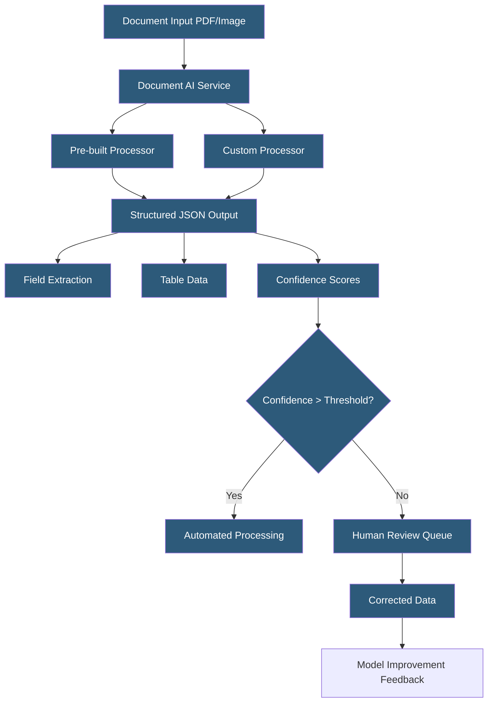

**Category:** Computer Vision Model Hosting
**Difficulty:** Intermediate
**Reading time:** 6 min read

---

Document AI services combine OCR with document understanding models to extract structured information from forms, invoices, receipts, contracts, and identity documents. These services go beyond character recognition to identify semantic fields, table structures, and key-value relationships within complex document layouts.

- **Key-Value Extraction** — identifying form fields and their values (e.g., "Invoice Number: INV-2024-001")
- **Table Extraction** — parsing tabular structures into row/column cell data
- **Document Processor** — specialized model fine-tuned for a specific document type (invoice, W-2, passport)
- **Pre-built Processor** — cloud provider's trained model for common document types, requiring no training
- **Custom Extractor** — user-trained processor for domain-specific document formats
- **Confidence Score** — per-field probability indicating extraction reliability; low-confidence fields flag for human review
- **Human-in-the-Loop (HITL)** — workflow routing low-confidence extractions to human reviewers for correction

Document AI services use a combination of OCR (text extraction) and layout understanding models (which understand spatial relationships between text blocks) to extract structured information. Unlike plain OCR that returns text with position coordinates, Document AI processors understand that text appearing to the right of the word "Total:" in an invoice is likely the total amount, and text in a table column header applies to all cells in that column.

Google Cloud Document AI offers pre-built processors for invoices (detecting 20+ fields: vendor name, invoice number, due date, line items, totals), receipts, form W-2, 1040 tax forms, driver licenses, passports, and bank statements. These processors achieve high accuracy on standard formats without any training. For custom document types, the Document AI Workbench allows labeling documents to train custom extractors using Google's foundation model with few-shot fine-tuning.

AWS Textract performs similar structured extraction with specific APIs: `AnalyzeDocument` with the `FORMS` feature extracts key-value pairs; the `TABLES` feature extracts tabular data. AWS added a specialized `AnalyzeExpense` API for expense documents and `AnalyzeID` for identity documents, returning standardized field schemas for each document type.

Azure Document Intelligence (formerly Form Recognizer) provides both pre-built models (invoices, receipts, IDs, business cards) and a custom model training workflow. Azure's layout model returns a detailed document structure including page, paragraph, table, and figure hierarchies — useful as a foundation for downstream NLP processing.

Human-in-the-Loop workflows are essential for production document processing. Extracting 95% of fields correctly automates the majority of documents while routing exceptions to human reviewers. Reviewed corrections feed back as additional training data, continuously improving extraction accuracy.

- Accounts payable automation extracting invoice data into ERP systems without manual entry
- Insurance claims processing extracting form data from submitted claims and supporting documents
- Mortgage lending automating income verification from paystubs, W-2s, and bank statements
- Government benefits processing extracting data from citizen-submitted forms at scale
- Legal contract analysis extracting key dates, parties, and obligations from agreements

| Advantage | Disadvantage |
|-----------|--------------|
| Pre-built processors work immediately for common document types without training | Per-page pricing accumulates quickly for high-volume document workflows |
| Confidence scores enable automated HITL routing reducing manual review costs | Custom processor training requires substantial labeled document examples |
| Table extraction handles complex multi-row financial data accurately | Performance degrades on poor scan quality, rotated pages, or unusual layouts |
| Async batch processing handles thousands of documents without synchronous management | Vendor-specific extraction schemas require transformation for cross-provider migration |

- [OCR Optical Character Recognition APIs](ocr-optical-character-recognition-apis.md)
- [Layout Analysis APIs](layout-analysis-apis.md)
- [Azure Computer Vision API](azure-computer-vision-api.md)

---
*Part of the [Computer Vision Model Hosting](index.md) category · [Back to Master Index](../../index.md)*
