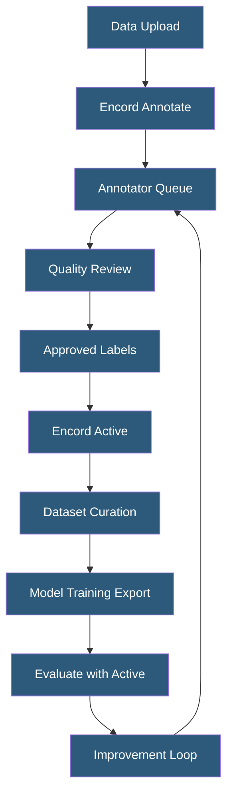

**Category:** Computer Vision Model Hosting
**Difficulty:** Intermediate
**Reading time:** 5 min read

---

Encord is an enterprise computer vision platform specializing in annotation, dataset management, and model evaluation for healthcare, autonomous systems, and industrial applications. It offers annotation tooling for complex modalities including medical imaging (DICOM), video, and point clouds, with strong quality management workflows.

- **Encord Annotate** — annotation editor supporting bounding boxes, polygons, polylines, keypoints, and classifications
- **DICOM Support** — native handling of medical imaging format for radiology AI development
- **Workflow Automation** — configurable annotation pipeline routing tasks through labeling, review, and QA stages
- **Label Consensus** — quality metric comparing annotations from multiple labelers on the same image
- **Encord Active** — separate open-source module for dataset curation and model evaluation
- **Index** — Encord's embedding-based dataset exploration feature for discovering distribution issues
- **Ontology** — structured definition of annotation classes and attributes used consistently across projects

Encord's annotation platform is built around a flexible ontology system — project administrators define the complete set of classes, attributes, and relationships before labeling begins, ensuring consistency across annotators. Annotations are stored as structured JSON linked to specific dataset versions, providing full provenance for each label.

For healthcare applications, Encord natively handles DICOM series — radiologists can annotate across CT or MRI slices with measurements and segmentation masks. The platform's medical-grade quality controls include radiologist review workflows, annotation history for audit compliance, and support for HIPAA-compliant data handling under appropriate enterprise agreements.

Workflow automation routes annotations through configurable pipeline stages: initial labeling → consensus check → expert review → export. Automated quality metrics (polygon IoU, attribute completeness, coverage ratio) flag annotations below quality thresholds for human review without requiring manual inspection of every label.

Encord Active (open-source, deployable locally) extends the platform with dataset curation: embedding images to identify duplicates, near-duplicates, and out-of-distribution samples. Active computes label quality metrics identifying likely annotation errors through cross-validation-style analysis. These tools reduce noise in training datasets without requiring additional labeling effort.

- Radiology AI company annotating CT scans with pixel-level tumor segmentation
- Autonomous driving team labeling multi-camera video with LiDAR fusion
- Industrial inspection company managing 50+ annotators across quality classification tasks
- Medical device startup building training datasets under FDA software validation requirements
- Agricultural AI team annotating drone imagery for crop disease detection

| Advantage | Disadvantage |
|-----------|--------------|
| DICOM support enables healthcare applications without preprocessing | Enterprise pricing is opaque and high for smaller teams |
| Flexible ontology system accommodates complex multi-attribute annotations | Steeper learning curve for ontology design compared to simpler tools |
| Encord Active open-source provides dataset curation without additional cost | Active deployment requires local infrastructure management |
| Strong quality workflows for regulated industry annotation requirements | Less community content and pre-trained models than Roboflow |

- [Roboflow Annotation Tools](roboflow-annotation-tools.md)
- [Image Segmentation Services](image-segmentation-services.md)
- [Computer Vision Model Versioning](computer-vision-model-versioning.md)

---
*Part of the [Computer Vision Model Hosting](index.md) category · [Back to Master Index](../../index.md)*
