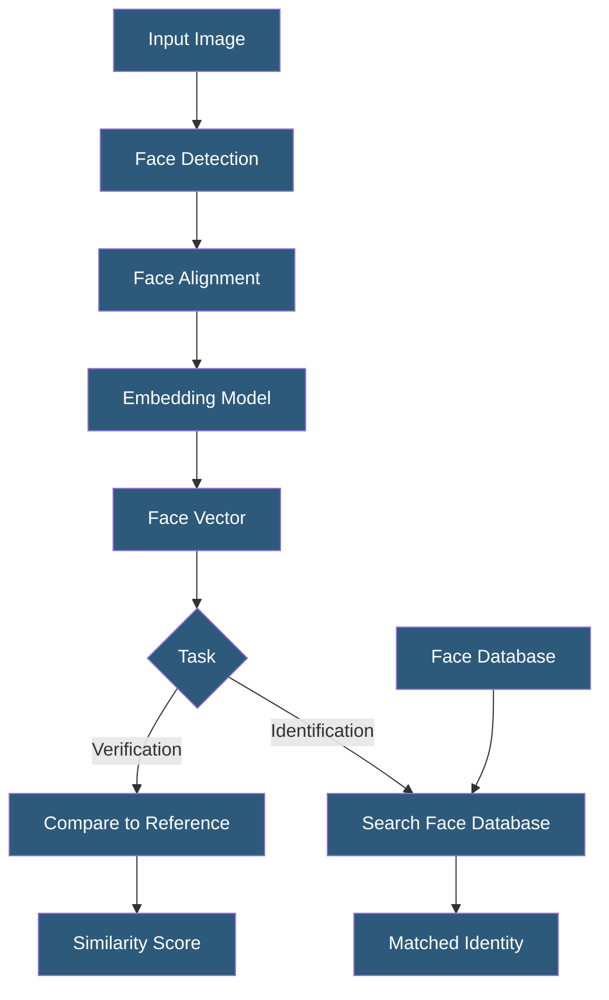

**Category:** Computer Vision Model Hosting
**Difficulty:** Advanced
**Reading time:** 7 min read

---

Facial recognition platforms identify individuals from facial images using deep learning embeddings stored in searchable face databases. Production deployments require careful attention to accuracy disparities across demographic groups, legal compliance with biometric data regulations, and security of the face embedding stores.

- **Face Detection** — locating faces in an image with bounding boxes (prerequisite to recognition)
- **Face Alignment** — normalizing detected face crops by eye position for consistent embedding generation
- **Face Embedding** — 128–512 dimensional vector representation of a face, unique enough for identification
- **1:1 Verification** — comparing two face images to determine if they show the same person
- **1:N Identification** — searching a database of known faces to find the best match for an unknown face
- **ArcFace / CosFace** — loss functions used in state-of-the-art face recognition training
- **Demographic Bias** — accuracy disparities across gender and race documented in NIST FRVT evaluations

Production facial recognition systems consist of four stages: detection, alignment, embedding, and search. Face detection (using MTCNN, RetinaFace, or YOLO-based detectors) finds face regions within images. Alignment normalizes the crop to a standard face position by locating landmark points (eyes, nose, mouth corners) and applying affine transformation. This normalization step is critical — embedding models trained on aligned faces perform significantly better on consistently aligned inputs.

Embedding models (ArcFace, FaceNet, ElasticFace) map aligned face crops to compact vector representations in a high-dimensional space where same-identity faces cluster tightly and different-identity faces separate. State-of-the-art models achieve >99.8% accuracy on the LFW benchmark for 1:1 verification. The embedding vectors are stored in a vector database (FAISS, Milvus) for efficient nearest-neighbor search in 1:N identification scenarios.

Verification thresholds determine the operating point: lower thresholds increase false accepts; higher thresholds increase false rejects. Applications choose thresholds based on their risk tolerance — access control systems may accept 0.01% false accept rates, while consumer photo deduplication may accept 1% false accepts for convenience. NIST's FRVT benchmark provides independent accuracy measurements across demographic groups.

Regulatory compliance is the dominant concern for production deployments. Illinois BIPA, Texas CUBI, Washington My Health MY Data, and EU GDPR Article 9 (biometric data as special category) impose consent requirements, retention limits, and sometimes outright prohibitions on certain use cases. AWS suspended Rekognition face identification to law enforcement in 2020; Microsoft, IBM, and other major providers restricted facial recognition services. Operators must conduct Privacy Impact Assessments before deployment and obtain explicit consent from individuals whose faces are enrolled.

- Employee access control using face verification at building entry points
- Mobile device authentication using on-device face matching (Apple Face ID pattern)
- Photo organization software clustering family photos by person without cloud upload
- Conference registration checking in attendees against registered participant photos
- Age verification systems for age-restricted content with appropriate consent

| Advantage | Disadvantage |
|-----------|--------------|
| 1:1 verification achieves >99.8% accuracy on standard benchmarks | Demographic bias: higher error rates for darker-skinned and female subjects |
| Contactless identification improves user experience vs passwords | Legal restrictions in multiple jurisdictions require careful compliance review |
| Face embeddings enable fast search across millions of enrolled faces | Biometric data breach cannot be reversed — faces cannot be re-issued |
| On-device processing eliminates cloud data transfer privacy risk | Low-quality images (poor lighting, angle, occlusion) significantly degrade accuracy |

- [Amazon Rekognition API](amazon-rekognition-api.md)
- [Object Detection APIs](object-detection-apis.md)
- [Pose Estimation APIs](pose-estimation-apis.md)

---
*Part of the [Computer Vision Model Hosting](index.md) category · [Back to Master Index](../../index.md)*
