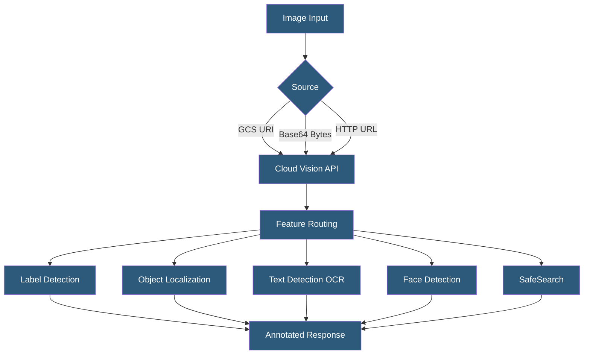

**Category:** Computer Vision Model Hosting
**Difficulty:** Intermediate
**Reading time:** 6 min read

---

Google Cloud Vision API provides computer vision capabilities including label detection, object localization, OCR, face detection, landmark recognition, and SafeSearch content moderation. It leverages Google's production-scale models accessible through a simple REST or gRPC API with per-feature pricing.

- **Feature Type** — specific analysis capability requested per image (LABEL_DETECTION, FACE_DETECTION, TEXT_DETECTION, etc.)
- **Batch Annotate** — processing multiple images in a single API request for efficiency
- **Async Annotate** — asynchronous processing for large batches stored in GCS, writing results to GCS
- **Localized Objects** — API returning object bounding boxes with normalized coordinates and category names
- **SafeSearch** — content moderation scoring for adult, violence, racy, medical, and spoof content
- **Document Text Detection (DOCUMENT_TEXT_DETECTION)** — OCR optimized for dense document layouts vs SIGN text
- **Product Search** — specialized API for visual product similarity search against a product catalog

Cloud Vision API processes images submitted as GCS URIs, base64-encoded byte strings, or public HTTP URLs. Each API request specifies which features to run — multiple features can be requested on the same image in a single call, and pricing is charged per feature per image. Requesting both LABEL_DETECTION and OBJECT_LOCALIZATION on 1000 images incurs separate charges for each feature type.

Label detection returns descriptive tags from Google's extensive visual taxonomy with confidence scores. Unlike fixed taxonomies, Google's label set includes mid-level concepts (e.g., "Sporting goods", "Ball game") alongside fine-grained ones ("Football", "Soccer ball"). Object localization returns specific object bounding boxes for a curated set of object categories — more precise than labels but covering fewer categories.

Cloud Vision's OCR is among the best available for document and scene text. `TEXT_DETECTION` is optimized for sparse scene text (signs, labels), returning individual words and their polygon coordinates. `DOCUMENT_TEXT_DETECTION` is optimized for dense document pages, returning character-level bounding boxes, paragraphs, and blocks, suitable for document digitization pipelines.

The Product Search feature enables visual similarity search against a product catalog stored in Vision Product Sets. Products are added with reference images, and new query images return visually similar catalog items with similarity scores — enabling "search by photo" features. For batch processing, `asyncBatchAnnotateImages` accepts GCS input files and writes JSON results to GCS, suitable for processing millions of images as a batch job without polling.

- E-commerce platform auto-tagging product images with category labels on upload
- Document digitization pipeline extracting and indexing text from scanned documents
- Real estate platform automatically categorizing listing photos by room type
- News organization verifying image content before publication
- Retail app implementing "shop the look" visual product search

| Advantage | Disadvantage |
|-----------|--------------|
| Multi-feature single-request API reduces round trips | Per-feature pricing means running many features on large datasets is expensive |
| Best-in-class OCR quality for document and scene text | Label taxonomy is opaque; cannot add custom labels without AutoML Vision |
| GCS-native integration for Google Cloud workflows | US-centric landmark detection; geographic coverage varies |
| Product Search provides visual catalog search without ML expertise | Product Search index management requires additional API complexity |

- [Amazon Rekognition API](amazon-rekognition-api.md)
- [Azure Computer Vision API](azure-computer-vision-api.md)
- [Image Classification Services](image-classification-services.md)

---
*Part of the [Computer Vision Model Hosting](index.md) category · [Back to Master Index](../../index.md)*
