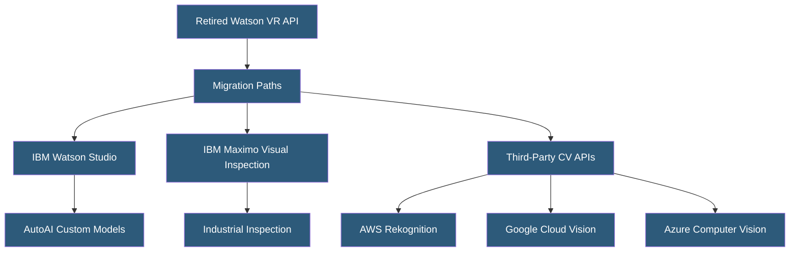

**Category:** Computer Vision Model Hosting
**Difficulty:** Intermediate
**Reading time:** 5 min read

---

IBM Watson Visual Recognition was IBM's cloud-based image analysis service providing classification, object detection, and custom model training. As of May 2021, the standalone Visual Recognition service was retired and its capabilities were merged into IBM Watson Studio and IBM Cloud Pak for Data, reflecting IBM's pivot toward enterprise AI platform consolidation.

- **Watson Studio** — IBM's current AI development platform replacing standalone Watson services for CV workloads
- **AutoAI** — IBM's automated machine learning feature in Watson Studio for model building without coding
- **Cloud Pak for Data** — IBM's containerized AI platform deployable on any cloud or on-premise
- **IBM Maximo Visual Inspection** — IBM's specialized CV product for industrial inspection and quality control
- **Custom Classifier** — user-trained classification model that was the primary Watson Visual Recognition feature
- **Default Classifier** — pre-trained general image classification model returning 1000+ visual concepts
- **Food Model** — specialized classifier identifying 2000 food items (one of Watson VR's specialized domains)

Watson Visual Recognition at its peak offered a REST API for submitting images and receiving classification results against IBM's general visual taxonomy or user-trained custom classifiers. The custom classifier feature used transfer learning similar to competing services — users uploaded positive and negative example images per class, triggered training, and received a versioned classifier endpoint.

IBM's specialized models represented the service's unique value proposition: a Food model trained on 2000 food categories for restaurant and nutrition applications, an Explicit model for content moderation, and a Face model returning age, gender, and identity attributes. These specialized models had higher accuracy in their domains than general-purpose classifiers.

Following the 2021 retirement, IBM redirected computer vision workloads to Watson Studio (for data scientists building custom models using open-source frameworks), IBM Maximo Visual Inspection (for industrial and manufacturing quality control with minimal-code training), and Cloud Pak for Data (for enterprise AI workloads requiring on-premise or private cloud deployment). For organizations that cannot migrate to Watson Studio, IBM explicitly recommends evaluating Google Cloud Vision, Amazon Rekognition, or Azure Computer Vision as replacement services.

IBM Maximo Visual Inspection deserves attention for industrial users: it provides a tablet-friendly annotation interface, supports object detection and classification, deploys inference at the edge on NVIDIA hardware, and connects with IBM Maximo asset management for industrial IoT workflows.

- Legacy applications migrating from Watson VR to alternative cloud CV APIs
- IBM enterprise customers leveraging Watson Studio for custom CV development
- Industrial manufacturers using Maximo Visual Inspection for defect detection
- Food delivery platforms that used Watson's specialized food recognition model
- Historical reference for understanding IBM's CV platform evolution

| Advantage | Disadvantage |
|-----------|--------------|
| Maximo Visual Inspection offers tablet-friendly UI for factory floor use | Standalone Watson VR service was retired in 2021 |
| Cloud Pak for Data enables on-premise deployment for regulated industries | IBM Watson ecosystem is significantly less developer-friendly than AWS/GCP/Azure |
| IBM enterprise support and SLAs for large organizations | Watson Studio has a steeper learning curve than competing no-code platforms |
| Deep integration with IBM infrastructure and Maximo | Smaller model library and community compared to competitors |

- [Amazon Rekognition API](amazon-rekognition-api.md)
- [Azure Computer Vision API](azure-computer-vision-api.md)
- [Google Cloud Vision API](google-cloud-vision-api.md)

---
*Part of the [Computer Vision Model Hosting](index.md) category · [Back to Master Index](../../index.md)*
