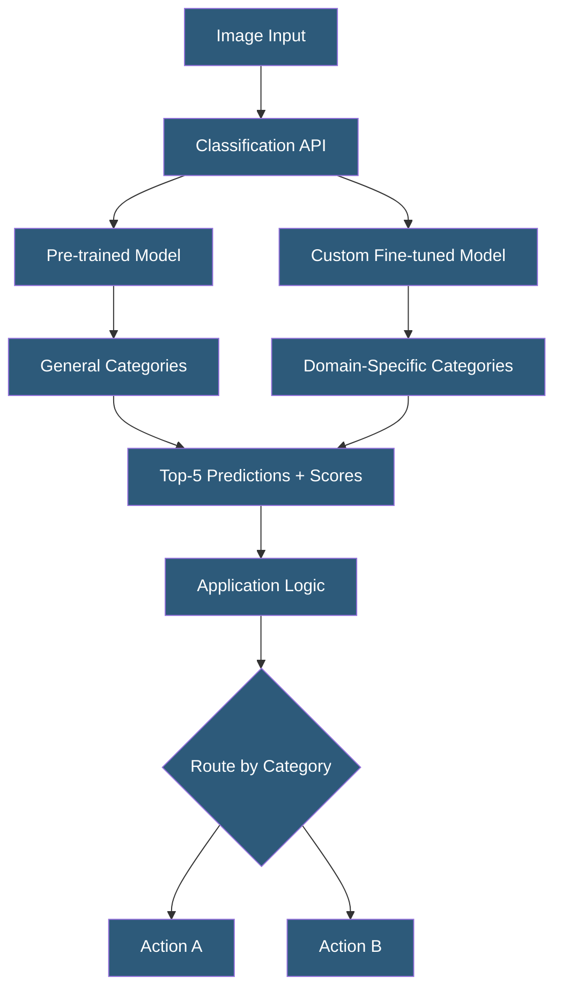

**Category:** Computer Vision Model Hosting
**Difficulty:** Beginner
**Reading time:** 5 min read

---

Image classification services assign one or more category labels to entire images using pre-trained or custom-trained neural networks. These services range from cloud APIs covering thousands of general categories to fine-tuned models for specific domains, accessible via REST APIs without model hosting infrastructure.

- **Single-Label Classification** — assigning exactly one class to an image (mutually exclusive categories)
- **Multi-Label Classification** — assigning multiple classes simultaneously (non-exclusive categories, e.g., an image can be both "outdoor" and "sunny")
- **Top-K Predictions** — returning the K most likely classes rather than only the top-1 prediction
- **Softmax Output** — probability distribution over all classes summing to 1 (single-label output)
- **Sigmoid Output** — independent probabilities per class for multi-label models (each class 0–1)
- **ImageNet** — benchmark dataset of 1.4M images across 1,000 categories; standard pre-training dataset
- **Transfer Learning** — fine-tuning a model pre-trained on ImageNet with domain-specific data

Image classification is the simplest computer vision task — given an image, predict which category it belongs to. Cloud classification services expose pre-trained models through HTTP APIs. The integration pattern is minimal: send an image, receive a list of class predictions with confidence scores. Provider general models cover 1000 (ImageNet) to 3000+ visual categories including objects, scenes, activities, and visual attributes.

For general classification tasks, AWS `DetectLabels`, GCP `LABEL_DETECTION`, and Azure `TAGS` all provide multi-label outputs covering the most common visual categories. Response formats vary: GCP returns a flat list of label strings with scores; AWS returns a hierarchical label structure with parent/child relationships; Azure returns tag strings with confidence values.

Custom classification requires domain-specific training when general models don't cover needed categories (e.g., specific product SKUs, medical conditions, proprietary equipment types). Custom training services (AWS Custom Labels, GCP AutoML Vision, Azure Custom Vision, Clarifai, Roboflow) use transfer learning: a pre-trained backbone extracts visual features, a new classification head learns the custom categories. Training requires 15–500+ images per class depending on visual complexity and desired accuracy.

EfficientNet, ResNet, ViT, and MobileNet are the dominant architectures for classification. Architecture selection trades off accuracy vs speed vs model size: MobileNetV3 fits on mobile devices at lower accuracy; ViT-Large achieves state-of-the-art accuracy but requires large GPU memory. For API services, the underlying architecture is abstracted; operators select by accuracy tier rather than by architecture.

- Insurance claim system routing damage type photos to appropriate claim handlers
- E-commerce automatically assigning product category to seller-uploaded images
- Library digitization system classifying scanned document types for routing
- Safety system classifying workplace scene types before applying relevant detection models
- Content platform routing user uploads to appropriate moderation queues by content type

| Advantage | Disadvantage |
|-----------|--------------|
| Simplest CV task — small datasets achieve good accuracy with transfer learning | Single-label classification fails for images with multiple relevant categories |
| Pre-trained APIs provide immediate value without any training | Fixed category vocabularies require custom training for specialized domains |
| Broad provider choice enables cost optimization | Custom classification accuracy degrades with imbalanced or small training sets |
| Fast inference — classification is less computationally demanding than detection | High confidence scores don't guarantee real-world accuracy in edge cases |

- [Object Detection APIs](object-detection-apis.md)
- [Clarifai Custom Models](clarifai-custom-models.md)
- [Amazon Rekognition API](amazon-rekognition-api.md)

---
*Part of the [Computer Vision Model Hosting](index.md) category · [Back to Master Index](../../index.md)*
