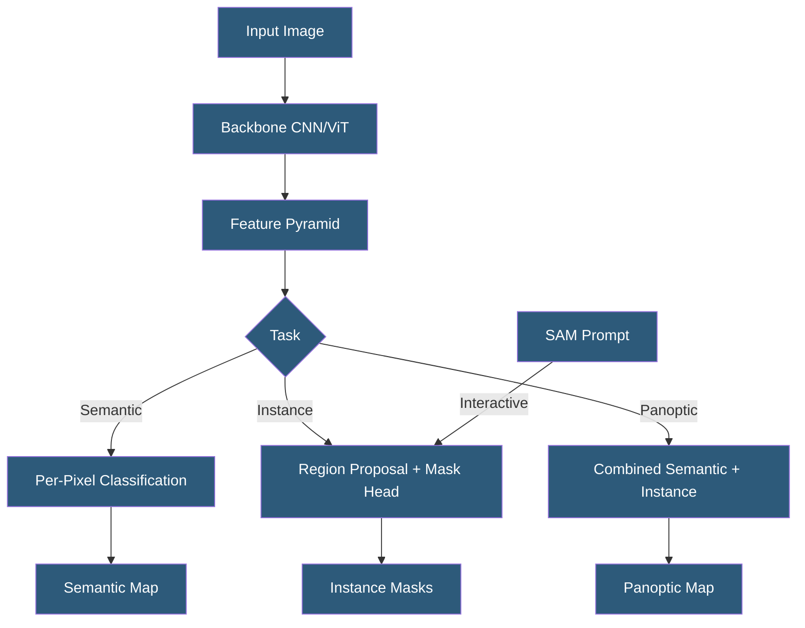

**Category:** Computer Vision Model Hosting
**Difficulty:** Advanced
**Reading time:** 6 min read

---

Image segmentation services classify every pixel in an image into semantic categories or individual object instances, enabling precise scene understanding beyond bounding box detection. Hosted segmentation APIs and frameworks span semantic segmentation (category per pixel), instance segmentation (individual object masks), and panoptic segmentation (combining both).

- **Semantic Segmentation** — assigning a category label to every pixel; different instances of the same class share a label
- **Instance Segmentation** — producing a separate mask for each distinct object instance in the image
- **Panoptic Segmentation** — unified approach combining semantic (stuff) and instance (things) segmentation
- **Mask R-CNN** — foundational two-stage instance segmentation architecture adding mask prediction to Faster R-CNN
- **DeepLab** — Google's semantic segmentation model family using dilated convolutions for large receptive fields
- **Polygon RNN** — approach predicting polygon vertices for efficient interactive annotation
- **FPN (Feature Pyramid Network)** — multi-scale feature extraction enabling detection and segmentation at different scales

Image segmentation models output spatial predictions rather than single values per image. Semantic segmentation models (DeepLabV3+, SegFormer, Mask2Former) encode the image with a backbone, decode features at the original resolution, and output a class probability map where each pixel has a distribution over all categories. The category with highest probability is assigned, producing a dense class map.

Instance segmentation (Mask R-CNN, YOLO-seg, PointRend) identifies individual objects and produces binary masks for each instance. The mask head runs on cropped region features from each detected bounding box, outputting a 28×28 (or configurable resolution) binary mask that is upsampled to the detection region. YOLOv8-seg integrates instance segmentation in the YOLO single-stage framework, enabling real-time segmentation on GPU with per-instance masks returned alongside detection boxes.

Cloud APIs providing segmentation include Azure Computer Vision (background removal and subject segmentation), Google Vertex AI Vision (custom segmentation model training), and AWS SageMaker (training and hosting custom segmentation models). For general-purpose segmentation, Meta's SAM provides the most accessible hosted option through Roboflow's integration and direct deployment via the inference server.

Model output requires post-processing: binary masks are returned as binary arrays, which are commonly encoded as RLE (Run-Length Encoding) for compact transmission. Applications may need to convert RLE to polygon contours for downstream use. Performance benchmarks use mean IoU (mIoU) — the average IoU score across all categories — as the primary accuracy metric.

- Autonomous vehicle semantic segmentation identifying road, curb, vehicles, and pedestrians per pixel
- Medical image analysis segmenting organ boundaries in CT scans for surgical planning
- Satellite imagery analysis segmenting land cover types (forest, urban, water, agriculture)
- Robotic manipulation identifying graspable object boundaries for grasp pose estimation
- Augmented reality applications requiring precise foreground/background separation in real time

| Advantage | Disadvantage |
|-----------|--------------|
| Pixel-level precision enables applications impossible with bounding boxes | Significantly higher computational cost than detection or classification |
| Instance segmentation handles overlapping objects unlike semantic-only approaches | High memory requirements — full-resolution feature maps demand GPU RAM |
| SAM enables zero-shot segmentation without domain-specific training | Post-processing (RLE encoding/decoding, polygon extraction) adds complexity |
| Panoptic segmentation provides complete scene understanding in a single pass | Annotation for segmentation training is 5–10x more expensive than bounding boxes |

- [Segment Anything Model Hosting](segment-anything-model-hosting.md)
- [Object Detection APIs](object-detection-apis.md)
- [Real-Time Video Inference](real-time-video-inference.md)

---
*Part of the [Computer Vision Model Hosting](index.md) category · [Back to Master Index](../../index.md)*
